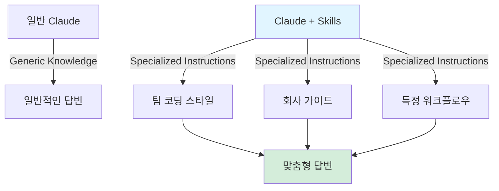
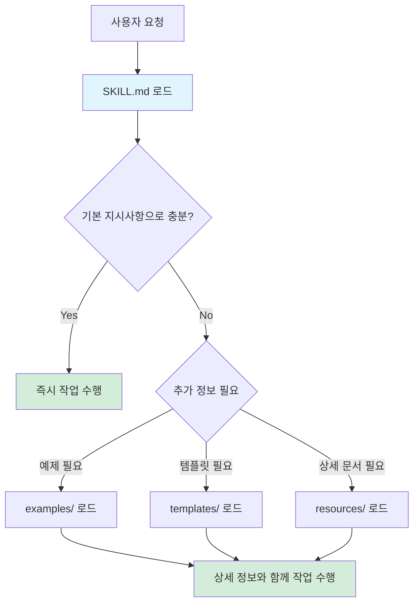
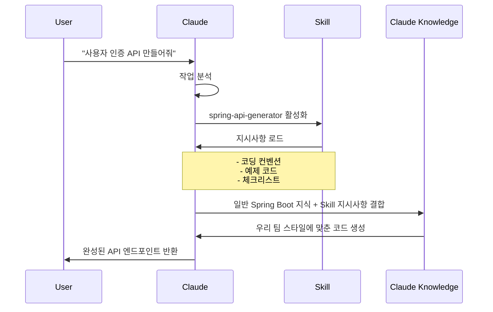
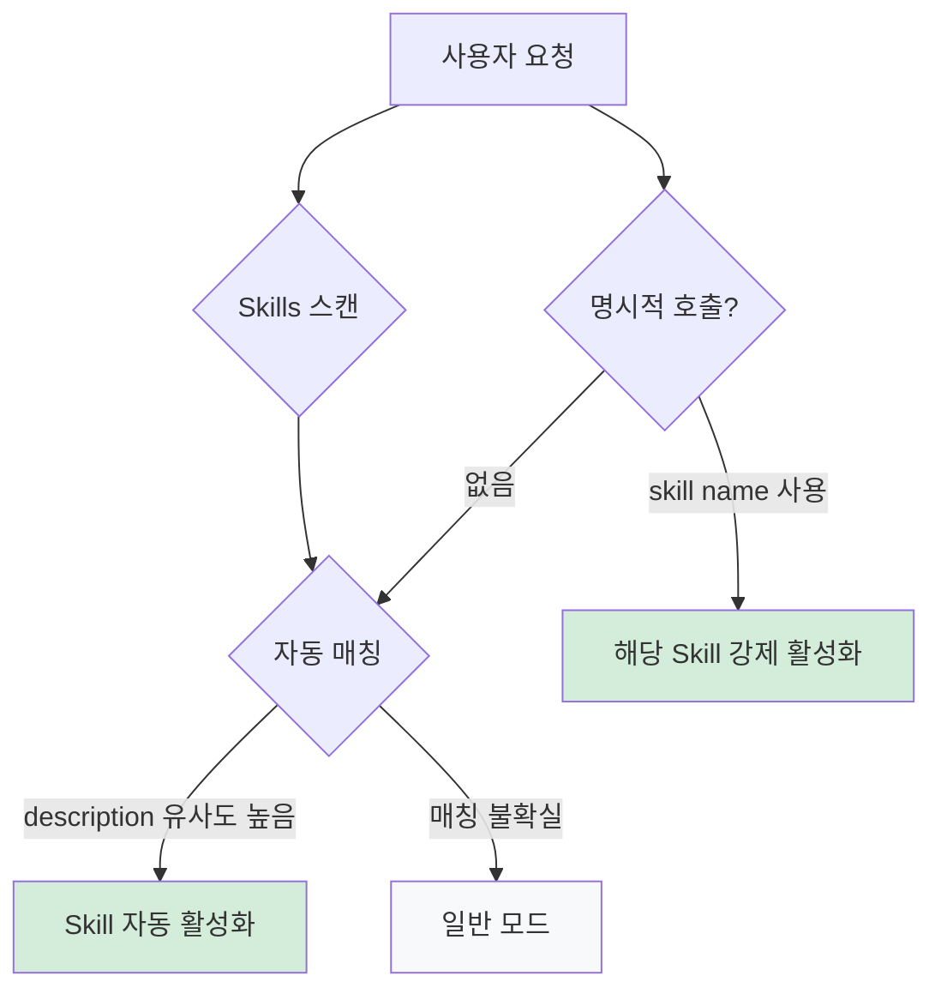

# Claude Skills

Claude Skills는 Claude가 특정 작업을 반복 가능하고 일관되게 수행할 수 있도록 하는 전문화된 지시사항 패키지다.

## 핵심 개념

기존에는 매 명령마다 긴 프롬프트를 작성해야 하거나 CLAUDE.MD에 모든 규칙을 넣어서 사용해야 했지만, Skills를 사용하면 다음과 같은 이점이 있다.

- 한 번 정의된 지시사항을 재사용 가능
- 필요할 때만 활성화되어 컨텍스트를 절약 가능



## 구조

Skills는 특정 디렉토리 안에 SKILL.md 파일과 관련 자료들을 포함하는 폴더 구조로 되어 있다.

```
my-skill/
├── SKILL.md          # 필수: 메타데이터와 핵심 지시사항 (항상 로드)
├── examples/         # 선택: 자세한 예제 (필요시 로드)
│   ├── good-example.md
│   └── bad-example.md
├── templates/        # 선택: 템플릿 파일 (필요시 로드)
│   └── controller-template.java
└── resources/        # 선택: 참조 자료 (필요시 로드)
    └── api-guide.pdf
```

### 계층적 정보 로딩

모든 정보를 SKILL.md에 넣는 것이 아니라, 핵심만 SKILL.md에 두고 자세한 내용은 별도 파일로 분리하여 필요할 때만 로드하여 컨텍스트를 절약할 수 있다.



## Skills 작동 흐름



## Skills 활성화 로직

Claude는 다음 기준으로 Skills를 자동 선택한다.

1. 설명(description) 매칭: 사용자 요청과 Skill 설명의 유사도 분석
2. 컨텍스트 분석: 현재 작업 중인 파일, 프로젝트 구조 파악
3. 명시적 호출: `@skill-name` 형태로 직접 지정



## Custom Skills 작성법

SKILL.md는 핵심 지시사항만 포함하고, 상세 내용은 별도 파일로 분리하는 것이 좋다.

```markdown
---
name: skill-name
description: Skill의 간단한 설명
dependencies:
  - other-skill-name
resources:
  - examples/
  - templates/
---

# Skill Name

## 역할

핵심 역할과 목적을 간단히 설명 (1-2문장)

## 핵심 규칙

가장 중요한 규칙 3-5개만 나열 (항상 적용되는 것들)

1. 규칙 1
2. 규칙 2
3. 규칙 3

## 워크플로우

기본적인 작업 순서 (간단히)

1. 단계 1
2. 단계 2
3. 단계 3

## 추가 리소스

더 자세한 정보가 필요한 경우:

- examples/good-example.md: 모범 사례
- examples/bad-example.md: 피해야 할 패턴
- templates/template.java: 코드 템플릿
- resources/guide.pdf: 상세 가이드
```

위 파일을 직접 작성할 수도 있지만, Claude는 `skill-creator`라는 메타-Skill을 제공하기 때문에 대화형으로 Skill을 자동 생성할 수도 있다.
