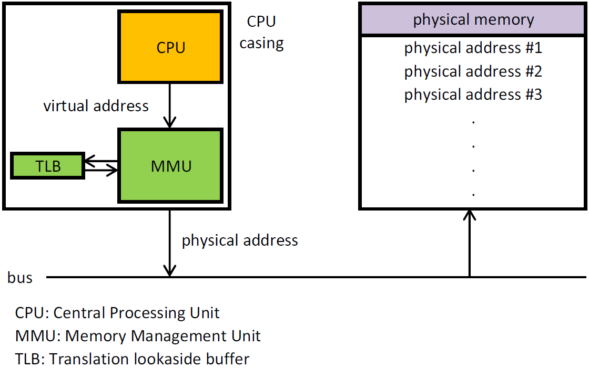

# Memory(메모리)

메모리란 프로그램과 프로그램 수행에 필요한 데이터 및 코드를 저장하는 장치로 크게 내부 기억 장치인 주기억장치와 외부 기억장치인 보조 기억장치로 분류된다.

## 메모리 주소

메모리 주소는 메모리에 저장된 데이터를 식별하기 위한 값으로, 물리 주소와 논리 주소로 구분된다.

- 물리 주소: 하드웨어가 직접 사용하는 주소
- 논리 주소: 프로그램이 사용하는 주소

여기서 CPU가 이해하는 주소는 논리 주소인데, 물리 주소를 논리 주소로 변환하기 위해 MMU(Memory Management Unit)가 사용된다.

## Memory Management Unit(MMU)

CPU가 주기억장치에 접근하는 것을 관리하는 장치로, 일반적으로는 CPU의 일부분으로 구성되며 별도의 칩으로 사용되는 경우도 있음

### MMU의 주요 역할

|  주요역할   |                             특징                             |
|:-------:|:----------------------------------------------------------:|
|  주소변환   |               CPU가 보내온 가상 주소를 실제의 물리적 주소로 변환               |
|  동적적재   |          실행에 반드시 필요한 프로그램과 데이터를 적재하는 OS 주요 기능 지원           |
|  캐시통제   |                 캐시 가능한 영역과 불가능한 영역 분리하여 관리                 |
|  권한통제   |                   사용자 프로그램에서 커널 영역 침범 차단                   |
| 읽기/쓰기보호 |                     읽기/쓰기 가능 여부 영역 관리                      |
|  메모리보호  | 각 프로세스들이 별도의 분리된 영역에서 운용되도록 통제 / 상한 레지스터 보다 큰 값이 오는 경우도 체크 |

## 캐시 메모리

캐시 메모리는 CPU와 주기억장치 사이에 위치하여 주기억장치의 느린 속도를 보완하기 위해 사용되는 메모리로,  
CPU가 주기억장치에 접근할 때 캐시 메모리에 해당 데이터가 있는지 확인하고 있으면 캐시 메모리에서 데이터를 가져오고(= 캐시 히트)  
반대로 없는 경우에는 주기억장치에서 데이터를 가져온다(= 캐시 미스).

### 캐시 적중률

캐시 히트가 발생한 비율로 `캐시 히트 횟수 / (캐시 히트 횟수 + 캐시 미스 횟수)`로 계산하여 일반 컴퓨터 기준 85~95% 정도의 적중률을 보인다.  
때문에 캐시 적중률을 높이기 위해, CPU가 메모리에 접근할 때 주된 경향을 바탕으로 접근하게 된다.(= 참조 지역성의 원리)

1. CPU는 최근에 접근했던 메모리 공간에 다시 접근할 확률이 높다.(= 시간 지역성)
    - 변수는 일반적으로 한 번만 사용되지 않고 여러 번 사용됨
2. CPU는 메모리 공간을 접근할 때 그 공간과 인접한 공간에 접근할 확률이 높다.(= 공간 지역성)
    - 프로그램은 보통 관련 데이터들끼리 모여있는 경우가 많음

###### 참고자료

- [한 권으로 읽는 컴퓨터 구조와 프로그래밍](https://kobic.net/book/bookInfo/view.do?isbn=9791189909284)
