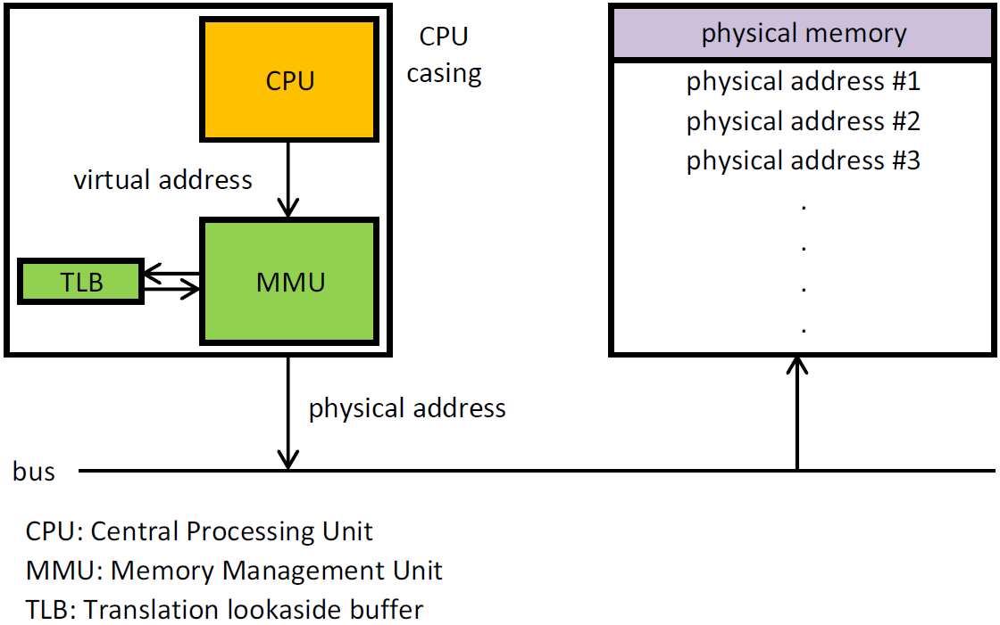

# 메모리

메모리란 프로그램과 프로그램 수행에 필요한 데이터 및 코드를 저장하는 장치로 크게 내부 기억 장치인 주기억장치와 외부 기억장치인 보조 기억장치로 분류된다.

## 메모리 주소

메모리 주소는 메모리에 저장된 데이터를 식별하기 위한 값으로, 물리 주소와 논리 주소로 구분된다.

- 물리 주소: 하드웨어가 직접 사용하는 주소
- 논리 주소: 프로그램이 사용하는 주소

여기서 CPU가 이해하는 주소는 논리 주소인데, 물리 주소를 논리 주소로 변환하기 위해 MMU(Memory Management Unit)가 사용된다.

## Memory Management Unit(MMU)

CPU가 주기억장치에 접근하는 것을 관리하는 장치로, 일반적으로는 CPU의 일부분으로 구성되며 별도의 칩으로 사용되는 경우도 있음

### MMU의 주요 역할

|  주요역할   |                             특징                             |
|:-------:|:----------------------------------------------------------:|
|  주소변환   |               CPU가 보내온 가상 주소를 실제의 물리적 주소로 변환               |
|  동적적재   |          실행에 반드시 필요한 프로그램과 데이터를 적재하는 OS 주요 기능 지원           |
|  캐시통제   |                 캐시 가능한 영역과 불가능한 영역 분리하여 관리                 |
|  권한통제   |                   사용자 프로그램에서 커널 영역 침범 차단                   |
| 읽기/쓰기보호 |                     읽기/쓰기 가능 여부 영역 관리                      |
|  메모리보호  | 각 프로세스들이 별도의 분리된 영역에서 운용되도록 통제 / 상한 레지스터 보다 큰 값이 오는 경우도 체크 |

## 캐시 메모리

캐시 메모리는 CPU와 주기억장치 사이에 위치하여 주기억장치의 느린 속도를 보완하기 위해 사용되는 메모리로,  
CPU가 주기억장치에 접근할 때 캐시 메모리에 해당 데이터가 있는지 확인하고 있으면 캐시 메모리에서 데이터를 가져오고(= 캐시 히트)  
반대로 없는 경우에는 주기억장치에서 데이터를 가져온다(= 캐시 미스).

### 캐시 적중률

캐시 히트가 발생한 비율로 `캐시 히트 횟수 / (캐시 히트 횟수 + 캐시 미스 횟수)`로 계산하여 일반 컴퓨터 기준 85~95% 정도의 적중률을 보인다.  
때문에 캐시 적중률을 높이기 위해, CPU가 메모리에 접근할 때 주된 경향을 바탕으로 접근하게 된다.(= 참조 지역성의 원리)

1. CPU는 최근에 접근했던 메모리 공간에 다시 접근할 확률이 높다.(= 시간 지역성)
    - 변수는 일반적으로 한 번만 사용되지 않고 여러 번 사용됨
2. CPU는 메모리 공간을 접근할 때 그 공간과 인접한 공간에 접근할 확률이 높다.(= 공간 지역성)
   - 프로그램은 보통 관련 데이터들끼리 모여있는 경우가 많음

## Virtual Memory

가상 메모리는 메모리가 실제 메모리보다 많아 보이게 하는 기술로, 어떤 프로세스가 실행될 때 메모리에 해당 프로세스 전체가 올라가지 않더라도 실행 가능하는 점에 착안하여 고안된 기술.

### 도입 배경

초창기 컴퓨터에서는 사용 가능한 RAM 용량이 가장 큰 애플리케이션의 공간보다 커야 실행할 수 있었는데, 추후 발달되어 애플리케이션의 일부분만 기억장치에 올려 실행할 수 있도록 하는 `오버레이` 기법을 사용하여
메모리 부족을 해결했다.  
그렇게 해서 메모리를 덜 사용할 수 있게 됐지만 충분한 메모리가 없을 경우 계속 해서 메모리 부족 오류가 발생하게됐다.  
이를 방지하기 위해 메모리에 올라가지 않은 나머지를 보조 기억장치에 올리는 가상 메모리 기법을 사용하게 된다.

## Demand Paging

요구 페이징은 CPU가 요청할 때 프로세스의 데이터를 메모리에 올리는 것으로, 처음부터 모든 데이터를 메모리에 적재하지는 않는다.

## Page Faults

페이지 폴트는 어떤 페이지에 접근하려 했을 때 해당 페이지가 실제 물리 메모리에 부재할 때 발생하는 인터럽트로,  
해당 문제가 발생하면 운영체제가 데이터를 메모리에 가져와서 다음 동작을 이어갈 수 있게 한다.

###### 참고자료

- [한 권으로 읽는 컴퓨터 구조와 프로그래밍 - 더 나은 소프트웨어 개발을 위한 하드웨어, 자료구조, 필수 알고리즘 등 프로그래머의 비밀 노트](https://www.nl.go.kr/seoji/contents/S80100000000.do?schM=intgr_detail_view_isbn&page=1&pageUnit=10&schType=simple&schStr=한+권으로+읽는+컴퓨터+구조와&isbn=9791189909284&cipId=228263315%2C)