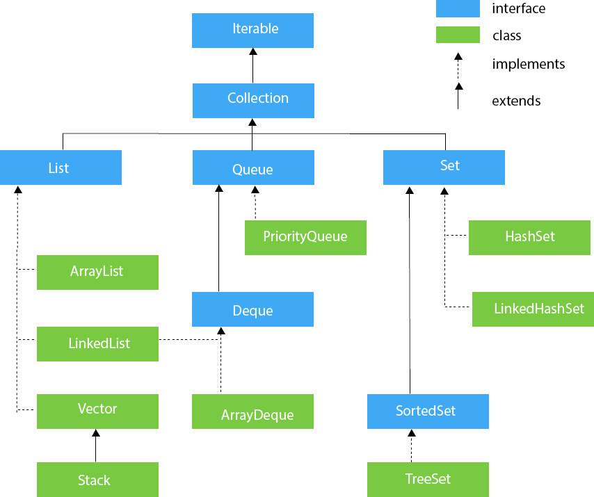

# Collections(컬렉션)

> 객체 그룹을 저장하고 조작하는 아키텍처를 제공하는 프레임워크

- 컬렉션 프레임워크 계층 구조



## Collection Interface

Iterator 인터페이스를 상속한 가장 기본이 되는 인터페이스로 add, remove, contains, isEmpty, size, toArray 등의 메소드를 가지고 있다.

### Collections vs Collection

Collections는 인스턴스화할 수 없는 클래스이며, Collection 인터페이스를 구현한 클래스들을 다루는 static 메서드를 제공한다.

```java
public class Collections {

    // Suppresses default constructor, ensuring non-instantiability.
    private Collections() {
    }
}
```

[제공 메서드](https://docs.oracle.com/javase/8/docs/api/java/util/Collections.html)

## Collection 하위 Class 특징

|     Class     |       Base Class       | Base Interface | Duplicate | Order | Sort |         Description         |
|:-------------:|:----------------------:|:--------------:|:---------:|:-----:|:----:|:---------------------------:|
|   ArrayList   |      AbstractList      |      List      |     O     |   O   |  X   |         배열 기반의 리스트          |
|    Vector     |      AbstractList      |      List      |     O     |   O   |  X   |    동기화를 지원하는 배열 기반의 리스트     |
|     Stack     |         Vector         |      List      |     O     |   O   |  X   | Vector의 하위 클래스로 LIFO 구조의 스택 |
|  LinkedList   | AbstractSequentialList |  List, Deque   |     O     |   O   |  X   |       연결 리스트 기반의 리스트        |
|  ArrayDeque   |   AbstractCollection   |     Deque      |     O     |   O   |  X   |          배열 기반의 덱           |
| PriorityQueue |     AbstractQueue      |     Queue      |     O     |   O   |  O   |           우선순위 큐            |
|    HashSet    |      AbstractSet       |      Set       |     X     |   X   |  X   |        해시 테이블 기반의 집합        |
| LinkedHashSet |        HashSet         |      Set       |     X     |   O   |  X   |    해시 테이블과 연결 리스트 기반의 집합    |
|    TreeSet    |      AbstractSet       |   SortedSet    |     X     |   O   |  O   |       이진 검색 트리 기반의 집합       |

### List

- ArrayList: 단방향 포인터 구조로 데이터에 대한 인덱스를 가지고 있어 조회가 빠르지만 데이터의 추가/삭제가 느리다.
- LinkedList: 양방향 포인터 구조로 데이터에 대한 인덱스를 가지고 있지 않아 노드를 순회해야하기 때문에 조회가 느리지만 데이터의 추가/삭제가 빠르다.
- Stack: LIFO 구조로 데이터의 추가/삭제가 빠르다.

[제공 메서드](https://docs.oracle.com/javase/8/docs/api/java/util/List.html)

- 시간 복잡도

|   Class    | add  | get  | remove | contains | size |
|:----------:|:----:|:----:|:------:|:--------:|:----:|
| ArrayList  | O(1) | O(1) |  O(n)  |   O(n)   | O(1) |
| LinkedList | O(1) | O(n) |  O(1)  |   O(n)   | O(1) |
|   Stack    | O(1) | O(1) |  O(n)  |   O(n)   | O(1) |

### Queue

- PriorityQueue: 데이터를 우선순위에 따라 정렬하는 큐로, 데이터의 추가/삭제가 빠르지만 데이터의 조회가 느리다.

[제공 메서드](https://docs.oracle.com/javase/8/docs/api/java/util/Queue.html)

- 시간 복잡도

|     Class     |   add    |  remove  | contains | size |
|:-------------:|:--------:|:--------:|:--------:|:----:|
| PriorityQueue | O(log n) | O(log n) |   O(n)   | O(1) |

### Deque

- ArrayDeque: 배열 기반의 덱으로, 데이터의 추가/삭제가 빠르다.

[제공 메서드](https://docs.oracle.com/javase/8/docs/api/java/util/Deque.html)

- 시간 복잡도

|   Class    | add  | remove | contains | size |
|:----------:|:----:|:------:|:--------:|:----:|
| ArrayDeque | O(1) |  O(1)  |   O(n)   | O(1) |

### Set

- HashSet: 해시 테이블 기반의 집합으로, 데이터의 추가/삭제가 빠르다.
- LinkedHashSet: 해시 테이블과 연결 리스트 기반의 집합으로, 데이터의 추가/삭제가 빠르다.

[제공 메서드](https://docs.oracle.com/javase/8/docs/api/java/util/Set.html)

- 시간 복잡도

|     Class     | add  | remove | contains | size |
|:-------------:|:----:|:------:|:--------:|:----:|
|    HashSet    | O(1) |  O(1)  |   O(1)   | O(1) |
| LinkedHashSet | O(1) |  O(1)  |   O(1)   | O(1) |

### SortedSet

- TreeSet: 이진 검색 트리 기반의 집합으로, 데이터의 추가/삭제가 빠르다.

[제공 메서드](https://docs.oracle.com/javase/8/docs/api/java/util/SortedSet.html)

- 시간 복잡도

|  Class  |   add    |  remove  | contains | size |
|:-------:|:--------:|:--------:|:--------:|:----:|
| TreeSet | O(log n) | O(log n) | O(log n) | O(1) |

###### 참고자료

- [java T point](https://www.javatpoint.com/collections-in-java)
- [Oracle Docs](https://docs.oracle.com/javase/8/docs/api/)
