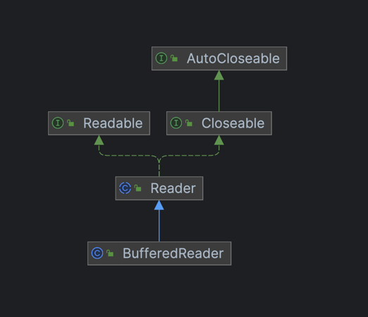

# try-with-resources

> try-finally보다는 `try-with-resources`를 사용하라

자바 라이브러리에는 `InputStream`, `OutputStream`, `java.sql.Connection`과 같이 `close()` 메서드를 호출하여 직접 자원을 회수해야 하는 자원이 많다.
자원을 회수하는 것은 클라이언트가 놓치기 쉬운 부분이기 때문에 성능 문제로 이어지는 경우가 많다.  
대체로 자원을 회수하기 위해선 `try-finally` 구문을 사용하게 된다.

## try-finally 사용

```java
class Test {

    // 하나의 자원을 회수하는 경우
    static String firstLineOfFile(String path) throws IOException {
        BufferedReader br = new BufferedReader(new FileReader(path));
        try {
            return br.readLine();
        } finally {
            br.close(); // 여기서 발생한 예외만 stack trace에 남음
        }
    }
}
```

위에서 알 수 있듯이 `try-finally` 문법은 코드가 지저분해지고 가독성이 떨어지는 문제가 있다.  
또한 `try-finally` 구문을 사용하면 예외가 발생했을 때, `finally` 블록 안에 `close()` 메서드에서도 예외가 발생하면 아래의 순서로 진행이 된다.

1. `br.readLine()`에서 예외가 발생(`try` 블록)
2. `finally` 블록으로 이동
3. `br.close()`에서도 예외가 발생(`finally` 블록)
4. `br.close()`의 예외가 `br.readLine()`의 예외를 덮어씀
5. 결과적으로 stack trace에는 `br.close()`의 예외만 남음

## try-with-resources 사용

위 문제는 Java 7에 나온 `try-with-resources` 구문을 사용하면 해결할 수 있다.  
이 구조를 사용하기 위해선 사용하는 자원(클래스)이 `AutoCloseable` 인터페이스를 구현해야 한다.  
`BufferedReader`는 `AutoCloseable` 인터페이스를 구현해놓은 클래스이며, 많은 자바 라이브러리들이 `AutoCloseable` 인터페이스를 구현해놓았다.  
AutoCloseable 인터페이스의 내용을 확인해보면 `close()` 메서드를 확인할 수 있으며, 이 메서드를 통해 자원을 회수한다.



```java
public interface AutoCloseable {
    /**
     * Closes this resource, relinquishing any underlying resources.
     * -> 이 자원을 회수하고, 관련된 하위 자원들도 회수한다.
     * This method is invoked automatically on objects managed by the
     * {@code try}-with-resources statement.
     * -> 이 메서드는 try-with-resources 문으로 관리되는 객체에서 자동으로 호출됩니다.
     *
     * ...
     */
    void close() throws Exception;
}
```

아래 코드에서 실행되는 순서는 다음과 같다.

```java
class Test {

    static String firsLineOfFile(String path) throws IOException {
        try (BufferedReader br = new BufferedReader(new FileReader(path))) {
            return br.readLine();
        } catch (IOException e) {
            throw e;
        } finally {
            System.out.println("finally");
        }
    }
}
```

- 정상 실행

1. `try` 블록 안에서 `BufferedReader` 객체 생성
2. `try` 블록 안에서 `BufferedReader` 객체의 `readLine()` 메서드를 호출
3. `finally` 블록 수행
4. `finally` 블록 실행 후 `AutoCloseable` 인터페이스를 구현한 `close()` 메서드를 호출

- 예외 발생

1. `try` 블록 안에서 `BufferedReader` 객체를 생성
2. `try` 블록 안에서 `BufferedReader` 객체의 `readLine()` 메서드를 호출
3. `readLine()` 메서드에서 예외 발생
4. `catch` 블록 진입하여 예외 처리(없는 경우 상위 호출 스택으로 전파)
5. `finally` 블록 수행
6. finally 블록 실행 후 `AutoCloseable` 인터페이스를 구현한 `close()` 메서드가 호출
7. `close()` 메서드에서도 예외가 발생 시 이 예외는 별도 처리 됨

결과적으로 예외 발생 시 realLine에서 발생한 예외가 `close()` 메서드에서 발생한 예외를 덮어쓰지 않는다.  
`close()`에서 발생한 예외는 별도로 처리되기 때문에 stack trace에는 `readLine()`에서 발생한 예외만 남게 되고,  
`close()`에서 발생한 예외도 `getSuppressed()` 메서드를 통해 확인할 수 있다.