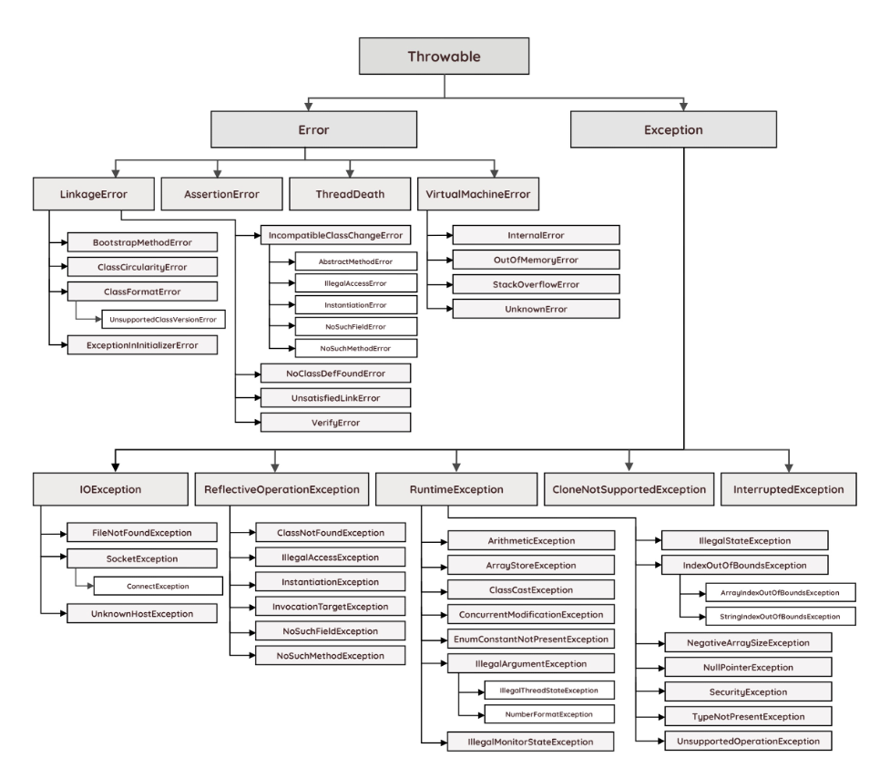

# Exception Handling(예외 처리)

> 프로그램이 실행되는 동안 발생하는 예외를 처리하는 것

프로그램에서 발생하는 에러는 크게 세 가지로 나눌 수 있다.

- 컴파일 에러: 컴파일 시 발생하는 에러
- 런타임 에러: 실행 시 발생하는 에러
- 논리적 에러: 실행은 되지만 의도와 다르게 동작하는 에러

Java의 예외 클래스는 계층 구조를 통해 다양한 종류의 예외를 체계적으로 관리할 수 있으며, 개발자는 필요한 예외를 선택하여 적절히 처리할 수 있다.

- 모든 예외 클래스는 `java.lang.Throwable` 클래스를 상속받는다.
- `Error` 클래스와 `Exception` 클래스는 `Throwable` 클래스를 상속받는다.
- `Error` 클래스 : 프로그램 코드에 의해서 수습될 수 없는 심각한 오류
- `Exception` 클래스 : 프로그램에서 코드에 의해서 수습될 수 있는 미약한 오류



## try-catch-finally

예외 처리를 위한 구문으로, 각 블록은 다음과 같은 역할을 한다.

- `try`: 예외가 발생할 수 있는 코드
- `catch`: 예외가 발생했을 때 수행할 코드
    - 프로그램의 비정상 종료를 막고, 정상적인 실행상태를 유지
- `finally`: 예외 발생 여부와 상관없이 항상 수행되어야 하는 코드
    - 보통 자원 해제 코드 작성

```java
class Example {

    public static void main(String[] args) {
        try {
            // 예외가 발생할 수 있는 코드
        } catch (Exception1 e1) {
            // Exception1 예외가 발생했을 때 처리하는 코드
        } catch (Exception2 e2) {
            // Exception2 예외가 발생했을 때 처리하는 코드
        } catch (Exception3 e3) {
            // Exception3 예외가 발생했을 때 처리하는 코드
        } catch (ExceptionA | ExceptionB e5) {
            // ExceptionA, ExceptionB 예외가 발생했을 때 처리하는 코드
        } finally {
            // 예외 발생 여부와 상관없이 항상 수행되어야 하는 코드
        }
        // 발생한 예외와 일치하는 catch 블록이 없으면 예외는 처리되지 않는다.
    }
}
```

## 예외 발생 정보

- printStackTrace() : 예외 발생 당시 호출 스택(Call Stack)에 있었던 메서드의 정보와 예외 메시지를 화면에 출력
- getMessage() : 발생한 예외 클래스의 인스턴스에 저장된 메시지를 얻어옴

```java
class Example {

    public static void main(String[] args) {
        try {
            int result = 3 / 0;
            System.out.println(result);
        } catch (ArithmeticException e) {
            e.printStackTrace(); // java.lang.ArithmeticException: / by zero, at Example.main(Example.java:5)
            System.out.println(e.getMessage()); // / by zero
        }
    }
}
```

## 메서드에 예외 선언

메서드 선언부에 예외를 선언함으로써 메서드를 사용하려는 사람에게 이에 대한 처리를 강요할 수 있으며 그와 동시에 어떤 예외가 발생할 수 있는지 알려줄 수 있다.

```java
class Exception {

    public static void main(String[] args) {
        try {
            File f = createFile(args[0]);
            System.out.println(f.getName() + "파일이 성공적으로 생성되었습니다.");
        } catch (Exception e) {
            System.out.println(e.getMessage() + " 다시 입력해 주시기 바랍니다.");
        }
    }

    static File createFile(String fileName) throws Exception {
        if (fileName == null || fileName.equals("")) {
            throw new Exception("파일이름이 유효하지 않습니다.");
        }
        File f = new File(fileName);
        f.createNewFile();
        return f;
    }
}
```

## Unchecked Exception

> 컴파일러가 예외 처리를 강제하지 않는 예외

`RuntimeException` 클래스를 상속받은 예외들은 `unchecked exception`인데, 이 예외는 별도로 예외 처리를 강제하지 않는다.

```java
class Example {

    public static void main(String[] args) {
        try {
            int[] arr = new int[3];
            arr[3] = 10;
        } catch (ArrayIndexOutOfBoundsException e) {
            System.out.println("배열의 인덱스가 범위를 벗어났습니다.");
        }
    }
}
```

위 예외는 `unchecked exception`이기 때문에 `try-catch`나 메서드에 `throws`절을 사용하지 않아도 컴파일 에러가 발생하지 않는다.  
코드가 복잡해지고 가독성이 떨어질 수 있는 것을 방지할 수 있고, 호출한 메서드에 불필요하게 에러 처리를 강요하지 않게 할 수 있다.

## 사용자정의 예외

보통 `Exception` 혹은 `RuntimeException` 클래스를 상속받아 사용자 정의 클래스를 만들며, 필요에 따라 알맞는 클래스를 선택하면 된다.

```java
class MyException extends Exception {

    private final int ERR_CODE;

    MyException(String msg, int errCode) {
        super(msg);
        ERR_CODE = errCode;
    }

    MyException(String msg) {
        this(msg, 100);
    }

    public int getErrorCode() {
        return ERR_CODE;
    }
}
```

위 예시처럼 `Exception` 클래스를 상속받는 대신 `RuntimeException` 클래스를 상속 받으면 예외 처리를 강제하지 않을 수 있다.

## 예외 되던지기

예외를 처리한 후에 인위적으로 다시 예외를 발생시켜, 상위 호출 메서드로 예외를 전달하는 방법이다.

```java
class ExceptionEx3 {

    public static void main(String[] args) {
        try {
            method1();
        } catch (Exception e) {
            System.out.println("main 메서드에서 예외가 처리되었습니다.");
        }
    }

    static void method1() throws Exception { // method1 에서 발생한 예외를 main 메서드로 넘겨준다.
        try {
            throw new Exception();
        } catch (Exception e) {
            System.out.println("method1 메서드에서 예외가 처리되었습니다.");
            throw e; // method1 에서 발생한 예외를 다시 발생시킨다.
        }
    }
}
```

###### 참고자료

- [java의 정석](https://www.nl.go.kr/seoji/contents/S80100000000.do?schM=intgr_detail_view_isbn&page=1&pageUnit=10&schType=simple&schStr=Java의+정석&isbn=9788994492032&cipId=200741285%2C)
