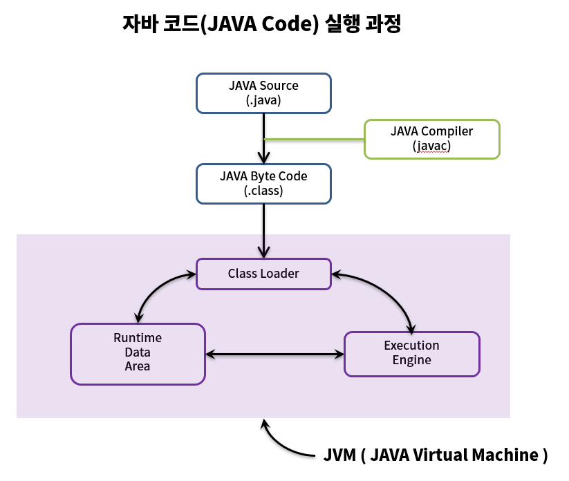
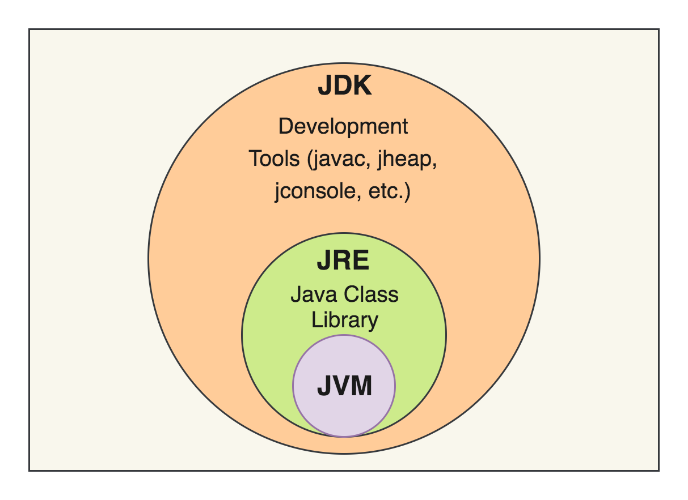

# Java Virtual Machine

> 자바 애플리케이션이 수행되는 런타임 엔진

Java 애플리케이션이 실행되는 환경은 다음과 같은 계층 구조를 가진다.

|    Java Application    |
|:----------------------:|
| JVM(Windows/Mac/Linux) |
| OS(Windows/Mac/Linux)  |
|   Computer(Hardware)   |

자바의 큰 특징 중 하나는 가상 환경인 JVM의 존재인데, Computer -> OS -> JVM -> Java Application 레이어 형태로 JVM 위에서 실행된다.  
이러한 특징으로 인해 다음과 같은 특징을 가지게 된다.

- 플랫폼 독립성: JVM 위에서 실행되기 때문에 어느 플랫폼이든 컴파일 된 코드가 실행될 수 있음
- JVM 필수 조건: 실행을 위해서는 반드시 JVM이 필요함
- 성능 이슈: JVM 거치기 때문에 속도가 느릴 수 있음(최근엔 컴파일러와 최적화 기술로 그 속도의 격차를 많이 줄임)

## Java 실행 과정

- Java Compiler: Java Source Code를 Java Byte Code로 변환
- Class Loader: 바이트 코드 로딩 / 검증 / 링킹 등 수행
- Runtime Data Area: 앱 실행을 위해 사용되는 JVM 메모리 영역
- Execution Engine: 메모리 영역에 있는 데이터를 가져와 해당하는 작업 수행

1. 작성된 Java Source를 Java Compiler를 통해 Java Byte Code로 변환
2. 컴파일 된 Byte Code를 JVM의 Class Loader에 전달
3. Class Loader는 Dynamic Loading을 통해 필요한 클래스들을 로딩 및 링크하여 Runtime Data Area(JVM Memory)로 전달
4. Execution Engine이 올라온 Byte Code들을 명령어 단위로 하나씩 가져와서 실행

### Class Loader에서 Class Loading 과정

클래스 로더는 컴파일된 자바 클래스 파일(*.class)을 메모리로 로드하고, Runtime Data Area에 배치하는 역할을 한다.  
class 파일을 로딩하는 순서는 다음과 같다.

1. Loading: 클래스 로더가 클래스 파일을 읽어들여 JVM 메모리에 로드
2. Linking: 클래스 파일을 사용하기 위해 검증
3. Initialization: 클래스 변수 초기화

클래스를 메모리에 올리는 Loading 단계에서는 클래스를 로드하는 규칙에 따라 클래스 로더가 클래스 파일을 읽어들인다.

- 모든 클래스를 한 번에 로드하는 것이 아니라 필요한 클래스만 동적으로 메모리에 로드
- static 멤버들 또한 전부 메모리에 올라가는 것이 아니라, 클래스 내의 static 멤버를 호출하게 되면 클래스가 동적으로 메모리에 로드

## JDK & JRE & JVM

- JVM(Java Virtual Machine): 자바 바이트 코드를 실행시키기 위한 가상 머신
- JRE(Java Runtime Environment): 자바 애플리케이션을 실행하기 위한 도구(필요한 라이브러리 및 필수 파일)가 포함된 실행 환경
- JDK(Java Development Kit): 자바로 개발하기 위한 필요 요소(javac 등)를 포함한 개발 키트

## JVM 메모리 구조

JVM 메모리는 크게 5가지 영역으로 나뉘며, 각각의 영역은 다음과 같은 역할을 수행한다.

|   영역   |                    용도                    |           생명 주기            | 스레드 공유 여부 |
|:------:|:----------------------------------------:|:--------------------------:|:---------:|
| Method |    클래스 정보, 클래스(static) 변수, 상수, 메소드 코드    |        JVM 시작 ~ 종료         |     O     |
|  Heap  |             객체 인스턴스, 인스턴스 변수             | `Gabage Collection`에 의해 관리 |     O     |
| Stack  | 스레드 별로 런타임에 호출 된 메서드, 지역 변수, 매개 변수, 리턴 값 |          메서드 종료 시          |     X     |

이외에도 스레드의 명령어 주소가 저장되는 `PC Register` 자바 외의 언어로 작성된 네이티브 코드가 저장되는 `Native Method Stack`이 존재한다.

###### 참고자료

- [Java의 정석](https://kobic.net/book/bookInfo/view.do?isbn=9788994492032)
