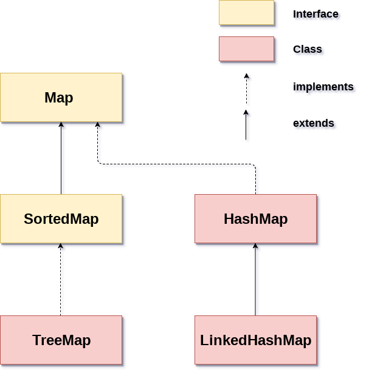

# Map

> Key-Value 쌍으로 이루어진 데이터 구조

- Java Map 계층 구조

`Map`은 중복된 키(key)를 허용하지 않지만 중복된 값(value)를 허용한다.

## Map Interface

- `Map` 인터페이스는 `Collection` 인터페이스를 상속받지 않는다.
- `Map` 인터페이스는 `key`와 `value`를 묶어서 하나의 데이터를 `entry`로 저장한다.
- put, get, remove, containsKey, containsValue, size, isEmpty, clear 등의 메소드를 제공한다.

[제공 메서드](https://docs.oracle.com/javase/8/docs/api/java/util/Map.html)

## Map 하위 Class 특징

|     Class     | Base Class  | Base Interface | Duplicate Key | Duplicate Value | Order |   Get    |
|:-------------:|:-----------:|:--------------:|:-------------:|:---------------:|:-----:|:--------:|
|    HashMap    | AbstractMap |      Map       |       X       |        O        |   X   |   O(1)   |
|    TreeMap    |  SortedMap  |  NavigableMap  |       X       |        O        |   O   | O(log n) |
| LinkedHashMap |   HashMap   |      Map       |       X       |        O        |   O   |   O(1)   |

### HashMap

- 내부적으로 `Entry` 배열을 만들어 관리
- `put()` 메서드를 이용하여 `Entry`를 추가하면 `key` 값으로 `hash`값을 계산하여 `Entry`를 저장할 위치(접근 인덱스)를 찾아 사용
- `hash`값 계산은 자바 버전에 따라 다르지만 기본적으로 `Object`의 `hashCode()` 메서드를 기반으로 동작
- `HashCode`를 계산하여 사용하기 때문에 순서가 보장되지 않음

### TreeMap

- `key`-`value` 쌍을 내부적으로 `Red-Black Tree`로 관리
- `key` 값으로 `Red-Black Tree`를 구성하기 때문에 `Comparator` 인터페이스를 구현하여 `key` 값을 정렬할 수 있음

### LinkedHashMap

- `HashMap`과 동일하게 내부적으로 `Entry` 배열을 만들어 관리
- `before`와 `after`를 이용하여 `Entry`를 추가한 순서대로 `Entry`를터 관리하기 때문에 순서가 보장됨
