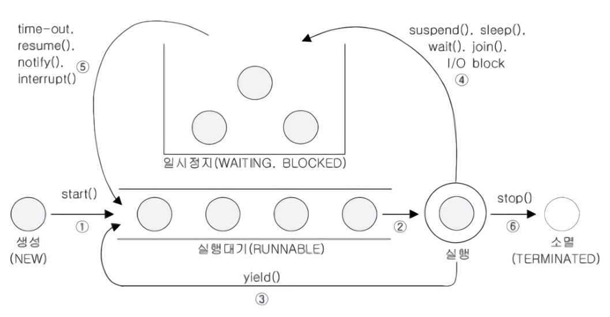

# Thread(스레드)

> 프로세스의 자원을 이용해 작업을 수행하는 실행 단위

## 스레드 구현

구현 방법으로는 아래 두 개의 방법이 있으며 큰 차이는 없으나 Thread 클래스를 상속 받으면 다른 클래스를 상속 받을 수 없기 떄문에 Runnable 방법을 권장한다.

- Thread 클래스를 상속받아 구현

```java
public class MyThread extends Thread {

    @Override
    public void run() {
        // Do something
    }
}
```

- Runnable 인터페이스를 구현

```java
public class MyThread implements Runnable {

    @Override
    public void run() {
        // Do Something
    }
}
```

## 스레드 실행

생성된 스레드를 실행하기 위해서는 `run()`이 아닌 `start()` 메서드를 호출해야 한다.

```java
class ThreadEX1 extends Thread {

    public void run() {
        for (int i = 0; i < 10; i++) {
            // 조상 클래스에 구현 된 getName() 메서드를 이용해 스레드 이름을 출력
            System.out.println("ThreadEX1: " + i + "번째 실행" + " Thread Name: " + getName());
        }
    }
}

class ThreadEX2 implements Runnable {

    public void run() {
        for (int i = 0; i < 10; i++) {
            // Thread 클래스의 static 메서드인 currentThread()를 이용해 현재 실행 중인 스레드를 반환받아 getName() 메서드를 이용해 스레드 이름을 출력
            System.out.println("ThreadEX2: " + i + "번째 실행" + " Thread Name: " + Thread.currentThread().getName());
        }
    }
}

class ThreadMain {

    public static void main(String[] args) {
        ThreadEX1 threadEX1 = new ThreadEX1();

        // Runnable 인터페이스를 구현한 객체를 Thread 클래스 생성자의 매개변수로 전달
        Thread thread = new Thread(new ThreadEX2());

        threadEX1.start();
        thread.start();
    }
}
```

`start()` 메서드가 호출되어도 해당 스레드에서 바로 실행 되는 것이 아니기 때문에, 스레드 스케줄러에 의해 대기 상태가 되고 대기 상태에 있는 스레드는 스레드 스케줄러에 의해 실행된다.  
한 번 실행된 스레드는 다시 실행할 수 없으며 두 번 이상 실행하게 되면 `IllegalThreadStateException` 예외가 발생한다.

### `start()` vs `run()`

- `run()`: 생성된 스레드를 실행시키는 것이 아니라 단순히 클래스에 선언된 메서드를 호출
- `start()`: 새로운 스레드가 작업을 실행하는데 필요한 `call stack`을 생성하고 생성된 `call stack`에 `run()`메서드를 실행

호출 스택을 강제로 출력하는 코드 사용하여 결과를 확인해보면 `start()` 메서드를 호출한 경우 main 스레드와 별도의 스레드가 생성되어 실행되는 것을 확인할 수 있다.  
`run()`을 통해 실행하게 되면 단순히 메서드를 호출하는 것이기 때문에 main 스레드에서 `run()` 메서드가 실행되는 것을 확인할 수 있다.

```java
class ThreadEX1 extends Thread {

    public void run() {
        throwException();
    }

    private static void throwException() {
        try {
            throw new Exception();
        } catch (Exception e) {
            e.printStackTrace();
        }
    }
}

class ThreadMain {

    public static void main(String[] args) {
        ThreadEX1 threadEX1 = new ThreadEX1();

        threadEX1.start();
    }
}

/*
java.lang.Exception
	at ThreadEX1.throwException(scratch.java:8)
	at ThreadEX1.run(scratch.java:3)
 */
```

```java
class ThreadEX1 extends Thread {

    public void run() {
        throwException();
    }

    private static void throwException() {
        try {
            throw new Exception();
        } catch (Exception e) {
            e.printStackTrace();
        }
    }
}

class ThreadMain {

    public static void main(String[] args) {
        ThreadEX1 threadEX1 = new ThreadEX1();

        threadEX1.run();
    }
}

/*
java.lang.Exception
	at ThreadEX1.throwException(scratch.java:8)
	at ThreadEX1.run(scratch.java:3)
	at ThreadMain.main(scratch.java:19)
 */
```

모든 스레드는 작업을 수행하기 위해 자신만의 `call stack`이 필요한데, 새로운 스레드를 생성하고 실행하면 아래와 같은 순서로 실행된다.

1. 새로운 스레드가 생성되고 `run()` 메서드가 호출되어 새로운 `call stack`이 생성
2. `run()` 메서드가 종료되면서 해당 스택이 비워지게 되면서, 해당 스레드는 종료되고 `call stack`도 소멸

결국 main 스레드에서 `start()` 메서드를 호출하면 아래의 순서로 실행된다.

1. main 메서드에서 구현한 스레드의 `start()` 메서드를 호출
2. `start()`는 새로운 스레드를 생성하고, 스레드가 작업하는데 사용될 `call stack`을 생성
3. 생성된 스레드가 새로 생성된 `call stack`에 `run()` 메서드를 호출
4. 스케줄러에 의해 번갈아 가며 작업 수행

## 스레드 우선순위

스레드는 `priority`라는 속성(멤버변수)를 가지고 있으며 이 속성은 스레드의 우선순위를 나타낸다.

- 스레드의 우선순위는 1 ~ 10 사이의 값을 가질 수 있으며 기본값은 5
- OS마다 다른 방식으로 스케쥴링하기 때문에 실행 결과는 정확히 알 수 없음

## 실행제어

멀티 스레드 프로그래밍이 어려운 이유는 동기화(synchronization)와 스케줄링(scheduling) 때문이다.  
효율적인 멀티스레드 관리를 위해서는 우선 관련 메서드와 스레드의 상태를 이해해야 한다.

### 스케줄링 메서드

|                 메서드                  |                                    설명                                     |
|:------------------------------------:|:-------------------------------------------------------------------------:|
|   `static void sleep(long millis)`   |                            지정된 시간 동안 스레드 일시정지                             |
| `void join(), void join(long mills)` | 지정된 시간동안 스레드가 실행되도록 함, 지정된 시간이 지나거나 작업이 종료되면 `join()`을 호출한 스레드로 다시 돌아와 실행 |
|          `void interrupt()`          |            `sleep()`/`join()`에 의해 일시정지 상태인 스레드를 깨워 실행대기 상태로 만듬            |
|            `void stop()`             |                                스레드를 강제로 종료                                |
|            `void yield()`            |                  다른 스레드에게 실행 양보하고, 호출한 스레드는 실행대기 상태로 변경                   |
|           `void suspend()`           |               스레드를 일시정지 상태로 만듬, `resume()`을 호출할 때까지 실행되지 않음               |
|           `void resume()`            |               `suspend()`에 의해 일시정지 상태인 스레드를 다시 실행대기 상태로 만듬                |

** `resume()`, `stop()`, `suspend()`는 스레드를 교착상태(dead-lock)로 만들기 쉽기 때문에 deprecated 됨

### 스레드의 상태

|           상태            |                                         설명                                          |
|:-----------------------:|:-----------------------------------------------------------------------------------:|
|           NEW           |                         스레드가 생성되고 아직 `start()`가 호출되지 않은 상태                          |
|        RUNNABLE         |                                  실행 중 또는 실행 가능한 상태                                  |
|         BLOCKED         |                     동기화 블럭에 의해 일시정지된 상태(`lock`이 풀릴 때까지 기다리는 상태)                     |
| WAITING / TIMED_WAITING | 스레드의 작업이 종료되지는 않았지만 실행가능하지 않은(`unrunnable`) 일시정지 상태(`TIMED_WAITING`은 일시정지시간이 지정된 경우 |
|       TERMINATED        |                                   스레드의 작업이 종료된 상태                                   |

### 스레드 생성 - 소멸 과정



1. 스레드 생성하고 `start()` 호출하여 실행 대기열에 저장되어 실행 대기 상태로 만듬
    - 실행대기열은 큐(queue)와 같은 구조로 먼저 실행대기열에 들어온 스레드가 먼저 실행됨
2. 실행 대기열에 있다가 차례가 되면 실행상태로 변경
3. 주어진 실행시간이 다되거나 `yield()`를 만나면 실행대기상태가 되고 다시 실행대기열에 들어감
4. 실행 중 `suspend()`, `sleep()`, `join()`, `wait()`, `I/O block` 의해 일시정지 상태가 될 수 있음
5. 지정된 일시정지시간이 다 되거나 `time-out()`, `notify()`, `resume()`, `interrupt()` 등의 메서드를 호출하면 다시 실행대기상태가 됨
6. 실행을 모두 마치거나 `stop()`을 호출하면 종료상태가 됨

## 스레드 동기화(`Synchronization`)

스레드가 여러개인 경우에는 프로세스 자원을 공유하게 되는데, 이 때 여러 스레드가 동시에 하나의 자원을 사용하려고 할 때 문제가 발생할 수 있다.  
이러한 일을 방지하기 위해 다른 스레드의 접근을 막아주는 임계 영역(`critical section`)과 잠금(`lock`) 개념이 필요하다.

1. 공유 데이터를 사용하는 코드 영역을 임계 영역으로 지정
2. 공유 데이터(객체)가 가지고 있는 잠금을 획득한 단 하나의 스레드만 이 영역 내의 코드를 수행할 수 있게 함
3. 해당 스레드가 임계 영역 내의 모든 코드를 수행하고 잠금을 반납
4. 다른 스레드가 잠금을 획득하여 임계 영역 내의 코드 수행

이러한 것을 `synchronized` 라고 한다.

### `synchronized` 키워드

`synchronized` 키워드는 메서드나 블럭에 사용할 수 있다.

```java
class Example {

    // 1. 메서드 전체를 임계 영역 지정
    public synchronized void method() {
        // ...
    }

    public void method() {
        // 2. 메서드 내의 특정 영역을 임계 영역 지정
        synchronized (this) {
            // ...
        }
    }
}
```

`synchronized` 키워드를 사용하면 해당 메서드나 블럭이 실행되는 동안에는 다른 스레드가 해당 메서드나 블럭에 접근할 수 없다.  
두 방법 모두 임계 영역에 들어가는 순간 잠금을 획득하고, 임계 영역을 빠져나오는 순간 잠금을 반납한다.  
이 영역을 잘 설정해야 멀티스레드 프로그램의 성능을 최대한 끌어올릴 수 있다.

- 스레드 동기화 예시

```java
class Example {

    public static void main(String[] args) {
        Runnable runnable = new Runnable();
        new Thread(runnable).start();
        new Thread(runnable).start();
    }
}

class Account {

    private int balance = 1000;

    public int getBalance() {
        return balance;
    }

    public /*synchronized*/ void withdraw(int money) {
        if (balance >= money) {
            try {
                Thread.sleep(100);
            } catch (InterruptedException ignored) {
            }
            balance -= money;
        }
    }
}

class Withdraw implements Runnable {

    Account acc = new Account();

    @Override
    public void run() {
        while (acc.getBalance() > 0) {
            int money = (int) (Math.random() * 3 + 1) * 100;
            acc.withdraw(money);
            System.out.println("balance : " + acc.getBalance());
        }
    }
}
```

위의 예시에서 `withdraw()` 메서드에 `synchronized` 키워드를 붙이지 않으면 잔액이 마이너스가 되는 경우가 발생한다.

- `withdraw()` 메서드가 임계 영역으로 지정되지 않으면 두 개 이상의 스레드가 동시에 `withdraw()` 메서드가 실행됨
- 여러 개의 스레드가 동시에 `balance` 변수의 값을 읽어오고, 비교 및 감소 연산을 수행하게 됨

### wait() / notify()

- `wait()`: 스레드를 일시 정지 상태로 만듬
- `notify()`: 일시 정지 상태에 있는 스레드를 실행 대기 상태로 만듬

아래 코드는 `wait()`와 `notify()`를 사용하여 두 스레드가 번갈아가며 실행되도록 한 예시이다.

```java
class Example {

    public static void main(String[] args) {
        Table table = new Table();

        new Thread(new Cook(table), "COOK").start();
        new Thread(new Customer(table, "donut"), "CUST1").start();
        new Thread(new Customer(table, "burger"), "CUST2").start();

        try {
            Thread.sleep(2000);
        } catch (InterruptedException ignored) {
        }
        System.exit(0);
    }
}

class Customer implements Runnable {

    private Table table;
    private String food;

    Customer(Table table, String food) {
        this.table = table;
        this.food = food;
    }

    @Override
    public void run() {
        while (true) {
            try {
                Thread.sleep(10);
            } catch (InterruptedException ignored) {
            }
            String name = Thread.currentThread().getName();

            table.remove(food);
            System.out.println(name + " ate a " + food);
        }
    }
}

class Cook implements Runnable {

    private Table table;

    Cook(Table table) {
        this.table = table;
    }

    @Override
    public void run() {
        while (true) {
            int idx = (int) (Math.random() * table.dishNum());
            table.add(table.dishNames[idx]);

            try {
                Thread.sleep(100);
            } catch (InterruptedException ignored) {
            }
        }
    }
}

class Table {

    final int MAX_FOOD = 6;
    String[] dishNames = {"donut", "donut", "burger"};
    private ArrayList<String> dishes = new ArrayList<>();

    public synchronized void add(String dish) {
        while (dishes.size() >= MAX_FOOD) {
            String name = Thread.currentThread().getName();
            System.out.println(name + " is waiting.");
            try {
                // 현재 실행 중인 스레드를 대기로 보냄
                wait();
                Thread.sleep(500);
            } catch (InterruptedException ignored) {
            }
        }
        dishes.add(dish);
        // 음식을 추가했으니 다른 스레드를 깨워 음식을 먹을 수 있도록 함
        notify();
        System.out.println("Dishes: " + dishes.toString());
    }

    public void remove(String dishName) {
        synchronized (this) {
            String name = Thread.currentThread().getName();

            while (dishes.size() == 0) {
                System.out.println(name + " is waiting.");
                try {
                    // 현재 음식이 없으니 스레드를 대기로 보냄
                    wait();
                    Thread.sleep(500);
                } catch (InterruptedException ignored) {
                }
            }

            while (true) {
                for (int i = 0; i < dishes.size(); i++) {
                    if (dishName.equals(dishes.get(i))) {
                        dishes.remove(i);
                        // 음식을 먹었으니 다른 스레드를 깨워 음식을 추가할 수 있도록 함
                        notify();
                        return;
                    }
                }

                try {
                    System.out.println(name + " is waiting.");
                    // 음식을 찾지 못했으니 스레드를 대기로 보냄
                    wait();
                    Thread.sleep(500);
                } catch (InterruptedException ignored) {
                }
            }
        }
    }

    public int dishNum() {
        return dishNames.length;
    }
}
```

## volatile

코어에는 코어마다 별도의 캐시를 가지고 있는데, 읽어온 값을 캐시에 저장하고 캐시에서 값을 읽어온다.  
만약 다시 같은 값을 읽어오려고 하면 캐시에서 읽어오기 때문에 메모리의 값이 변경되어도 캐시에 저장된 값을 읽어올 수 있다.

```java
class Example {

    volatile boolean v = false;
}
```

`volatile`를 변수에 적용하면 캐시가 아닌 항상 메모리에서 직접 읽고 쓰도록 하여, 변수의 값이 변경되면 다른 스레드에서도 즉시 변경된 값을 읽을 수 있게 된다.

### 원자화

JVM은 데이터를 4byte 단위로 읽어오고 쓰기 때문에 `int`나 보다 작은 타입들은 원자적으로 읽고 쓸 수 있다.  
하지만 `long` 같은 큰 타입은 하나의 명령어로 읽고 쓸 수 없기 때문에 변수의 값을 읽고 쓰는 도중 다른 스레드가 값을 변경하면 값의 불일치가 발생할 수 있다.  
이는 `volatile`을 사용하거나 `synchronized`를 사용하여 해결할 수 있다.

- `volatile` : 해당 변수에 대한 읽기/쓰기가 원자적으로 이루어진다.
- `synchronized` : 해당 블록에 감싸진 코드가 원자적으로 이루어진다.

### volatile의 한계

`volatile`는 변수의 읽기/쓰기만 원자화 시킬 뿐, 동기화 시키는 개념은 아니다.  
아래 코드에서 `balance`는 `volatile`로 선언되어 있지만, `getBalance()`와 `withdraw()`는 동기화 처리 되어 있지 않다면,  
`balance`의 값이 변경되는 도중에 `getBalance()`가 호출되면 값의 불일치가 발생할 수 있다.

```java
class Example {

    volatile int balance;

    synchronized int getBalance() {
        return balance;
    }

    synchronized void withdraw(int amount) {
        balance -= amount;
    }
}
```

###### 참고자료

- [Java의 정석](https://kobic.net/book/bookInfo/view.do?isbn=9788994492032)
