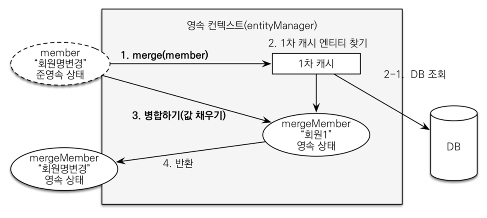

# 변경 감지

> `준영속 엔티티`: 영속성 컨텍스트가 더 이상 관리하지 않는 엔티티로, 영속성 컨텍스트가 제공하는 기능을 사용할 수 없다.

## 준영속 엔티티를 수정하는 2가지 방법

### 변경 감지

`변경 감지`: 영속성 컨텍스트가 관리하는 엔티티의 값을 변경하면 트랜잭션이 커밋되는 시점에 변경 감지 기능이 작동해서 변경된 엔티티를 찾아내고, 변경된 엔티티를 데이터베이스에 업데이트한다.

```java
class Example {
    @Transactional
    void update(Item itemParam) { // itemParam: 파리미터로 넘어온 준영속 상태의 엔티티
        Item findItem = em.find(Item.class, itemParam.getId()); // 같은 엔티티를 조회
        findItem.setPrice(itemParam.getPrice()); // 데이터 수정
        // itemRepository.save(findItem); -> 호출 할 필요 없이 자동으로 commit
    }
}
```

영속성 컨텍스트에서 엔티티를 다시 조회한 후에 데이터를 수정하는 방법으로,  
`Transaction` 안에서 엔티티를 조회하고, 엔티티의 데이터를 변경하면 트랜잭션이 커밋되는 시점에 변경 감지 기능이 작동해서 데이터베이스에 업데이트한다.

### 병합

`병합`: 준영속 상태의 엔티티를 다시 영속 상태로 변경하는 기능



```java
class Example {
    @Transactional
    void update(Item itemParam) { // itemParam: 파리미터로 넘어온 준영속 상태의 엔티티
        Item mergeItem = em.merge(itemParam); // 준영속 상태의 엔티티를 영속 상태로 변경
    }
}
```

1. `merge()` 실행
2. 준영속 상태의 엔티티와 식별자 값으로 1차 캐시에서 엔티티 조회
   1. 1차 캐시에 엔티티가 없으면 데이터베이스에서 조회 후 1차 캐시에 저장
3. 준영속 상태의 엔티티의 값으로 조회된 영속 상태의 엔티티(2번에서 찾은)의 값을 모두 교체
4. 영속 상태의 엔티티를 반환

변경 감지 기능을 사용하면 원하는 속성만 선택해서 변경할 수 있지만, 병합을 사용하면 모든 속성이 변경된다.  
때문에 병합 시 일부 `property`에 값이 없는 경우 `null`로 업데이트 될 위험이 있어 사용하지 않는 것이 좋다.

## 결론

엔티티를 변경할 때는 항상 변경 감지를 사용하자.

- 컨트롤러에서 어설프게 `entity` 생성 금지
- `transaction`이 있는 서비스 계층에 식별자(id)와 변경할 데이터를 명확하게 전달(파라미터 or DTO)
- `transaction` 안에서 데이터베이스에서 엔티티를 조회 후 데이터를 변경
- `transaction` 커밋 시점에 변경 감지가 동작해서 데이터베이스에 UPDATE SQL 실행
- `transaction`이 걸린 서비스 로직(메서드)의 경우 외부에서 식별자 값을 찾고 그 안에서 `entity`를 조회하는 것이 좋다(트랜잭션 내 영속성 보장으로 변경감지 기능 사용 가능)

###### 출처

- https://www.inflearn.com/course/스프링부트-JPA-활용-1