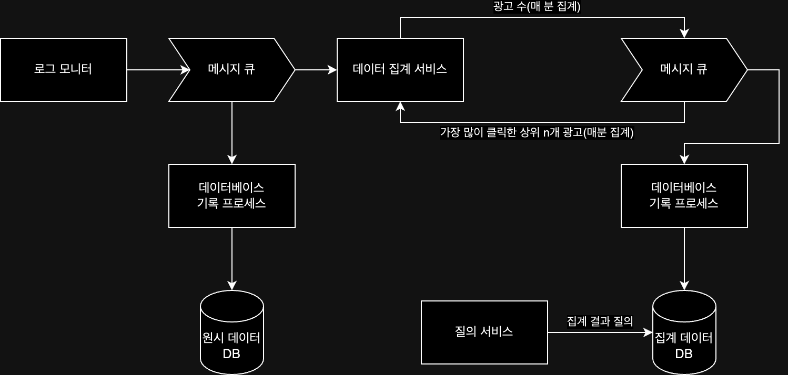

# Design Ad Click Event Aggregation System

## 요구사항

- 클릭 이벤트가 발생할 때마다 로그 파일의 끝에 추가되는 로그 파일 형태의 데이터가 입력됨
- 세 가지 질의 지원
    - 특정 광고에 대한 지난 M분간의 클릭 이벤트 수
    - 특정 기간 동안 가장 많이 클릭된 광고 N개
    - ip / user_id / country 등 속성을 기준으로 위 2개의 질의 결과 필터링
- 엣지 케이스 존재
    - 늦게 도착하는 이벤트 발생 가능성 존재
    - 중복된 이벤트 발생 가능성 존재
    - 시스템 일부 다운 가능성 존재
- 집계 처리는 수 분 내에 완료 필요

매일 10억 개의 광고 클릭 발생과 매일 200만 회의 광고 게재가 발생한다고 가정할 때 아래와 같이 추정할 수 있다.

- 광고 클릭 QPS = 10억 / (24 * 3600) = 11574
- 최대 QPS = 11574 * 5 = 57870
- 일일 저장소 요구량 = 0.1KB * 10억 = 100GB(광고 클릭 이벤트 하나당 0.1KB라고 가정)

## 질의 API 설계

위에서 언급 된 세 가지 질의는 다음과 같다.

- 일정 기간 동안 각 ad_id데 발생한 클릭 수 집계
- 일정 기간 동안 가장 많이 클릭된 N개의 ad_id 목록 반환
- 다양한 속성을 기준으로 집계 결과 필터링

위 세 가지 질의는 두 개의 API로 지원할 수 있다.(필터링은 호출 인자를 통해 지원)

### API 1: 특정 기간 동안 ad_id별 클릭 수 집계

- endpoint: `GET /ads/{:ad_id}/aggregated_count`
- 인자
    - `from`: 집계 시작 시간
    - `to`: 집계 종료 시간
    - `filter`: 필터링 전략 식별자
- 반환 응답
    - `ad_id`: 광고 식별자
    - `count`: 집계된 클릭 횟수

### API 2: 특정 기간 동안 가장 많이 클릭된 N개의 ad_id 목록 반환

- endpoint: `GET /ads/popular`
- 인자
    - `count`: 상위 N개 수
    - `window`: 분 단위로 표현된 집계 윈도 크기
    - `filter`: 필터링 전략 식별자
- 반환 응답
    - `ad_ids`: 광고 식별자 목록

## 데이터 모델

광고 클릭 이벤트 집계 시스템이 다루는 데이터는 원시 데이터와 집계 결과 데이터 두 가지로 나눌 수 있다.

- 원시 데이터
    - `ad_id` / `click_timestamp` / `user_id` / `ip` / `country` 등 클릭 이벤트에 대한 속성
    - 클릭 이벤트가 발생할 때마다 로그 파일의 끝에 추가되는 형태로 입력됨
- 집계 결과 데이터
    - `ad_id` / `click_minute` / `count` / `filter_id` 등 집계 결과에 대한 속성
    - 원시 데이터를 매분 집계하여 저장하는 형태로 저장됨

원시 데이터는 알 수 있듯이 막대한 데이터 용량을 차지하게 되어 비용이 발생할 수 있지만, 원시 데이터와 집계 데이터 둘 다 저장하는 것이 좋다.

- 문제 발생 시 원시 데이터로 디버깅 및 복구 가능
- 집계 데이터는 빠른 질의를 위해 사용
- 오래된 원시 데이터는 냉종 저장소(cold storage)로 옮겨 비용 절감

## 데이터베이스 선택

데이터베이스 선택 시엔 다음과 같은 사항을 고려하여 선택할 수 있다.

- 데이터의 형태(관계형 데이터 / 문서 데이터 / 이진 대형 객체(BLOB) 등)
- 읽기 중심 / 쓰기 중심 / 둘 다
- 트랜잭션 지원 유무
- 질의 과정에서 SUM / COUNT 같은 분석 처리 함수의 잦은 사용 여부

원시 데이터와 집계 데이터의 특성을 고려할 때, 다음과 같은 데이터베이스를 선택할 수 있다.

- 원시 데이터: 쓰기 및 시간 범위 질의에 최적화된 시스템인 카산드라(Cassandra) 사용
    - 일반적인 작업에선 원시 데이터에 대한 질의가 필요 없으나, 사용자 분석 등을 연구하는 경우에는 필요할 수 있음
    - 최대 QPS가 57870의 쓰기 중심 시스템
- 집계 데이터: 쓰기 및 시간 범위 질의에 최적화된 시스템인 카산드라(Cassandra) 사용
    - 시계열 데이터
    - 읽기 연산 / 쓰기 연산 둘 다 많이 사용

마찬가지로 원시 데이터와 같은 이유로 카산드라를 사용할 수 있다.

## 개략적 설계

데이터의 흐름은 다음과 같이 흘러가게 된다.

1. 입력: 로그 모니터의 로그 파일들이 집계
2. 프로세스: 원시 데이터를 집계하여 저장
3. 저장: 집계된 데이터를 저장
4. 질의: API를 통해 질의

위 흐름을 동기식으로 처리하게 된다면, 급작스러운 트래픽 증가에 대응하기 어려울 수 있기 때문에 메시지 큐를 도입하는 것이 좋다.

위 설계안을 보면 두 개의 메시지 큐로 분리하여 데이터베이스에 바로 기록하지 않는 것을 볼 수 있는데, 이는 정확하게 한 번 데이터를 처리하기 위함이다.

## 상세 설계

### 시간

집계를 하기 위해선 타임스탬프가 필요하다. 타임스탬프는 두 가지 위치에서 만들어 질 수 있다.

- 이벤트 발생 시각: 광고 클릭이 발생한 시각
- 처리 시각: 집계 서버가 클릭 이벤트를 처리한 시스템 시각

네트워크 지연이나 비동기적 처리 환경때문에 두 시각 사이의 격차가 커질 수 있으며, 집계에 어떤 시각을 사용하는 것에 따라 장단점이 존재한다.

|    시각     | 장점                    | 단점                                                                  |
|:---------:|:----------------------|:--------------------------------------------------------------------|
| 이벤트 발생 시각 | 광고 클릭 시점을 더 정확히 파악 가능 | 클라이언트 생성 타임스탬프에 의존하는 방식으로, 클라이언트 설정 시각이 잘못되거나 악성 클라이언트에 의해 조작될 수 있음 |
|   처리 시각   | 클라이언트 설정 시각에 의존하지 않음  | 네트워크 지연이나 비동기적 처리 환경 때문에 시간이 달라 집계 결과가 부정확해짐                        |

### 전달 보장

집계 결과는 과금 등에 활용될 수 있어 데이터 정확성과 무결성이 아주 중요하기 때문에 아래 두 가지를 보장할 수 있는 방법이 필요하다.

- 이벤트 중복 처리 회피 방법
- 모든 이벤트 처리 보장 방법

카프카와 같은 메시지 큐는 최대 한 번 / 최소 한 번 / 정확히 한 번 전달 방식을 지원하며, 이 중 정확히 한 번 전달 방식을 사용하는 것이 좋다.

### 데이터 중복 제거

가장 흔하게 발생 할 수 있는 이슈 가운데 하나는 중복된 데이터로, 아래 두 가지 상황에서 중복된 데이터가 발생할 수 있다.

- 악성 클라이언트: 한 클라이언트가 같은 이벤트를 악의적인 의도로 여러 번 전송
    - 중복 이벤트를 처리하는 광고 사기 / 위험 제어 컴포넌트를 두어 이를 방지
- 서버 장애: 집계 도중 집계 서비스 노드에서 장애가 발생하고, 이벤트 메시지에 대해 응답 받지 못하여 다시 전송하여 재차 집계
    - 오프셋을 저장하여 이미 처리된 이벤트를 추적하고, 처리되지 않은 이벤트만 처리할 수 있도록 함

###### 참고자료

- [가상 면접 사례로 배우는 대규모 시스템 설계 기초](https://www.nl.go.kr/seoji/contents/S80100000000.do?schM=intgr_detail_view_isbn&isbn=9788966264339)
