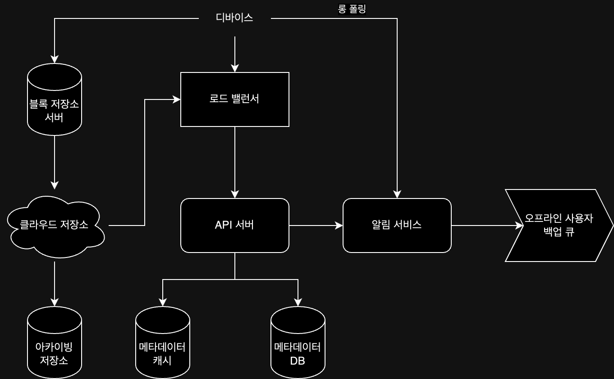
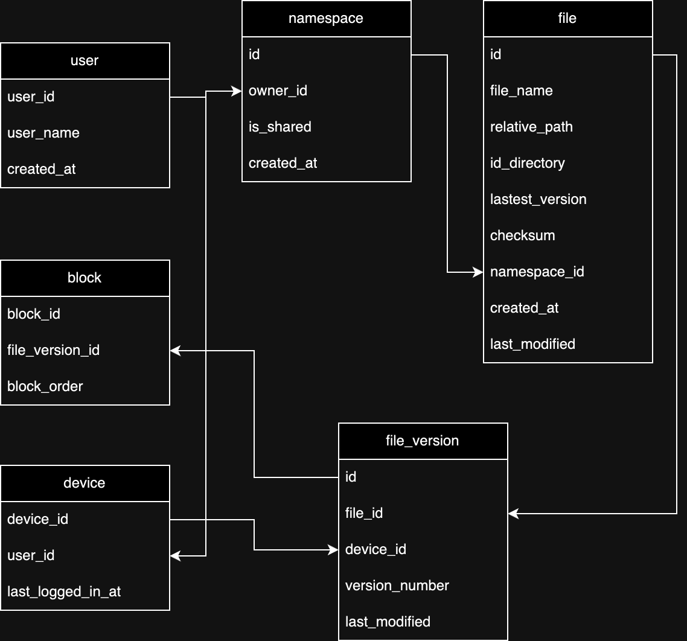

# Design Cloud Storage Service

## 요구사항

- 파일 업로드 / 다운로드 / 동기화, 알림 기능 지원
- 모바일 웹 / 앱 지원
- 파일 암호화 지원
- 파일 크기 10GB 제한
- 높은 가용성 / 규모 확장성 / 안정성
- 빠른 동기화 속도
- 불필요한 네트워크 대역폭 사용 최소화
- 전체 이용자 5,000만명 / DAU 1,000만명
- 모든 사용자에게 10GB의 저장 공간 제공
- 매일 각 사용자 평균 500kb 파일 2개 업로드
- 읽기 쓰기 비율 1:1

클라우드 저장소 서비스를 구현하기 위해 위와 같은 요구사항을 만족해야할 때, 아래와 같이 추정할 수 있다.

- 필요한 저장공간 총량: 5,000만명 * 10GB = 50PB
- 업로드 API QPS = 1,000만명 * 2회 업로드 / 24 / 3600 = 231
- 최대 QPS = 231 * 2(부하를 고려하여) = 460

## 기능 정의

클라우드 저장소 서비스를 구현하기 위한 기능을 API 단위로 나누어 정의하면 다음과 같다.

1. 파일 업로드: 사용자가 파일을 업로드할 수 있는 API
    - `/files/upload`
    - 인자: `{uploadType: 'normal' | 'resumable', data: File}`(normal: 단순 업로드, resumable: 이어 올리기)
2. 파일 다운로드: 사용자가 파일을 다운로드할 수 있는 API
    - `/files/download`
    - 인자: `{path: 'path/to/file'}`
3. 파일 갱신 히스토리 API: 파일 갱신 히스토리를 조회할 수 있는 API
    - `/files/list_revisions`
    - 인자: `{path: 'path/to/file', limit: 10}`(limit: 히스토리 길이 최대치)

## 시스템 설계

클라우드 저장소를 하나의 서버로 구현하게 되면, 결국 금방 용량이 부족해지고, 서버에 장애가 발생하면 서비스 전체가 중단될 수 있기 때문에 다른 방법을 고려해야 한다.

- 데이터 샤딩: 용량 문제는 해결할 수 있지만, 데이터 유실 문제에 대한 대책 필요
- AWS S3: 클라우드 서비스를 이용하면 용량 문제와 데이터 유실 문제를 해결할 수 있지만, 비용 발생

S3를 이용하면 비용이 발생하는 단점이 존재하지만, 아래와 같은 장점을 제공해주고 이미 많은 기업에서 사용하고 있기 때문에 S3를 이용하는 것이 좋다.

- 확장성
- 가용성
- 보안

클라우드 저장소 서비스를 구현하기 위해 위에 언급된 데이터 저장소를 포함한 시스템을 설계하면 다음과 같다.

- 블록 저장소 서버: 여러 블록으로 나뉜 파일을 클라우드 저장소에 업로드하는 서버
    - 각 블록에는 고유한 해시값이 할당되어 해시값을 메타데이터 데이터베이스에 저장
    - 각 블록은 독립적인 객체로 취급되어 클라우드 저장소에 저장
- 클라우드 저장소: 블록 단위로 나뉜 파일을 저장하는 저장소(=S3)
- 아카이빙 저장소: 오랫동안 사용되지 않은 비활성 파일을 저장하는 저장소
- 로드밸런서: 네트워크 트래픽 분산 및 장애 발생 시 서버 우회
- API 서버: 파일 업로드 외 다른 요청 처리(사용자 인증 / 파일 메타데이터 갱신 등)
- 메타데이터 데이터베이스: 사용자 / 파일 / 블록 / 버전 등의 메타데이터 정보 관리
- 알림 서비스: 특정 이벤트 발생 시 사용자에게 알림 전송(파일 추가 / 편집 / 삭제 등)
- 오프라인 사용자 백업 큐: 최신 상태를 확인할 수 없는 오프라인 사용자의 파일을 넣어 접속 시 동기화 가능하도록 함

## 상세 설계

### 블록 저장소 서버 - 네트워크 대역폭 최적화

갱신되는 파일들이 업데이트 될 때마다 전체 파일을 서버로 보내게 되면 불필요한 네트워크 대역폭을 사용하게 되므로, 아래 두 가지 방법을 생각해볼 수 있다.

- 델타 동기화 전략: 파일 수정 발생 시 전체 파일 대신 수정이 일어난 블록만 동기화
- 압축 알고리즘: 블록 단위로 압축해 두어 데이터 크기를 줄임

### 높은 일관성 보장

클라우드 저장소 서비스는 사용자에 따라 다르게 보이면 안되는 강한 일관성을 보장해야 하기 때문에 메타데이터 캐시와 데이터베이스 계층에도 같이 강한 일관성 원칙이 적용되어야 한다.

- 메모리 캐시: 보통 최종 일관성 모델을 지원하기 때문에 추가적으로 아래 사항 보장 필요
    - 캐시에 보관된 사본과 데이터베이스 원본 일치
    - 데이터베이스에 보관된 원본 변경 발생 시 캐시에 있는 사본 무효화
- 데이터베이스: 강한 일관성을 보장하기 쉬운 관계형 데이터베이스 사용

### 메타데이터 데이터베이스

메타데이터 베이스의 스키마를 간략히 나타내면 다음과 같다.

- user: 사용자 기본 정보
- device: 단말 정보
- namespace: 사용자의 루트 디렉토리 정보
- file: 파일의 최신 정보
- file_version: 파일의 갱신 이력, 갱신 이력 훼손을 방지하기 모든 레코드를 읽기 전용으로 관리
- block: 파일 블록에 대한 정보

### 업로드 절차

파일 업로드 요청을 하게 되면 파일 메타데이터 추가와 파일을 클라우드에 저장소에 업로드하는 두 가지 요청이 병렬적으로 진행된다.

- 파일 메타데이터 추가
    1. 새 파일 메타데이터 추가 요청
    2. 새 파일의 메타데이터를 데이터베이스에 저장하고 업로드 상태를 대기로 변경
    3. 새 파일이 추가되었음을 알림 서비스에 전송
    4. 다른 관련된 클라이언트에게 파일이 추가되었음을 알림
- 파일 클라우드 저장소 업로드
    1. 블록 저장소 서버에 업로드 요청
    2. 블록 저장소 서버는 파일을 블록 단위로 쪼갠 뒤 압축 및 암호화하여 클라우드 저장소에 전송
    3. 클라우드 저장소에서 업로드 완료 후 완료 콜백을 API 서버로 전송
    4. API 서버에서 메타데이터 데이터베이스를 완료 상태로 갱신
    5. 알림 서비스는 다른 관련된 클라이언트에게 파일이 업로드되었음을 알림

수정 및 삭제도 위와 같은 방법으로 진행된다.

### 다운로드 절차

파일 다운로드는 파일이 새로 추가되거나 수정되면 자동으로 시작되는데, 수정 및 추가 감지는 아래 두 가지 방법으로 진행된다.

- 접속 중인 경우: 알림 서비스가 클라이언트에게 직접 알림
- 접속 중이 아닌 경우: 알림 서비스가 오프라인 사용자 백업 큐에 추가

클라이언트가 파일 다운로드가 필요함을 인지하면, 아래 절차로 진행된다.

1. 알림을 확인한 클라이언트는 API 서버에 새로운 메타데이터 요청
2. API 서버에서 메타데이터 데이터베이스에서 새 파일 메타데이터를 조회하여 클라이언트에게 반환
3. 클라이언트는 블록 저장소 서버에 블록 다운로드 요청
4. 블록 저장소 서버는 클라우드 저장소에서 블록을 다운로드하여 클라이언트에게 반환
5. 클라이언트는 블록을 조합하여 파일을 재구성

### 알림 서비스

파일 추가 및 수정에 대한 감지 및 알림을 위해 알림 서비스를 이용하는데, 알림 전송 방법으론 두 가지 정도를 고려해볼 수 있다.

- 롱 폴링: 클라이언트가 서버에 연결을 유지하고 있지만, 서버가 응답을 보내거나 타임아웃이 발생할 때까지 연결을 유지하는 방식
- 웹 소켓: 지속적인 통신 채널을 제공하여 양방향 통신 가능

양방향 통신이 필요하지 않고, 알림을 보낼 일이 빈번하지 않기 때문에 롱 폴링 방법을 채택하여도 무방하다.

### 저장소 공간 절약

파일 갱신 이력을 보존하고 안정성을 보장하기 위해선 파일의 여러 버전을 여러 데이터센터에 보관해야하는데, 그렇게 되면 저장용량을 많이 차지하게 된다.  
이를 해결하기 위해 아래 보통 아래 세 가지 방법을 사용한다.

- 중복 제거(de-dupe): 해시 값을 비교하여 중복된 파일 블록을 계정 차원에서 제거하는 방법
- 지능적 백업 전략 도입: 보관해야하는 파일 버전 개수 상한 제한 / 업데이트 될 때마다 모든 버전을 저장하는 것이 아닌 특정 시점의 버전만 저장
- 아카이빙 저장소: 오랫동안 사용되지 않은 파일을 아카이빙 저장소로 이관

### 기타 장애 처리

- 로드밸런서 장애: 부 로드밸런서를 구축하여 로드 밸런서끼리 상태 모니터링
- 블록 저장소 서버 장애: 다른 블록 저장소 서버에서 미완료 혹은 대기 상태 작업을 가져와 처리
- 클라우드 저장소 장애: 여러 지역에 다중화 시켜놓아 장애 발생 시 다른 지역에서 파일 조회
- API 서버 장애: API 서버 다중화
- 메타데이터 캐시 장애: 캐시 서버 다중화
- 메타데이터 데이터베이스 장애
    - 주 데이터 서버 장애: 부 데이터베이스 서버 중 하나를 주 데이터베이스 서버로 승격
    - 부 데이터베이스 서버 장애: 다른 부 데이터베이스 서버로 조회
- 알림 서비스 장애: 유지됐던 롱 폴링을 다른 서버로 전환 시 동시에 롱 폴링 시도하지 않도록 설정
- 오프라인 사용자 백업 큐 장애: 백업 큐 다중화

###### 참고자료

- [가상 면접 사례로 배우는 대규모 시스템 설계 기초](https://kobic.net/book/bookInfo/view.do?isbn=9788966263158)
