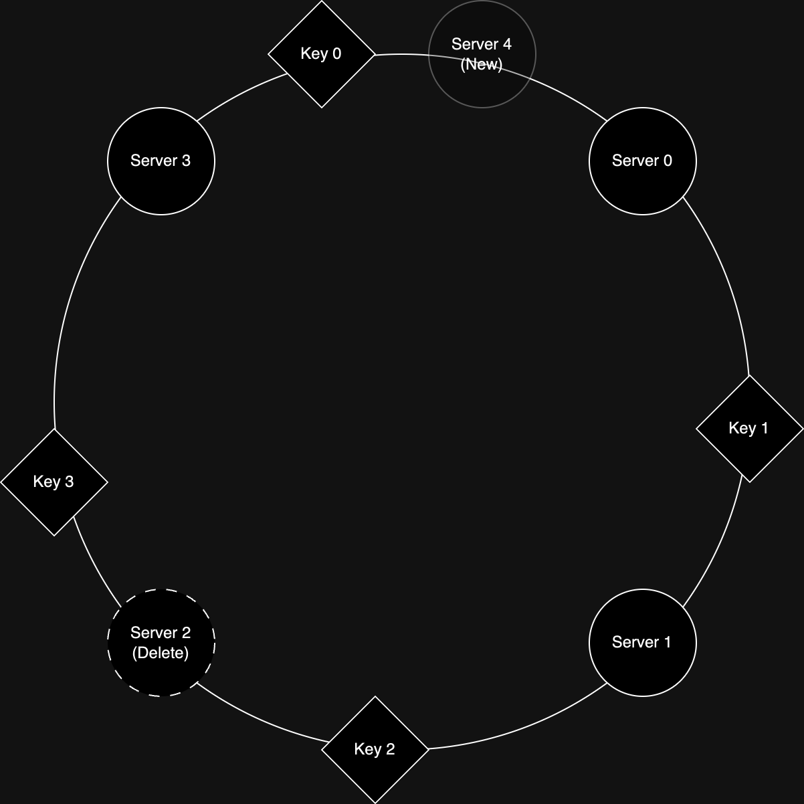
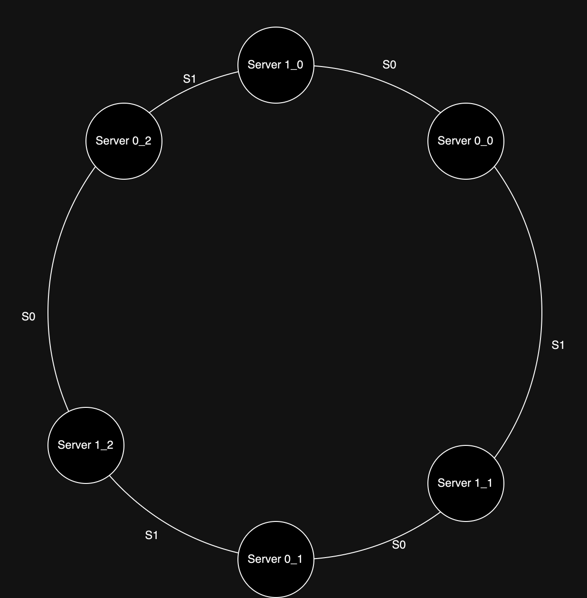

# Design Consistent Hashing

수평적 규모 확장을 위해서는 요청 또는 데이터가 각 서버에 균등하게 분배되는 것이 중요하다.  
안정 해시는 이러한 목적을 달성하기 위해 보편적으로 사용되는 해시 방식이다.

## 해시 키 재배치(refresh) 문제

서버들의 부하를 균등하게 나누기 위해 간단한 해시 함수를 사용할 수 있다.(`serverIndex = hash(key) % serverCount`)  
이 방법은 서버 풀의 크기가 고정되어 있거나, 데이터 분포가 균등할 때는 잘 동작하지만 다음의 경우 문제가 발생한다.

1. 서버가 삭제되거나 추가되는 상황 발생
2. 서버 풀의 크기가 변경되어 serverIndex가 변경
3. 기존 요청이 다른 서버에 전달되어 대규모 캐시 미스가 발생

기존 해시 함수는 이 문제가 발생하여, 안정 해시를 사용하여 이 문제를 효과적으로 해결하고 있다.

## 안정해시 키 재배치 방법

안정 해시는 해시 테이블 크기가 조정 될 때 대부분 재배치되는 전통적 해시 테이블과는 다르게 오직 `키의 개수/슬롯의 개수`만큼의 키만 재배치하면 된다.  
해시 공간의 범위를 링 형태로 표현하고, 각 서버와 키를 이 링 상에 배치하여 키를 서버에 할당하는 방식을 사용한다.

각 키는 나머지 연산이 아닌, 해당 키의 위치로부터 시계 방향으로 링을 탐색하여 가장 가까운 서버에 할당하게 된다.

- 서버 추가 시: `Key 0`만 `Server 0`에서 `Server 4`로 재배치
- 서버 삭제 시: `Key 2`만 `Server 2`에서 `Server 3`로 재배치

## 가상 노드(virtual node)

재배치 문제는 해결되었으나, 파티션의 크기 불균등 문제나 키가 불균등하게 분포되어 하나의 서버에 너무 많은 키 혹은 너무 적은 키가 할당되는 문제가 발생할 수 있다.  
이를 해결하기 위해 가상 노드라는 기법을 사용한다.

사진으론 세 개의 가상 노드를 할당했지만 실제로는 훨씬 큰 값을 사용하여 균등하게 할당할 수 있도록 한다.(늘릴수록 균등해지지만 가상 노드를 위한 데이터 공간이 커지게 됨) 

###### 참고자료

- [가상 면접 사례로 배우는 대규모 시스템 설계 기초](https://kobic.net/book/bookInfo/view.do?isbn=9788966263158)
