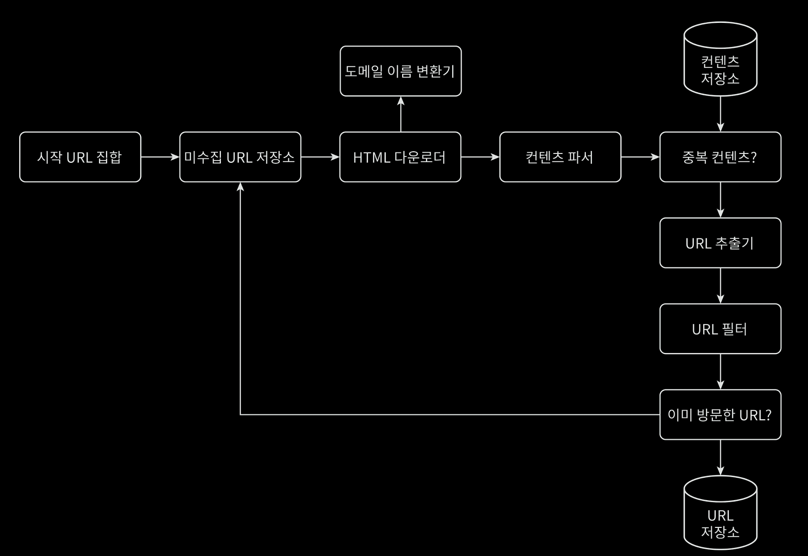

## Web Crawler

웹 크롤러는 웹 페이지를 탐색하고 정보를 수집하는 기술로, 다양하게 이용된다.

- 검색 엔진 인덱싱: 가장 보편적인 용례로, 웹 페이지를 모아 검색 엔진을 위한 로컬 인덱스 생성 목적
- 웹 아카이빙: 나중에 사용하기 위한 장기보관 목적
- 웹 마이닝: 인터넷 웹의 유용한 지식을 추출하기 위한 목적
- 웹 모니터링: 인터넷에서 저작권이나 상표권이 침해되는 것을 감지하기 위한 목적

웹 크롤러는 처리해야 할 데이터의 규모에 따라 시스템의 복잡도도 달라지기 때문에, 주 목적과 수집해야할 데이터의 양을 고려하여 설계해야 한다.

## 요구사항 및 개략적 추정

- 검색 엔진 인덱싱 수집 목적
- 매달 10억 개의 웹 페이지 수집
- 수집한 웹 페이지는 5년간 보관
- 규모 확정성 용이
- 크롤링 시 안정성 보장(무반응 서버 / 장애 / 악성 코드 등)
- 수집 대상 웹 사이트에 불필요한 요청 X
- 중복된 컨텐츠는 무시

웹 크롤러가 위와 같은 요구사항을 만족해야할 때, 아래와 같이 추정해볼 수 있다.

- QPS = 10억 / 30일 / 24시간 / 60분 / 60초 = 385/초, 최대 QPS = 385 * 2 = 770/초
- 레코드 수: 10억 * 12개월 * 5년 = 600억
- 저장 용량: (평균 웹 페이지 크기 500k 가정) 600억 * 500k = 300PB

## 설계 및 수집 플로우

웹 크롤러 설계 시 위와 같이 컴포넌트를 나누어 설계할 수 있다.

- 시작 URL 집합: 웹 크롤러가 크롤링을 시작하는 URL 집합
- 미수집 URL 저장소: 현대적 웹 크롤러는 크롤링 크롤링 상태를 다운로드할 URL / 다운로드 된 URL 두 가지로 나눠 관리하는데, 다운로드할 URL에 해당하는 URL 저장소
- HTML 다운로더: 웹 페이지를 다운로드
- 도메인 이름 변환기: URL을 IP 주소로 변환
- 컨텐츠 파서: 웹 페이지를 파싱하고, 올바른 웹 페이지인지 확인
- 중복 컨텐츠: 중복된 컨텐츠를 확인
    - 문자열로 보고 비교하는 것이 가장 정확하고 간단하지만, 느리기 때문에 해시 값을 비교하는 방법 사용
- 컨텐츠 저장소: 다운로드한 웹 페이지를 저장
- URL 추출기: HTML 페이지를 파싱하여 새로운 URL을 추출
    - 예시: 상대 경로인 `/wiki/platypus`를 `https://en.wikipedia.org/wiki/platypus`로 변환
- URL 필터: 특정한 컨텐츠 타입이나 파일 확장자를 갖는 URL / 접속 시 오류 발생 URL / 제외 목록에 포함된 URL 등을 필터링
- 이미 방문한 URL: 이미 방문한 URL인지 확인하여 같은 URL 여러 번 방문하는 것을 방지
- URL 저장소: 다운로드된 URL을 저장

위 컴포넌트로 구성된 웹 크롤러의 작업 흐름을 간략하게 요약하면 다음과 같다.

1. 시작 URL들을 미수집 URL 저장소에 저장
2. HTML 다운로더에서 미수집 URL 저장소에서 URL 목록을 가져옴
3. 도메인 이름 변환기를 사용하여 URL의 IP 주소로 변환 후 웹페이지 다운로드
4. 컨텐츠 파서에서 다운된 HTML 페이지를 파싱하여 올바른 웹 페이지인지 검증
5. 검증 후 중복 컨텐츠인지 확인
6. 중복 컨텐츠인지 확인하기 위해 컨텐츠 저장소에서 해시 값을 비교
    - 이미 저장소에 있는 경우 처리하지 않고 버림
7. URL 추출기에서 해당 HTML 페이지에서 링크를 추출
8. 추출된 링크를 URL 필터로 전달
9. 필터링을 거친 후 남은 URL들 중 이미 방문한 URL인지 확인
    - 이미 방문한 URL인 경우 처리하지 않고 버림
10. 저장소에 없는 URL인 경우 URL 저장소에 저장 후 미수집 URL 저장소에 전달
11. 전달된 URL들을 대상으로 다시 2번으로 돌아가 반복

## 상세 설계

### DFS vs BFS

하나의 웹 페이지 안엔 여러 링크가 존재하고, 이 링크들은 다른 웹 페이지로 연결되어 있어, 하나의 유향 그래프라고 볼 수 있다.  
때문에 크롤링 프로세스도 이러한 유향 그래프를 탐색하는 과정이라 볼 수 있어, DFS와 BFS 중 어떤 방식으로 탐색할지 결정해야 한다.

- DFS: 그래프 크기가 클 경우 어느 정도로 깊숙이 탐색하게 될지 가늠하기 어렵기 때문에 잘 사용하지 않음
- BFS: 보통 사용하는 방식이지만, 아래 두 가지 문제가 발생할 수 있음
    - 예의(politeness): 하나의 페이지에서 나오는 링크 중 상당 수는 같은 서버로 연결되어 있어, 같은 서버에 대한 요청이 많아질 수 있음(해당 서버에 부하 발생)
    - 우선순위: 모든 웹 페이지가 같은 수준의 품질이나 중요성을 갖지 않지만, 표준적 BFS는 우선순위가 없어 여러 척도(페이지 순위 / 트래픽 양 등)에 따른 우선순위 필요

때문에 크롤링 알고리즘 구현 시 BFS를 사용하되, 위 두 가지 문제를 해결하기 위해 미수집 URL 저장소를 활용할 수 있다.

### 미수집 URL 저장소

전면 큐로 우선순위 결정 과정을 처리한 뒤, 후면 큐로 크롤러가 예의 바르게 동작하도록 보증하여 예의(politeness)와 우선순위 문제를 해결할 수 있다.

#### 우선순위

크롤러 입장에서는 중요한 페이지를 먼저 수집하도록 하는 것이 좋은데, 이를 위해서 순위 결정 장치를 추가할 수 있다.  
순위 결정 장치는 유용성에 따라 URL 우선순위를 나눌 때는 페이지랭크 / 트래픽 양 / 갱신 빈도 등 다양한 척도에 따라 URL 우선순위를 정하도록 한다.

- 순위 결정 장치(prioritizer): URL을 입력으로 받아 우선순위 계산
- 큐: 우선순위별로 큐 하나씩 할당
- 큐 선택기: 임의 큐에서 처리할 URL을 꺼내는 작업 수행, 순위가 높은 큐에서 더 자주 꺼내도록 설계

#### 예의(politeness)

예의(politeness) 문제를 해결하기 위해선 동일 웹 사이트에 대해서는 한 번에 한 페이지만 요청해야 한다.  
미수집 URL 저장소를 설계할 때, 다음과 같은 컴포넌트들로 해당 문제를 해결할 수 있다.

- 큐 라우터: 같은 호스트에 속한 URL이 언제나 같은 큐로 라우팅되도록 보장
- 매핑 테이블: 호스트 이름과 큐 사이의 관계를 저장하는 테이블
- FIFO 큐: 같은 호스트에 속한 URL은 같은 큐에 보관(호스트 별로 큐를 생성하여 관리)
- 큐 선택기: 큐들을 순회하면서 큐에서 URL을 꺼내어 지정된 작업 스레드에 전달
- 작업 스레드: 전달된 URL을 다운로드하는 작업 수행

웹사이트 호스트명과 다운로드 수행 작업 스레드 사이의 관계를 유지하면서, 각 작업 스레드는 별도 FIFO 큐를 가지고, 해당 큐에서 꺼낸 URL만 다운로드하도록 설계할 수 있다.

### HTML 다운로더

HTML 다운로더에서도 성능을 최적화하기 위해 여러 가지 방법을 사용할 수 있다.

- Robots.txt 캐싱: 크롤러가 수집해도 되는 페이지 목록들이 존재하는 `Robots.txt` 파일을 여러 번 다운로드하는 것을 피하기 위해, 주기적으로 다운받아 캐시에
  저장하는 방법을 사용할 수 있다.
- 분산 크롤링: 크롤링 작업을 여러 서버에 분산하여 수행
- 도메인 이름 결과 캐시: 도메인 이름 변환기에서 받은 결과를 캐시에 저장
- 지역성: 크롤링 대상 서버와 지역적으로 가까운 서버에 위치한 크롤러 사용
- 짧은 타임아웃: 웹 서버는 항상 응답을 빠르게 하지 않기 때문에 최대 얼마나 기다릴지 결정하는 타임아웃을 설정

또한 다운로드 시 안정성도 중요하기 때문에 아래의 방법을 사용할 수 있다.

- 안정 해시: 다운러도 서버들에 부하 분산 적용시 사용
- 크롤링 상태 및 수집 데이터 저장: 장애 발생 시 쉽게 복구할 수 있도록 지속적 저장장치에 기록

###### 참고자료

- [가상 면접 사례로 배우는 대규모 시스템 설계 기초](https://www.nl.go.kr/seoji/contents/S80100000000.do?schM=intgr_detail_view_isbn&page=1&pageUnit=10&schType=simple&schStr=%EA%B0%80%EC%83%81+%EB%A9%B4%EC%A0%91+%EC%82%AC%EB%A1%80%EB%A1%9C+%EB%B0%B0%EC%9A%B0%EB%8A%94+%EB%8C%80%EA%B7%9C%EB%AA%A8&isbn=9788966263240&cipId=228421467%2C)
