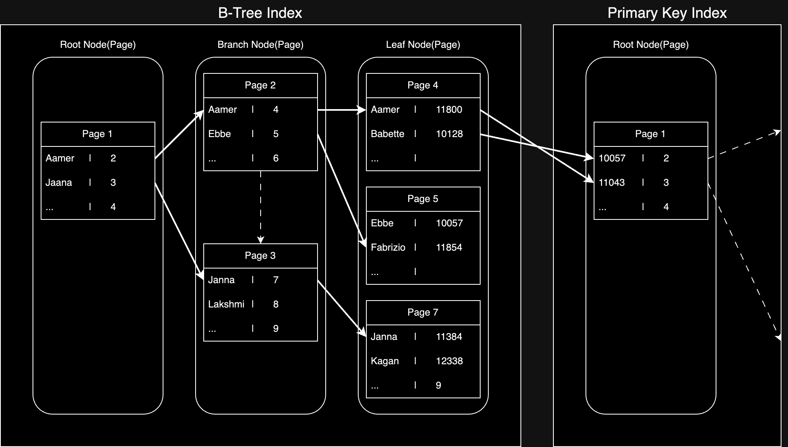

# Architecture(아키텍처)

MySQL 서버는 크게 MySQL 엔진과 스토리지 엔진으로 구성된다.

- MySQL 엔진: 클라이언트로부터 접속 및 쿼리 요청을 처리
    - 커넥션 헨들러 / SQL 파서 / 전처리기 / 옵티마이저 등을 중심으로 구성
    - 하나의 MySQL 서버에는 하나의 MySQL 엔진만 존재
- 스토리지 엔진: 실제 데이터를 디스크 스토리지에 저장하고 읽어오는 역할
    - 하나의 MySQL 서버에는 여러 개의 스토리지 엔진을 동시에 사용할 수 있음

## 스레딩 구조

MySQL 서버는 프로세스 기반이 아닌 스레드 기반으로 동작하며, 포그라운드(Foreground) 스레드와 백그라운드(Background) 스레드로 구분된다.

- 포그라운드 스레드(클라이언트 스레드): 클라이언트 사용자가 요청하는 쿼리 문장을 처리하는 스레드
    - 최소 MySQL 서버에 접속된 클라이언트 수만큼 존재
    - 요청을 처리 후 커넥션을 종료하면 해당 커넥션을 담당하는 스레드는 다시 스레드 캐시(Thread Cache)에 반환
    - 여기서 이미 스레드 캐시에 일정 개수 이상의 대기 스레드가 있으면, 캐시에 넣지 않고 스레드를 종료 시켜 일정 개수의 스레드만 캐시에 유지
    - 캐시에 유지되는 최대 스레드 개수는 `thread_cache_size` 시스템 변수로 설정 가능
- 백그라운드 스레드: MySQL 서버의 여러 작업을 처리하는 스레드
    - 인서트 버퍼(Insert Buffer)를 병합하는 스레드
    - 로그를 디스크로 기록하는 스레드(Log Thread)
    - InnoDB 버퍼 풀의 데이터를 디스크에 기록하는 스레드(Write Thread)
    - 데이터를 버퍼로 읽어 오는 스레드
    - 잠금이나 데드락을 모니터링하는 스레드

## 메모리 구조

MySQL 서버는 글로벌 메모리 영역과, 로컬 메모리 영역으로 구분된다.

- 글로벌 메모리 영역: 클라이언트 스레드 수와 무관하게 하나의 메모리 공간만 할당되며, 모든 클라이언트 스레드가 공유하는 메모리 영역
- 로컬 메모리 영역: 세션 메모리 영역이라고도 하며, MySQL 서버상에 존재하는 클라이언트 스레드가 쿼리를 처리하는 데 사용하는 메모리 영역

## 쿼리 실행 구조

MySQL 서버는 클라이언트로부터 쿼리를 받으면 다음과 같은 과정을 거쳐 쿼리를 처리한다.

1. SQL 요청
2. 쿼리 파서
    - 사용자 요청으로 들어온 쿼리 문장을 토큰(MySQL 인식 최소 단위)을 분리해 트리 형태 구조로 만드는 작업
    - 쿼리 문장의 기본 문법을 검사하고, 문법에 맞지 않는 문장이면 에러를 반환
3. 전처리기
    - 파서 과정에서 만들어진 파서 트리를 기반으로 쿼리 문장에 구조적인 문제점 있는지 검사
    - 각 토큰을 테이블 이름이나 칼럼 이름 또는 내장 함수와 같은 개체를 매핑해 해당 객체 존재 여부 및 접근 권한 등 확인
4. 옵티마이저
    - 쿼리 문장을 저렴한 비용으로 처리할 수 있는 최적의 실행 계획을 생성
5. 쿼리 실행 엔진
    - 옵티마이저의 명령을 받아 각 핸들러에 쿼리를 전달
6. 스토리지 엔진(핸들러)
    - 서버 가장 밑단에서 MySQL 실행 엔진의 요청에 따라 데이터를 읽고 쓰는 역할
    - 스토리지 엔진은 핸들러를 의미
7. SQL 응답

## InnoDB 스토리지 엔진 아키텍처

InnoDB는 MySQL에서 가장 많이 사용되는 스토리지 엔진으로, MySQL 스토리지 엔진 중 거의 유일하게 레코드 기반 잠금 제공하여 높은 동시성 처리가 가능하다.  
InnoDB의 주요 특징들과 장점은 아래와 같다.

### PK 기반 저장

- PK 기반으로 테이블에 저장되기 때문에 PK가 필수적으로 존재해야 함
- 실제론 PK 없이 테이블을 생성할 수 있지만, 내부적으론 아래의 규칙에 따라 PK로 사용할 컬럼을 결정
    1. 지정된 PK를 사용
    2. PK가 없다면 NOT NULL + 유니크 인덱스 중 첫 번째 컬럼을 PK로 사용
    3. 둘 다 해당하지 않는다면 AUTO_INCREMENT를 사용한 유니크 컬럼을 추가하여 PK로 사용(노출되지 않으며 쿼리에서 사용 불가능)

### PK에 의한 클러스터링

- 유사한 PK(Primary Key)끼리 물리적인 위치에 클러스터링하여 저장하여 PK 값의 순서대로 디스크에 저장되어 있어 PK를 이용한 레인지 스캔을 우선적으로 사용
- 장점
    - PK만으로 데이터 레코드를 찾아올 수 있어 다른 인덱스를 통한 조회보다 빠름
    - 연속 조회 시에도 디스크에 PK 값의 순서대로 저장되어 랜덤 IO가 아닌 순차 IO로 읽어오기 때문에 성능 향상
        - 실행 계획에서 다른 보조 인덱스보다 PK를 이용한 레인지 스캔을 우선적으로 사용
- 단점
    - 물리적인 위치를 순차적으로 유지해야 하기 때문에 레코드의 삽입/삭제 시 성능 저하
    - 모든 인덱스가 PK에 의존하여 PK 값이 큰 경우 인덱스의 크기가 커지게 되면서 페이지의 양도 많아짐

### 인덱스를 통한 PK와 레코드 접근

- 리프노드에 저장된 PK 값으로 실제 레코드를 읽어오는 방식으로 동작하여, 두 번의 작업이 필요
    1. 인덱스 키를 통해 리프 노드를 찾아 PK 값을 찾아냄
    2. PK 값을 통해 실제 레코드를 찾아냄
- 반면에, MyISAM은 리프노드가 데이터를 바로 가리키고 있음
    - 이 방식은 PK가 변경될 때 레코드의 주소가 변경되는데 그 때마다 모든 인덱스에 저장된 레코드 주소를 변경해야 하기 때문에 성능 저하가 발생

### 외래키 지원

- 외래키를 이용한 무결성 제약 조건을 지원하여 데이터 무결성 보장
- `foreign_key_checks` 시스템 변수를 OFF 하여 제약 조건에 대한 검사를 생략할 수 있게 변경 가능

### 언두 로그(Undo log)

- DML 작업을 수행할 때마다 이전 버전의 데이터를 별도로 백업하는 기능
- 트랜잭션을 롤백해야할 때 이전 데이터를 복구하기 위해 사용
- 트랜잭션 격리 수준에 맞게 데이터를 읽어오기 위해 사용
- DML을 실행한 트랜잭션이 완료될 때 삭제되는 것이 아닌, 해당 레코드에 접근한 모든 트랜잭션이 완료될 때 삭제

### MVCC(Multi-Version Concurrency Control) 지원

- 언두 로그를 이용하여 하나의 레코드에 대해 여러 개의 버전을 관리하는 기능
- 여러 버전이 있기 때문에 트랜잭션 격리 수준에 따라 다른 레코드를 읽어 올 수 있음

### 잠금 없는 일관된 읽기(Non-Locking Consistent Read) 지원

- 다른 트랜잭션이 가지고 있는 잠금을 기다리지 않고 읽기 작업을 수행할 수 있는 기능
- MVCC 기능을 사용해 이용하여 잠금된 레코드의 언두 로그를 읽어오는 방식으로 구현
- 락을 걸지 않는 순수한 SELECT 쿼리를 사용하여 읽기 작업을 수행할 때 사용됨

### 자동 데드락 감지

- InnoDB 스토리지 엔진의 데드락 감지 스레드가 주기적으로 데드락을 감지
- 일반적으로 데드락이 발생하면 교착 상태에 빠진 트랜잭션 중 언두 로그가 가장 작은 트랜잭션을 롤백(롤백 시 처리량이 가장 적기 때문)

### 장애 복구 자동화

- 손실이나 장애로부터 데이터를 보호하기 위한 기능이 내장되어, 장애 복구를 위한 자동화된 기능을 제공

### InnoDB 버퍼 풀

- InnoDB의 가장 핵심적인 부분으로, 디스크 데이터 파일이나 인덱스 정보를 메모리에 캐시해 두는 공간
- 쓰기 작업을 지연시켜 일괄 작업으로 처리할 수 있게 해주는 버퍼 역할도 수행
- DML 작업 시 변경 데이터를 모아서 처리하게 해주어 랜덤 디스크 작업을 줄여 성능 향상

### 체인지 버퍼

- 레코드가 INSERT / UPDATE 될 때 인덱스를 변경해야하는데, 이 때 디스크 I/O 작업이 생겨 성능 저하가 발생
- 변경해야 할 인덱스 페이지를 디스크에 기록하는 체인지 버퍼라는 임시 공간에 저장하여 지연시켜 성능 향상
- 체인지 버퍼에 저장된 변경 내용은 백그라운드 스레드에 의해 반영
- 유니크 인덱스는 중복 여부를 체크해야 하기 때문에 체인지 버퍼 사용이 불가능

### 어댑티브 해시 인덱스

- 자주 읽히는 데이터 페이지의 키 값을 이용해 해시 인덱스를 생성하여 빠르게 읽을 수 있게 해주는 기능
- B-Tree 검색 시간을 줄여주기 위해 도입된 기능으로, 리프 노드까지 탐색하는 비용을 줄여주어 속도 향상 및 자원 사용량 감소 효과

## 그 외

- MySQL 8.0 이전에는 쿼리 캐시 기능이 존재했으나, 현재 8.0 버전에서는 동시 처리 성능 저하로 인해 완전히 제거되고 사용하지 않음

###### 참고자료

- [Real MySQL 8.0 (1권)](https://kobic.net/book/bookInfo/view.do?isbn=9791158392703)
