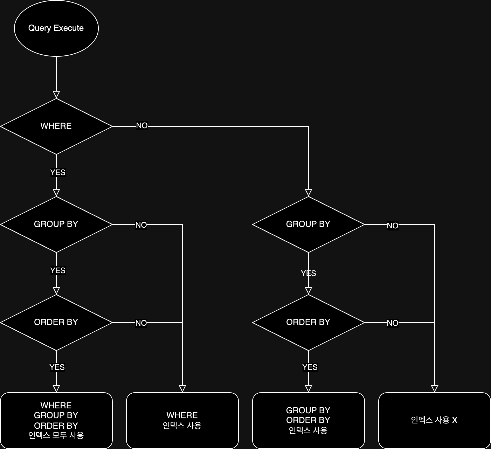

# SELECT

일반적으로 INSERT / UPDATE / DELETE 는 거의 레코드 단위로 발생하기 떄문에 성능상 문제가 없다.  
하지만 SELECT는 여러 개의 테이블로부터 데이터를 가져오기 때문에 어떤 방식으로 데이터를 가져올지에 따라 성능이 크게 달라진다.

## SELECT 절의 인덱스 사용

### 인덱스 사용을 위한 기본 규칙

기본적으로 컬럼의 값 자체를 변환하지 않고 그대로 사용하는 조건을 만족해야 인덱스를 정상적으로 사용할 수 있다.

```mysql
# 인덱스 사용 불가
SELECT *
FROM salaries
WHERE salary * 10 > 1000000;

# 인덱스 사용 가능
SELECT *
FROM salaries
WHERE salary > 1000000 / 10;
```

또한 비교 대상이 다른 타입을 가지게 되면 내부적으로 형 변환이 발생하게 되는데 이 경우에도 인덱스를 사용할 수 없다.

### WHERE 절의 인덱스

WHERE 조건에서 여러 개의 컬럼을 조합하여 사용하는 경우에는 인덱스를 어떻게 구성하느냐에 따라 성능이 크게 달라진다.  
여기서 실제로 작성 된 순서로 인덱스가 구성되는 것이 아니라 인덱스의 컬럼 순서에 따라 최적화 수행을 하게 되기 때문에 인덱스의 컬럼 순서를 잘 고려해야 한다.
여기서 위의 설명은 모두 AND 조건에 해당하는 경우이며, OR 조건의 경우에는 처리 방식이 바뀌게 된다.

```mysql
SELECT *
FROM employees
WHERE first_name = 'Platypus' # 인덱스 사용 가능
   OR last_name = 'Ogu'; # 인덱스 사용 불가능
```

만약 WHERE 조건에 OR 조건이 걸려있고, 위와 같이 인덱스가 설정 되어있는 경우 AND의 경우 `first_name` 인덱스를 사용할 수 있지만,  
OR 연산자가 적용되어 각 조건이 별개로 처리되기 때문에 풀 테이블 스캔이 발생하게 된다.

### GROUP BY 절의 인덱스

GROUP BY 절에서는 인덱스를 사용하기 위해선 아래의 조건을 만족해야 한다.

- GROUP BY 절에 명시된 컬럼이 인덱스 컬럼 순서와 위치가 동일해야 한다.
- 인덱스 구성 컬럼 중 뒤쪽에 있는 컬럼은 GROUP BY 절에 명시되지 않아도 인덱스를 사용할 수 있지만, 앞쪽에 있는 컬럼이 GROUP BY 절에 명시되지 않으면 인덱스를 사용할 수 없다.

### ORDER BY 절의 인덱스

GROUP BY 처리 방법과 비슷하며 기본적으로 위의 GROUP BY 절의 인덱스를 사용할 수 있는 조건을 따르게 되며 추가적으로 아래의 조건을 만족해야 한다.

- ORDER BY 절에 명시된 모든 컬럼이 오름차순이거나 내림차순으로 정렬되어야 한다.

### WHERE + ORDER BY(or GROUP BY) 절의 인덱스

WHERE 절과 ORDER BY 절을 동시에 사용하는 경우에는 아래의 방법으로 인덱스를 이용하게 된다.

- WHERE 절만 인덱스 이용
    - ORDER BY 절은 인덱스를 이용한 정렬이 불가능하며, WHERE 절의 대상 컬럼이 인덱스에 포함돼 있을 때 사용 가능
    - WHERE 인덱스를 통해 조회된 결과를 별도로 정렬하는 방식으로 처리된다.
    - WHERE 절 조건에 일치하는 레코드 건수가 적을 수록 성능이 좋다.
- ORDER BY 절만 인덱스 이용
    - WHERE 절은 인덱스를 이용한 조회가 불가능하며, ORDER BY 절의 정렬 대상 컬럼이 인덱스에 포함돼 있을 때 사용 가능
    - ORDER BY 절의 순서대로 인덱스를 읽으면서 레코드 한 건씩 WHERE 조건에 일치하는지 확인하는 방식으로 처리된다.
- WHERE 절 + ORDER BY 절 동시에 같은 인덱스 이용
    - WHERE 절의 `범위` 비교 조건에서 사용하는 컬럼과 ORDER BY 절의 정렬 대상 컬럼이 모두 하나의 인덱스에 연속해서 포함돼 있을 때 사용 가능
    - WHERE 절의 `동등` 비교 조건으로 사용하는 컬럼과 ORDER BY 절에 정렬 대상 컬럼이 중첩 상관 없이 인덱스 순서대로 포함돼 있을 때 사용 가능
    - 제일 빠른 성능을 보이기 때문에 가능하다면 이 방법을 사용하는 것이 좋다.

```mysql
# 1
SELECT *
FROM tb_test
WHERE COL_1 = 10
ORDER BY COL_2, COL_3;

# 2
SELECT *
FROM tb_test
WHERE COL_1 = 10
ORDER BY COL_1, COL_2, COL_3;
```

위 쿼리는 동등 비교이기 때문에 1번에서 COL_1 GROUP BY 절에 추가하더라도 정렬 순서에 변화가 없어(COL_1에 대한 데이터가 한 건이기 때문) 쿼리 실행 결과가 같다.  
때문에 옵티마이저에서 실행 계획을 최적화하여 WHERE + GROUP BY 절 인덱스 사용 방식으로 처리할 수 있게 된다.

```mysql
# 1
SELECT *
FROM tb_test
WHERE COL_1 > 10
ORDER BY COL_2, COL_3;

# 2
SELECT *
FROM tb_test
WHERE COL_1 > 10
ORDER BY COL_1, COL_2, COL_3;
```

하지만 위 쿼리는 범위 비교이기 때문에 COL_1 > 10 을 만족하는 레코드가 여러 개 일 수 있기 때문에,  
1번은 정렬을 할 때 인덱스를 사용할 수 없게 되고, 2번은 그대로 모두 인덱스를 사용할 수 있게 된다.

### GROUP BY + ORDER BY 절의 인덱스

GROUP BY 절과 ORDER BY 절에 명시된 컬럼의 순서와 내용이 모두 같아야 인덱스를 사용할 수 있다.  
만약 둘 중 하나라도 인덱스를 이용할 수 없을 경우 모두 인덱스를 사용할 수 없다.

### WHERE + GROUP BY + ORDER BY 절의 인덱스

위의 규칙이 모두 적용되며, 그 흐름은 아래와 같다.



###### 참고자료

- [Real MySQL 8.0 2 - 개발자와 DBA를 위한 MySQL 실전 가이드](https://www.nl.go.kr/seoji/contents/S80100000000.do?schM=intgr_detail_view_isbn&page=1&pageUnit=10&schType=simple&schStr=Real+MySql+8.0&isbn=9791158392727&cipId=228440238%2C)