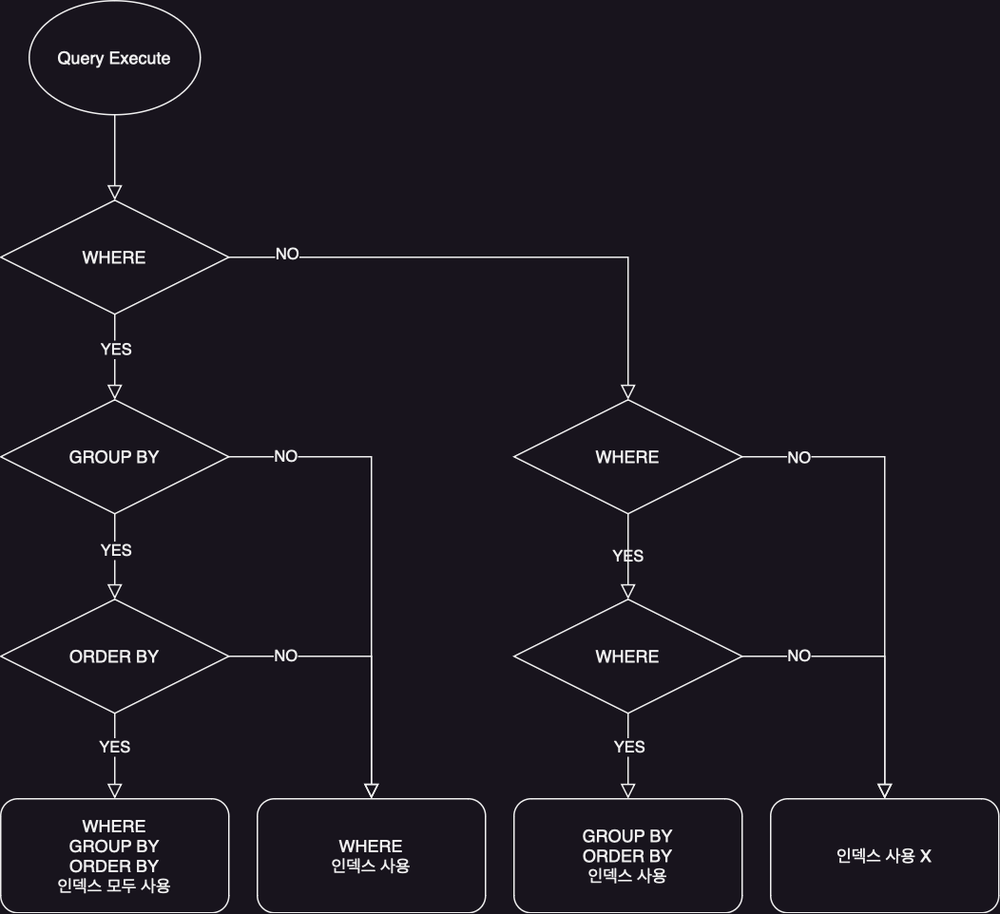

# SELECT

일반적으로 INSERT / UPDATE / DELETE 는 거의 레코드 단위로 발생하기 떄문에 성능상 문제가 없다.  
하지만 SELECT는 여러 개의 테이블로부터 데이터를 가져오기 때문에 어떤 방식으로 데이터를 가져올지에 따라 성능이 크게 달라진다.

## SELECT 절의 인덱스 사용

### 인덱스 사용을 위한 기본 규칙

기본적으로 컬럼의 값 자체를 변환하지 않고 그대로 사용하는 조건을 만족해야 인덱스를 정상적으로 사용할 수 있다.

```mysql
# 인덱스 사용 불가
SELECT *
FROM salaries
WHERE salary * 10 > 1000000;

# 인덱스 사용 가능
SELECT *
FROM salaries
WHERE salary > 1000000 / 10;
```

또한 비교 대상이 다른 타입을 가지게 되면 내부적으로 형 변환이 발생하게 되는데 이 경우에도 인덱스를 사용할 수 없다.

### WHERE 절의 인덱스

WHERE 조건에서 여러 개의 컬럼을 조합하여 사용하는 경우에는 인덱스를 어떻게 구성하느냐에 따라 성능이 크게 달라진다.  
여기서 실제로 작성 된 순서로 인덱스가 구성되는 것이 아니라 인덱스의 컬럼 순서에 따라 최적화 수행을 하게 되기 때문에 인덱스의 컬럼 순서를 잘 고려해야 한다.
여기서 위의 설명은 모두 AND 조건에 해당하는 경우이며, OR 조건의 경우에는 처리 방식이 바뀌게 된다.

```mysql
SELECT *
FROM employees
WHERE first_name = 'Platypus' # 인덱스 사용 가능
   OR last_name = 'Ogu'; # 인덱스 사용 불가능
```

만약 WHERE 조건에 OR 조건이 걸려있고, 위와 같이 인덱스가 설정 되어있는 경우 AND의 경우 `first_name` 인덱스를 사용할 수 있지만,  
OR 연산자가 적용되어 각 조건이 별개로 처리되기 때문에 풀 테이블 스캔이 발생하게 된다.

### GROUP BY 절의 인덱스

GROUP BY 절에서는 인덱스를 사용하기 위해선 아래의 조건을 만족해야 한다.

- GROUP BY 절에 명시된 컬럼이 인덱스 컬럼 순서와 위치가 동일해야 한다.
- 인덱스 구성 컬럼 중 뒤쪽에 있는 컬럼은 GROUP BY 절에 명시되지 않아도 인덱스를 사용할 수 있지만, 앞쪽에 있는 컬럼이 GROUP BY 절에 명시되지 않으면 인덱스를 사용할 수 없다.

### ORDER BY 절의 인덱스

GROUP BY 처리 방법과 비슷하며 기본적으로 위의 GROUP BY 절의 인덱스를 사용할 수 있는 조건을 따르게 되며 추가적으로 아래의 조건을 만족해야 한다.

- ORDER BY 절에 명시된 모든 컬럼이 오름차순이거나 내림차순으로 정렬되어야 한다.

### WHERE + ORDER BY(or GROUP BY) 절의 인덱스

WHERE 절과 ORDER BY 절을 동시에 사용하는 경우에는 아래의 방법으로 인덱스를 이용하게 된다.

- WHERE 절만 인덱스 이용
    - ORDER BY 절은 인덱스를 이용한 정렬이 불가능하며, WHERE 절의 대상 컬럼이 인덱스에 포함돼 있을 때 사용 가능
    - WHERE 인덱스를 통해 조회된 결과를 별도로 정렬하는 방식으로 처리된다.
    - WHERE 절 조건에 일치하는 레코드 건수가 적을 수록 성능이 좋다.
- ORDER BY 절만 인덱스 이용
    - WHERE 절은 인덱스를 이용한 조회가 불가능하며, ORDER BY 절의 정렬 대상 컬럼이 인덱스에 포함돼 있을 때 사용 가능
    - ORDER BY 절의 순서대로 인덱스를 읽으면서 레코드 한 건씩 WHERE 조건에 일치하는지 확인하는 방식으로 처리된다.
- WHERE 절 + ORDER BY 절 동시에 같은 인덱스 이용
    - WHERE 절의 `범위` 비교 조건에서 사용하는 컬럼과 ORDER BY 절의 정렬 대상 컬럼이 모두 하나의 인덱스에 연속해서 포함돼 있을 때 사용 가능
    - WHERE 절의 `동등` 비교 조건으로 사용하는 컬럼과 ORDER BY 절에 정렬 대상 컬럼이 중첩 상관 없이 인덱스 순서대로 포함돼 있을 때 사용 가능
    - 제일 빠른 성능을 보이기 때문에 가능하다면 이 방법을 사용하는 것이 좋다.

```mysql
# 1
SELECT *
FROM tb_test
WHERE COL_1 = 10
ORDER BY COL_2, COL_3;

# 2
SELECT *
FROM tb_test
WHERE COL_1 = 10
ORDER BY COL_1, COL_2, COL_3;
```

위 쿼리는 동등 비교이기 때문에 1번에서 COL_1 GROUP BY 절에 추가하더라도 정렬 순서에 변화가 없어(COL_1에 대한 데이터가 한 건이기 때문) 쿼리 실행 결과가 같다.  
때문에 옵티마이저에서 실행 계획을 최적화하여 WHERE + GROUP BY 절 인덱스 사용 방식으로 처리할 수 있게 된다.

```mysql
# 1
SELECT *
FROM tb_test
WHERE COL_1 > 10
ORDER BY COL_2, COL_3;

# 2
SELECT *
FROM tb_test
WHERE COL_1 > 10
ORDER BY COL_1, COL_2, COL_3;
```

하지만 위 쿼리는 범위 비교이기 때문에 COL_1 > 10 을 만족하는 레코드가 여러 개 일 수 있기 때문에,  
1번은 정렬을 할 때 인덱스를 사용할 수 없게 되고, 2번은 그대로 모두 인덱스를 사용할 수 있게 된다.

### GROUP BY + ORDER BY 절의 인덱스

GROUP BY 절과 ORDER BY 절에 명시된 컬럼의 순서와 내용이 모두 같아야 인덱스를 사용할 수 있다.  
만약 둘 중 하나라도 인덱스를 이용할 수 없을 경우 모두 인덱스를 사용할 수 없다.

### WHERE + GROUP BY + ORDER BY 절의 인덱스

위의 규칙이 모두 적용되며, 그 흐름은 아래와 같다.



## WHERE 절 비교 조건 사용 시 주의사항

### NULL 비교

MySQL에서는 NULL 값도 하나의 값으로 인정하여 포함된 레코드도 인덱스로 관리한다.(SQL 표준에서는 NULL 값은 비교할 수 없는 값으로 정의되어 있음)  
하지만 모든 쿼리 실행 계획에서 NULL 값을 레인지 스캔으로 처리하지는 않는다.

```mysql
# 1
SELECT *
FROM titles
WHERE to_date IS NULL;
# 2
SELECT *
FROM titles
WHERE ISNULL(to_date);
# 3
SELECT *
FROM titles
WHERE ISNULL(to_date) = 1;
# 4
SELECT *
FROM titles
WHERE ISNULL(to_date) = true; # 4
```

1 / 2 쿼리는 정상적으로 레인지 스캔을 사용하지만, 3 / 4 쿼리는 레인지 스캔을 사용하지 못하고 풀 스캔을 사용하게 된다.

### 문자열 / 숫자 비교

문자열 / 숫자 컬럼 비교 시 반드시 그 타입에 맞는 상수값 사용해야 인덱스를 정상적으로 사용할 수 있다.

### 날짜 비교

날짜를 저장하는 타입에는 DATETIME, DATE, TIMESTAMP, TIME 이 존재하기 때문에 각각 타입을 비교할 때 주의해야 한다.

#### DATE(DATETIME) - 문자열 비교

기본적으러 문자열 값을 `STR_TO_DATE`를 명시하지 않아도 자동으로 DATETIME 타입으로 변환하여 비교를 수행하게 된다.(인덱스 또한 정상 적용)  
이렇게 상수를 변환하는 것은 인덱스를 사용하는데에 영향이 없지만, 날짜 컬럼을 `DATE_FORMAT`, `DATE_ADD` 등의 함수를 사용하여 변환하는 경우에는 인덱스를 사용할 수 없다.

#### DATE - DATETIME 비교

변환을 따로 명시하지 않는 경우엔 DATE 컬럼을 DATETIME 타입으로 변환하여 비교를 수행하게 된다.  
`2023-05-09` -> `2023-05-09 00:00:00` 으로 변환되어 비교를 수행하게 되는데, 타입 변환이 인덱스 사용 여부에 영향을 주지 않기 때문에 쿼리 결과에만 주의를 하면 된다.

#### TIMESTAMP - DATETIME 비교

DATETIME - TIMESTAMP 별도 타입 변환 없이 비교 시 문제없이 작동하는 것처럼 보일 수 있지만 실제로는 그렇지 않을 수 있기 때문에 주의해야 한다.

```mysql
SELECT COUNT(*)
FROM employees
WHERE hire_date < UNIX_TIMESTAMP('2023-05-09 12:05:09'); # hire_date: datetime 타입
```

UNIX_TIMESTAMP 함수는 내부적으로 단순 숫자 값에 불과하기 때문에 정상적으로 DATETIME 타입으로 변환되지 않아 올바르지 않은 결과를 반환하게 된다.  
이런 경우에는 `FROM_UNIXTIME` 함수를 사용하여 타입 변환을 명시해야 한다.

```mysql
SELECT COUNT(*)
FROM employees
WHERE hire_date < FROM_UNIXTIME(UNIX_TIMESTAMP('2023-05-09 12:05:09')); # hire_date: datetime 타입
```

## Short Circuit Evaluation

기본적으로 WHERE 조건 중 인덱스가 있는 경우엔 해당 컬럼을 먼저 조건 검사하지만, 아닌 경우엔 WHERE에 명시된 순서대로 조건 검사를 수행한다.  
떄문에 많은 리소스가 소모하는 조건을 나중에 명시하면 더 빠르게 쿼리를 수행할 수 있다.

## LIMIT n

쿼리 결과에서 지정된 순서에 위치한 레코드만 가져올 때 사용하는 문법이다.  
MySQL의 LIMIT은 WHERE 조건이 아니기 때문에 항상 쿼리의 마지막에 실행된다.

```mysql
SELECT *
FROM employees
WHERE emp_no BETWEEN 10001 AND 10010 # 1. employees 테이블에서 WHERE 조건에 일치하는 레코드를 전부 읽음
ORDER BY first_name # 2. 1번에서 읽어온 레코드를 first_name 컬럼값에 따라 정렬
LIMIT 0, 5; # 3. 정렬된 결과에서 상쉬 5개의 레코드만 반환
```

LIMIT은 필요한 레코드 건수가 조회되면 즉시 쿼리를 종료하게 되는데, 쿼리에 따라 성능 향상을 기대할 수 있다.

- 인덱스 처리 되지 않은 GROUP BY / ORDER BY: 모든 레코드를 읽어야 하므로 성능 향상 미미
- DISTINCT: 유니크한 레코드 건수가 LIMIT에 명시된 값보다 큰 경우 성능 향상 기대(테이블을 읽는 도중 중단)
- 위에 해당하지 않음: 큰 성능 향상 기대 가능

### 페이징

직관적으로 페이징하는 방법은 LIMIT을 통해 페이지 번호와 페이지 당 레코드 수를 곱한 값을 LIMIT에 명시하는 것이다.

- 일반적인 LIMIT 사용

```mysql
SELECT *
FROM salaries
ORDER BY salary
LIMIT 200000, 10;
```

적은 양의 데이터에서는 문제가 되지 않지만 성능에 영향을 줄 정도의 양의 데이터를 조회하는 경우에는 결국엔 해당 페이지까지의 모든 레코드를 읽어야 하기 때문에 성능에 영향을 줄 수 있다.

- 포인터(커서) 개념을 사용한 페이징

```mysql
# 첫 페이지 조회
SELECT *
FROM salaries
ORDER BY salary
LIMIT 0, 10;

# 그 다음 페이지 조회
SELECT *
FROM salaries
WHERE salary >= 5959
  AND NOT (salary = 5959 AND emp_no <= 10001) # 첫 페이지에서 가장 마지막 레코드의 salary 값
ORDER BY salary
LIMIT 0, 10;

# ...
# 계속해서 다음 페이지 조회
SELECT *
FROM salaries
WHERE salary >= 1295000
  AND NOT (salary = 1295000 AND emp_no <= 20344) # 이전 페이지에서 가장 마지막 레코드의 salary 값
ORDER BY salary
LIMIT 0, 10;
```

위와 같이 포인터(커서) 개념을 사용하면 데이터 건수에 따라 비약적인 성능 향상을 기대할 수 있다.

## COUNT()

결과 레코드의 건수를 반환하는 함수

- 내부 인자: 컬럼명이나 `*`, `1`을 사용할 수 있다.
    - `*`는 SELECT 절에서 사용되는 것처럼 모든 컬럼을 가져오는 것을 의미하는 것이 아니라 레코드 자체를 의미
    - 1이나 특정 컬럼명을 사용하는 것과 성능상 동일
    - 만약 인자로 컬럼을 넣은 경우 해당 컬럼이 NULL이 아닌 레코드만 카운트
- WHERE 조건
    - WHERE 조건이 없는 경우엔 메타 정보에서 레코드 건수를 가져오기 때문에 바로 결과를 반환해 빠르게 처리
    - 조건이 있는 경우엔 WHERE 조건에 일치하는 레코드 조회하기 때문에 일반적인 DBMS와 동일하게 처리
- ORDER BY
    - 갯수 조회를 하는 데에 정렬이 필요하지 않기 때문에 불필요한 성능 저하를 유발할 수 있음(MySQL 8.0 미만)
    - MySQL 8.0 이상부터는 ORDER BY를 사용하더라도 옵티마이저에서 최적화(무시)하여 성능 저하를 방지

## JOIN()

조인 작업에서 드라이빙 테이블을 읽을 때는 인덱스 탐색 작업을 한 번만 수행하고, 드리븐 테이블을 읽을 때는 인덱스 탐색 작업을 레코드 건수만큼 수행하게 된다.  
때문에 JOIN 순서와 인덱스 유무에 따라 성능에 크게 영향을 주게 되는데, 이를 옵티마이저가 최적화하여 성능 저하를 방지하는 쪽으로 동작한다.

```mysql
SELECT *
FROM employees e,
     dept_emp de
WHERE e.emp_no = de.emp_no;
```

위의 쿼리가 존재할 때 옵티마이저는 아래와 같이 동작한다.(무조건 아래와 같이 동작하는 것은 아니지만 대부분의 경우 아래와 같이 동작한다.)

| emp_no 인덱스 | dept_no 인덱스 |                                               조인 순서와 옵티마이저 동작                                               |
|:----------:|:-----------:|:-----------------------------------------------------------------------------------------------------------:|
|     O      |      O      |                   어느 테이블을 드라이빙으로 선택하든 인덱스를 이용해 드리븐 테이블 조회를 빠르게 처리하기 때문에 통계 정보를 이용해 적절히 선택                   |
|     O      |      X      | dept_emp 테이블을 드라이빙 테이블로 선택하여 테이블 풀 스캔을 한 번만 수행할 수 있도록 하고, employees 테이블을 드리븐 테이블로 선택하여 인덱스를 이용해 조회할 수 있도록 함 |
|     X      |      O      |                                                  위와 반대로 동작                                                  |
|     X      |      X      |                     어떤 경우에서든 드리븐 테이블의 풀 스캔이 발생하기 때문에 레코드 건수가 적은 테이블을 드라이빙 테이블로 선택하게 된다.                     |

또한 WHERE 조건과 마찬가지로 JOIN 조건에서의 비교 대상 컬럼이 서로 동일해야 인덱스를 효율적으로 사용할 수 있다.(아닌 경우 테이블 풀 스캔이 발생할 수 있다.)

### 지연 조인(Delayed Join)

조인을 사용하여 GROUP BY, ORDER BY 등의 작업을 수행할 때, 인덱스를 사용하고 있다면 옵티마이저가 최적으로 처리하고 있을 확률이 높다.  
하지만 그렇지 않은 경우엔 먼저 조인을 수행하고 GROUP BY, ORDER BY 등의 작업을 수행하게 된다.  
이런 경우 조인을 할 수록 레코드 건수와 레코드 자체의 크기가 늘어나 성능 저하가 발생할 수 있기 때문에, 먼저 GROUP BY, ORDER BY 등의 작업을 수행하고 조인을 수행하는 것이 좋다.  
지연 조인을 적용하기 전과 후의 쿼리와 실행계획을 비교하면 아래와 같다.

- 지연 조인 적용 전

```mysql
SELECT e.*
FROM salaries s,
     employees e
WHERE e.emp_no = s.emp_no
  AND s.emp_no BETWEEN 10001 AND 13000
GROUP BY s.emp_no
ORDER BY SUM(s.salary) DESC
LIMIT 10;
```

1. employees 테이블을 드라이빙 테이블로 선택
2. 10001 ~ 13000 사이의 레코드를 조회
3. salaries 테이블과 조인(조인 후 레코드 건수가 증가)
4. 위 결과를 임시테이블에 저장
5. GROUP BY 작업 수행하여 최대 3000개의 레코드로 줄어듦
6. ORDER BY 작업 수행
7. LIMIT 10으로 최종 결과 반환

- 지연 조인 적용 후

```mysql
SELECT e.*
FROM (SELECT s.emp_no
      FROM salaries s
      WHERE s.emp_no BETWEEN 10001 AND 13000
      GROUP BY s.emp_no
      ORDER BY SUM(s.salary) DESC
      LIMIT 10) x,
     employees e
WHERE e.emp_no = x.emp_no;
```

1. salaries 테이블에서 10001 ~ 13000 사이의 레코드를 조회
2. GROUP BY / ORDER BY / LIMIT 작업을 수행하여 최대 10개의 레코드로 줄어듦
3. employees 테이블과 조인

위의 예시는 지연 조인을 적용했을 때 성능이 향상되는 예시이지만, 지연 조인을 적용했을 때 성능이 저하되는 경우도 존재한다.  
지연 조인을 적용하여 성능 향상을 기대하려면 아래의 조건을 만족해야 한다.

- LEFT(OUTER) JOIN인 경우
    - 드라이빙 테이블과 드리븐 테이블은 1:1 또는 M:1 관계여야 한다.
- INNER JOIN인 경우
    - 드라이빙 테이블과 드리븐 테이블이 1:1 또는 M:1 관계여야 한다.
    - 드라이빙 테이블에 있는 레코드는 드리븐 테이블에 모두 존재해야 한다.

### 래터럴 조인(Lateral Join)

MySQL 8.0부터 지원하는 기능으로 특정 그룹별로 서브쿼리를 실행해서 결과를 반환하는 기능이다.

```mysql
# employees 테이블에서 first_name이 Matt인 레코드를 조회하고, 
# salaries 테이블에서 가장 최근에 받은 급여 2건을 조회하는 쿼리
SELECT *
FROM employees e
         LEFT JOIN LATERAL ( SELECT *
                             FROM salaries s
                             WHERE s.emp_no = e.emp_no
                             ORDER BY s.from_date DESC
                             LIMIT 2) s2 ON s2.emp_no = e.emp_no
WHERE e.first_name = 'Matt';
```

여기서 특징은 LATERAL 키워드를 사용하여 서브쿼리를 사용하고 있는데, 그 내부에서 외부 쿼리의 FROM 절에 정의된 테이블의 컬럼을 참조할 수 있다는 것이다.  
LATERAL 키워드를 가진 서브쿼리는 조인 순서상 후순위로 밀리고, 외부 쿼리의 결과 레코드 단위로 임시 테이블이 생성되어 처리된다.

## ORDER BY

ORDER BY는 레코드를 어떤 순서로 정렬하지 결정하는 절인데, 명시하지 않으면 아래와 같이 정렬되어 반환된다.

- 인덱스를 사용하여 조회 된 경우엔 인덱스의 정렬 순서대로 반환
- InnoDB에서 풀 테이블 스캔을 한 경우 기본적으로 프라이머리 키 순서대로 반환
- SELECT 쿼리가 임시 테이블을 사용하여 조회됐을 경우엔 레코드 순서를 예측하기 어려움

`ORDER BY 2`와 같이 컬럼의 순번을 지정하여 정렬할 수도 있지만, 이는 가독성이 떨어지고 컬럼의 순서가 변경되면 쿼리도 함께 변경되어 유지보수가 어려워지기 때문에 사용하지 않는 것이 좋다.  


###### 참고자료

- [Real MySQL 8.0 2 - 개발자와 DBA를 위한 MySQL 실전 가이드](https://www.nl.go.kr/seoji/contents/S80100000000.do?schM=intgr_detail_view_isbn&page=1&pageUnit=10&schType=simple&schStr=Real+MySql+8.0&isbn=9791158392727&cipId=228440238%2C)
