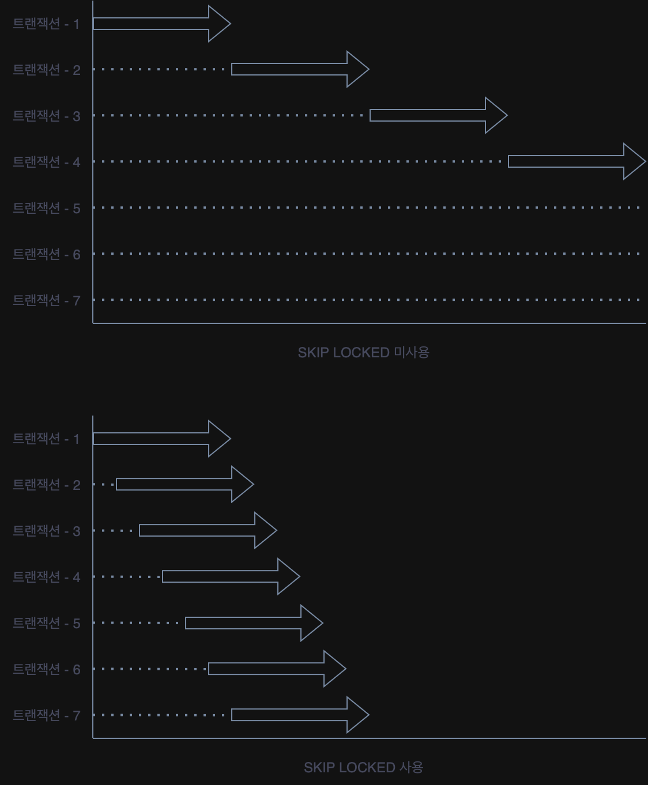

# SELECT Lock

보통 InnoDB 테이블에 대해서 레코드를 읽을 때 레코드에 아무런 잠금을 걸지 않는다.(=Non Locking Consistent Read)  
단순 조회하는 상황에서는 잠금을 걸지 않는 것이 좋지만, 읽은 레코드의 컬럼 값을 애플리케이션에서 가공해서 업데이트 할 떄엔 다른 트랜잭션의 영향을 받지 않도록 잠금을 걸어야 한다.  
`FOR SHARE`와 `FOR UPDATE`절을 추가해서 읽기 및 배타 잠금을 걸 수 있고, 차이는 다음과 같다.

- `FOR SHARE` : 읽은 레코드에 대해 읽기 잠금을 건다. 다른 트랜잭션은 읽기 잠금을 걸 수 있지만, 배타 잠금은 걸 수 없다.(S-lock, Shared Lock)
- `FOR UPDATE` : 읽은 레코드에 대해 배타 잠금을 건다. 다른 트랜잭션은 읽기 잠금도 배타 잠금도 걸 수 없다.(X-lock, Exclusive Lock)

InnoDB 스토리지 엔진에서 조금 다른 점은, 잠금 없는 읽기가 지원되기 때문에 특정 레코드가 `FOR UPDATE` 쿼리에 의해서 잠겨진 상태라도,  
`FOR SHARE`나 `FOR UPDATE` 절을 가지지 않은 단순 `SELECT` 쿼리는 정상적으로 읽기를 수행할 수 있다.

## 잠금 테이블 선택

```mysql
SELECT *
FROM employees e
         INNER JOIN dept_emp de ON de.emp_no = employees.emp_no
         INNER JOIN departments d ON d.dept_no = de.dept_no
    FOR
UPDATE;
```

위 쿼리는 `employees`, `dept_emp`, `departments` 테이블에 대해 잠금을 걸지만, `employees` 테이블에만 잠금을 걸고 싶다면 `FOR UPDATE` 절을 추가하면 된다.

```mysql
SELECT *
FROM employees e
         INNER JOIN dept_emp de ON de.emp_no = employees.emp_no
         INNER JOIN departments d ON d.dept_no = de.dept_no
    FOR
UPDATE OF e;
```

## `NOWAIT` & `SKIP LOCKED`

해당 레코드를 읽으려는데, `FOR UPDATE` 절에 의해 잠겨져 있다면, 해당 트랜잭션은 레코드가 잠긴 상태를 기다려야 한다.  
이렇게 되면 해당 트랜잭션의 해제를 기다려야하거나, 심각한 경우 애플리케이션 오류 등으로 해제가 되지 않았을 경우 `innodo_lock_wait_timeout`에 설정 된 시간까지 대기해야 한다.

```mysql
SELECT *
FROM employees
WHERE emp_no = 10001
    FOR
UPDATE NOWAIT;
```

하지만 위처럼 `NOWAIT` 절을 추가하면, 해당 레코드가 잠겨져 있을 경우엔 바로 에러를 반환하면서 쿼리를 즉시 종료시킨다.  
비슷한 기능으로 `SKIP LOCKED` 절이 있는데, 이는 잠긴 레코드는 건너뛰고 읽기를 수행한다.(같은 쿼리라도 다른 결과를 반환하는 `NOT-DETERMINISTIC` 쿼리가 된다.)

### 예시를 통한 활용 방법

`NOWAIT`와 `SKIP LOCKED` 기능은 큐(Queue)와 비슷한 기능을 MySQL 서버에서 구현할 때 유용하게 사용할 수 있다.  
다음과 같은 쿠폰 발급 기능을 구현한다고 가정해보자.

- 하나의 쿠폰은 한 사용자만 사용 가능
- 쿠폰의 개수는 1000개 제한
- 선착순으로 요청한 사용자에게 발급

```mysql
CREATE TABLE coupon
(
    coupon_id     BIGINT      NOT NULL,
    owned_user_id BIGINT      NULL DEFAULT 0,
    coupon_code   VARCHAR(15) NOT NULL,
#   ...
    primary key (coupon_id),
    INDEX ix_owneduserid (owned_user_id)
);
```

테이블은 위와 같고 쿠폰 발급 과정을 간략화하면 다음과 같은 쿼리를 실행할 수 있다.

```mysql
BEGIN;

SELECT *
FROM coupon
WHERE owned_User_id = 0
ORDER BY coupon_id ASC
LIMIT 1
FOR
UPDATE;

# 애플리케이션 로직 수행

UPDATE coupon
SET owned_user_id = ?
WHERE coupon_id = ?;

COMMIT;
```

위 쿼리를 동시에 1000명의 사용자가 요청하게 되면 애플리케이션 서버는 그 요청만큼 프로세스를 생성해 위의 트랜잭션을 동시에 실행하려고 할 것이다.  
하지만 가장 첫 트랜잭션만 `FOR UPDATE` 쿼리로 인해 잠금을 걸고 나머지 999개의 트랜잭션은 해당 레코드가 잠겨져 있기 때문에 대기하게 되고,  
결국엔 대기 시간 동안 잠금을 획득하지 못해서 에러를 반환하게 된다.

여기서 `UPDATE SKIP LOCKED` 절을 사용하면 잠금 된 레코드는 건너뛰고 다음 레코드를 읽어서 수행하기 때문에 1000개의 트랜잭션을 성능 저하 없이 처리할 수 있다.



점선은 트랜잭션을 대기하는 것을 의미하고, 굵은 화살표는 실제 데이터 처리 흐름을 의미할 때,  
`SKIP LOCKED`를 사용하면 실제로 대기하는 시간은 매우 짧은 시간(레콬드 한 건을 스킵하는 데 걸리는 시간)이므로 1000개의 트랜잭션을 빠르게 처리할 수 있다.

###### 참고자료

- [Real MySQL 8.0 2 - 개발자와 DBA를 위한 MySQL 실전 가이드](https://www.nl.go.kr/seoji/contents/S80100000000.do?schM=intgr_detail_view_isbn&page=1&pageUnit=10&schType=simple&schStr=Real+MySql+8.0&isbn=9791158392727&cipId=228440238%2C)