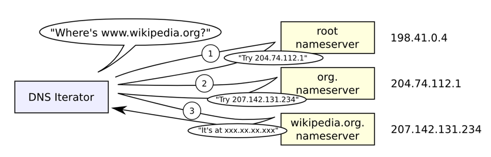

# Application Layer(응용 계층) - TCP/IP Layer 4

응용 계층은 사용자가 직접 사용하는 애플리케이션과 네트워크를 연결해주는 최상위 계층 역할을 한다.  
사용자가 네트워크 서비스와 원활하게 상호작용 할 수 있도록 중요한 역할을 한다.
(웹 브라우저에서 사용하는 HTTP, 메일을 주고받는 SMTP, 파일 전송을 위한 FTP 등)

## DNS(Domain Name System)

네트워크 상에서는 MAC 주소와 IP 주소로 호스트를 특정할 수 있지만 실제로 사용하기엔 아래의 단점들이 존재한다.

- 주소들을 외우기 어려움
- IP 주소는 변경될 수 있음

때문에 DNS가 등장하여 애플리케이션 계층과 네트워크 계층 사이에서 도메인 이름을 IP 주소로 변환하는 중요한 브리지 역할을 하고 있다.

### 계층적 도메인 구조

DNS는 도메인 이름을 계층 구조로 구성하며 각 레벨은 `.`로 구분된다.  
이 계층 구조는 도메인 이름의 가장 오른쪽이 최상위 도메인(Top Level Domain)이며, 왼쪽으로 갈수록 하위 도메인(Sub Domain)이 된다.  
보통 사용되는 최상위 도메인은 `.com`, `.net`, `.org` 등이 있으며, 이러한 최상위 도메인은 IANA(Internet Assigned Numbers Authority)에서 관리하고 있다.

`www.platypus.ogu.com`를 예로 들면 아래와 같다.

- `com`: 최상위 도메인(Top Level Domain)
- `ogu`: Second Level Domain
- `platypus`: Third Level Domain
- `www`: Forth Level Domain

마지막 레벨의 도메인은 일반적으로 도메인 내의 특정 호스트나 서비스를 나타낸다.  
또한 도메인의 왼쪽에 더 많은 수준을 추가하여 서브도메인을 생성하여 계층을 더욱 세분화할 수 있다.

### DNS 서버

DNS 서버는 도메인 이름을 IP 주소로 변환하는 역할을 하는데, 전세계적인 거대한 분산 시스템이라고 할 수 있다.  
DNS 서버는 계층 구조로 구성되어 있으며, 사용자가 접속한 호스트의 도메인 이름을 가지고 있는 DNS 서버를 찾아가며 IP 주소를 찾아온다.(폴더 트리 구조와 비슷)  
사용자가 가장 먼저 찾는 DNS 서버는 Local DNS 서버로, DHCP를 사용한다면 DHCP 서버가 자동으로 설정해준다.

- DNS 서버 계층 구조


사용자가 도메인을 입력하면, 웹 브라우저에서 캐시를 확인하고 도메인 이름을 가지고 있다면, IP 주소를 반환하여 사용자가 접속하게 된다.  
만약 없다면 Local DNS 서버에 요청하고, Local DNS에도 없다면 아래 그림과 같이 DNS 서버 계층 구조를 따라서 IP 주소를 찾아오게 된다.



위의 예시는 반복적 질의(Iterative Query) 방식으로 진행되었는데,  
질의를 받은 DNS 서버가 다시 하위 DNS 서버에게 질의를 하는 재귀적 질의(Recursive Query) 방식도 존재한다.

## URI(Uniform Resource Identifier)

URI(Uniform Resource Identifier)는 웹 애플리케이션과 네트워크에서 리소스를 식별하는 데 사용되는 문자열이다.  
웹 브라우징, API 호출, 데이터 전송 등 다양한 웹 애플리케이션과 관련된 작업에서 중요한 역할을 한다.

### URI 구성 요소

```
          userinfo       host      port
          ┌──┴───┐ ┌──────┴──────┐ ┌┴┐
  https://john.doe@www.example.com:123/forum/questions/?tag=networking&order=newest#top
  └─┬─┘   └─────────────┬────────────┘└───────┬───────┘ └────────────┬────────────┘ └┬┘
  scheme          authority                  path                  query           fragment

  urn:oasis:names:specification:docbook:dtd:xml:4.1.2
  └┬┘ └──────────────────────┬──────────────────────┘
  scheme                    path
```

|    문법    |             내용              |                       설명                       |
|:--------:|:---------------------------:|:----------------------------------------------:|
|  scheme  | http, https, ftp, file, ... |             리소스에 접근하기 위한 프로토콜을 가리킴             |
| userinfo |        user:password        |     서버에 접근할 때 사용자 정보(FTP 같은 몇몇 프로토콜에서 사용)      |
|   host   |       www.google.com        |                  호스트명 또는 IP주소                  |
|   port   |        80, 443, 8080        |              접근 포트(일부 port 생략 가능)              |
|   path   |           /search           |                 리소스 경로, 계층적 구조                 |
|  query   |       ?q=hello&hl=ko        | key=value 형태, `?`로 시작 `&`로 구분, query parameter |
| fragment |          #bookmark          | html 내부 북마크, id(서버에 전송하지 않음)로 리소스의 특정 부분을 가리킴  |

### URI/URL/URN 단어 뜻

- `https://www.example.com:443/index.html`: HTTPS 프로토콜을 사용하는 리소스의 URI
- `ftp://ftp.example.net/files/documents/report.pdf`: FTP 프로토콜을 사용하는 리소스의 URI
- `urn:isbn:0451450523`: URN(Uniform Resource Name)을 사용하는 리소스의 URI


- Uniform: 리소스 식별하는 통일된 방식
- Resource: 자원, URI로 식별할 수 있는 모든 것(제한 없음)
- Identifier: 다른 항목과 구분하는데 필요한 정보
- Locator: 리소스가 있는 위치를 지정
- Name: 리소스에 이름을 부여

결국 URL과 URN을 아래와 같이 정의할 수 있다.

- URL: 위치 기반 자원 식별, 특정 서버의 한 리소스에 대한 구체적인 위치를 서술
- URN: 이름 기반 자원 식별, 콘텐츠를 이루는 한 리소스에 대해, 그 리소스의 위치에 영향을 받지 않는 유일무이한 이름

URN은 아직 널리 채택되지 않았으며, 현재는 URL을 사용하는 것이 일반적이다.

### URI 인코딩

> 모든 인터넷 프로토콜로 URL을 전송할 수 있어야 했으며, 안전하게 전송할 수 있는 문자는 이진 데이터와 알파벳을 한정적이었으나 이를 해결하기 위해 안전하지 않은 문자를 인코딩하는 방법이 생겨났다.

역사적으로 컴퓨터 애플리케이션이 US-ASCII 문자 집합을 사용해왔고, 이는 7비트로 표현되는 128개의 문자를 표현할 수 있었다.  
128개의 문자로는 영어와 숫자, 일부 특수문자만 표현할 수 있었고, 한글과 같은 다른 언어나 특수문자를 사용하기 위해 인코딩을 사용하게 되었다.

또한 몇 몇 문자는 이미 특별한 의미로 예약어로 사용되고 있기 때문에 이 문자들도 인코딩을 해야 한다.  
URI 이스케이프는 예약된 문자나 다른 지원하지 않는 글자들을 안전하게 URI에 삽입하기 위해 `%` 문자와 16진수로 표현된 문자의 아스키 코드 값을 사용한다.(`%2B` = `=`, `%7E` = `~`)

|   문자 분류    |                                          사용 가능 문자 집합                                          |          설명          |
|:----------:|:---------------------------------------------------------------------------------------------:|:--------------------:|
| 예약되지 않은 문자 |                                    영숫자, `-`, `_`, `.`, `~`                                    | URI에서 특별한 의미를 가지지 않음 |
|   예약된 문자   | `?`, `#`, `&`, `=`, `+`, `/`, `:`, `;`, `@`, `!`, `$`, `'`, `(`, `)`, `*`, `,`, `[`, `]`, ` ` |   URI에서 특별한 의미를 가짐   |
|  이스케이프 문자  |                                              `%`                                              |  예약된 문자를 표현하기 위해 사용  |

### URL의 한계

URL은 인터넷에 있는 리소스를 나타내는 유일한 방법이지만, URL만 가지고는 리소스를 식별하는데 한계가 있다.  
예를들어 리소스가 옮겨지게 된다면 예전 시점에 기존 리소스를 가리키는 URL은 더 이상 유효하지 않게 되어 원래의 리소스를 찾을 수 없게 된다.  
이를 해결하기 위해 URN을 도입하는 등의 시도가 있었지만, 이미 널리 사용되고 있는 URL을 대체하기 위해서는 많은 시간이 필요하고 많은 비용이 들어가기 때문에 사용하지 않게 되었다.

###### 참고자료

- [현실 세상의 컴퓨터 공학 지식 - 네트워크](https://fastcampus.co.kr/dev_online_newcomputer)
- [HTTP 완벽 가이드](https://www.nl.go.kr/seoji/contents/S80100000000.do?schM=intgr_detail_view_isbn&page=1&pageUnit=10&schType=simple&schStr=HTTP+완벽+가이드&isbn=9788966261208&cipId=200309770%2C4096969)