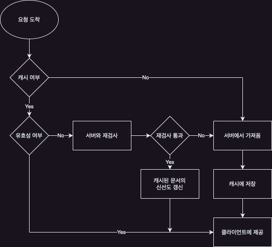

# Cache(캐시)

> 웹 서버에서 클라이언트로 전송된 리소스를 임시로 저장하는 장소

- 자주 쓰이는 데이터에 대해 반복되는 데이터 전송을 줄여 네트워크 트래픽 감소
- 원격 서버보다 로컬 네트워크의 속도가 빠른 특성으로 인해 네트워크 병목 감소
- 원 서버에 대한 요청이 줄어 서버의 부하 감소
- 먼 거리에 있는 서버의 데이터 응답 시간 감소(네트워크 속도 자체의 물리적인 한계 및 중간 커넥션 노드 수의 생략)

## 적중 / 비적중

캐시에 해당 요청에 대한 데이터가 존재하는지 여부에 따라 적중(cache hit) / 비적중(cache miss)으로 나뉜다.

- 캐시 적중(cache hit): 캐시에 해당 요청에 대한 데이터가 존재하는 경우 캐시에서 바로 응답
- 캐시 비적중(cache miss): 캐시에 해당 요청에 대한 데이터가 존재하지 않는 경우 원 서버에 요청을 보내 응답

### 재검사(Revalidation)

원 서버의 콘텐츠가 변경될 수 있기 때문에, 캐시는 반드시 원 서버에 콘텐츠가 변경되었는지 확인해야 한다.  
리소스 전체에 대해 검사를 하게 되면 네트워크 트래픽이 많아지기 때문에, 캐시는 콘텐츠의 일부분만 검사하게 된다.

- 재검사 적중: 캐시가 원 서버에 재검사를 요청하고, 원 서버가 콘텐츠가 변경되지 않았을 경우, 서버는 클라이언트에게 304 Not Modified 응답을 보낸다.
- 재검사 부적중: 캐시가 원 서버에 재검사를 요청하고, 원 서버가 콘텐츠가 변경되었을 경우, 서버는 콘텐츠 전체와 함께 클라이언트에게 200 OK 응답을 보낸다.
- 객체 삭제: 캐시가 원 서버에 재검사를 요청하고, 원 서버가 콘텐츠가 삭제되었을 경우, 서버는 클라이언트에게 404 Not Found 응답을 보낸다.

여기서 캐시가 요청을 처리하게 되는 비율을 적중률이라고 하는데, 적중률은 적중 횟수를 전체 요청 횟수로 나눈 값으로, 0 ~ 1 사이의 값이다.(높을수록 좋으며, 약 40% 정도면 괜찮은 수준이라고 함)

## 캐시 토폴로지

캐시는 한 명의 사용자에게만 적용될 수도 있고(public cache), 여러 명의 사용자에게 적용될 수도 있다(private cache).

- 개인 전용 캐시(Private Cache)
    - 한 명의 사용자에게만 적용되는 캐시
    - 웹브라우저에 개인 전용 캐시를 내장하고 있다.
- 공용 캐시(Public Cache)
    - 여러 명의 사용자에게 적용되는 캐시
    - 자주 찾는 객체를 한 번만 가져와 공유된 사본을 제공하여 네트워크 트래픽을 줄일 수 있다.

## 캐시 처리 단계

현대 웹에서의 상용 프락시 캐시는 고성능이면서 다른 여러 기능을 지원하도록 설계되었다.  
기본적인 동작은 비교적 단순하며, 캐시를 처리할 때 다음과 같은 단계로 이루어진다.

1. 요청 받기: 캐시는 네트워크로부터 도착한 요청 메시지를 읽음
2. 파싱: 읽어 온 메시지를 파싱하여 URL과 헤더들을 추출
3. 검색: 로컬 복사본이 있는지 검사한 뒤, 사본이 없다면 사본을 받아와 로컬에 저장
4. 신선도 검사: 캐시된 사본이 유효한지 확인한 후, 유효하지 않다면 원 서버에 재검사를 요청
5. 응답 생성: 새로운 헤더와 캐시된 본문으로 응답 메시지를 생성
6. 발송: 네트워크를 통해 응답을 클라이언트에 반환
7. 로깅: (선택 사항)트랜잭션에 대한 로그를 남김

## 캐시 신선도 유지

리소스는 변경될 수 있기 때문에 캐시된 사본은 항상 원 서버의 데이터와 일치하지 않을 수 있다.  
때문에 문서 만료와 서버 재검사라는 단순한 매커니즘을 통해 캐시된 사본의 신선도를 유지하게 된다.

### 문서 만료

HTTP의 Cache-Control / Expires 헤더를 사용하여 캐시된 사본의 유효기간을 설정할 수 있게 해준다.

|               헤더                |           설명           |
|:-------------------------------:|:----------------------:|
| Cache-Control: max-age=<second> | 캐시된 사본의 유효기간을 초 단위로 설정 |
|         Expires: <date>         |  캐시된 사본의 유효기간을 날짜로 설정  |

위의 시간이 지나면 캐시된 사본은 만료되고, 만료된 사본은 재검사를 통해 유효한지 확인해야 한다.  
여기서 해당 사본이 원 서버와 일치하지 않다는 것을 의미하는 것은 아니고 만료된 사본이라는 것만 의미하여 재검사를 통해 유효한지 확인할 필요가 있음을 의미한다.

### 서버 재검사

`캐시된 문서 만료 == 원 서버의 문서와 다름` 을 의미하진 않지만, 검사할 필요가 있음을 의미하는데, 이를 서버 재검사라고 한다.  
문서의 신선도를 매 요청마다 검증할 필요가 없이 문서가 만료되었을 때 한 번만 재검사하여 문서가 유효한지 확인하면 되기 때문에 트래픽을 절약하면서 응답 시간을 줄일 수 있다.

HTTP의 조건부 메서드를 통해 서버 재검사를 더 효율적으로 만들어준다.  
서버가 갖고 있는 캐시가 유효한지 확인하기 위해 클라이언트가 서버에게 요청을 보낼 때, 조건부 GET이라는 요청을 보낼 수 있도록 해준다.

|            헤더             |                설명                |
|:-------------------------:|:--------------------------------:|
| If-Modified-Since: <date> |  주어진 날짜 이후로 수정됐을 경우, 요청 메서드를 수행  |
|   If-None-Match: <ETag>   | 주어진 ETag와 일치하지 않을 경우, 요청 메서드를 수행 |

해당 요청 안에 위와 같은 헤더를 함께 보내지기 때문에 서버가 캐시를 재검사할 수 있도록 해준다.

#### If-Modified-Since vs If-None-Match

- 리소스 유형과 서버에서 생성되는 방식에 따라 날짜 기반 비교 / ETag 일치 여부 비교 중 편한 것이 있을 수 있음
    - 파일을 제공하는 경우 파일의 마지막 수정 날짜로 사용하는 것이 가장 간단한 해결책일 수 있음
    - 마지막 변경 날짜 값이 없는 경우엔 컨텐츠의 md5 해시값을 생성해서 비교하는 것이 좋은 해결책 일 수도 있음
- Last-Modified 헤더의 경우엔 초 단위까지 표현할 수 있기 때문에, 1초 미만 단위로 캐시 조정이 불가능
    - ETag는 1초 미만의 시간 단위로 캐시 조정이 가능
- If-Modified-Since는 데이터의 시간적 격차에 대한 정보를 얻을 수 있지만, If-None-Match는 데이터 동일 여부만 알 수 있음

## HTTP 헤더 Cache-Control 캐시 지시어

HTTP 헤더에는 문서가 만료되기 전까지 캐시된 사본을 어떻게 관리할지에 대한 정책을 가지고 있다.

- `max-age` : 캐시 유효 시간을 초 단위로 지정
- `no-cache` : 데이터는 캐시해도 되지만, 캐시된 데이터를 사용하기 전에 항상 원 서버에 검증을 요청
- `no-store` : 데이터에 민감한 정보가 포함되어 있으므로 캐시에 저장하지 않음
- `must-revalidate`: 캐시 만료 후엔 반드시 원 서버에 재검사를 요청하도록 하여 검증되지 않은 만료된 객체를 사용하지 않도록 함
- `expires` : 캐시 유효 시간을 날짜와 시간으로 지정, `max-age`가 지정되어 있으면 무시되며 `max-age` 사용을 권장`

###### 참고자료

- [HTTP 완벽 가이드](https://kobic.net/book/bookInfo/view.do?isbn=9788966261208)
- [그림으로 배우는 HTTP & Network Basic](https://kobic.net/book/bookInfo/view.do?isbn=9788931447897)
