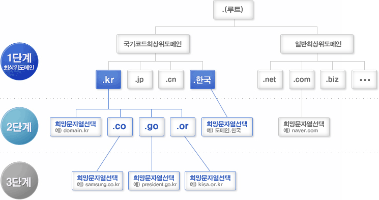

# DNS(Domain Name System)

네트워크 상에서는 MAC 주소와 IP 주소로 호스트를 특정할 수 있지만 실제로 사용하기엔 아래의 단점들이 존재한다.

- 주소들을 외우기 어려움
- IP 주소는 변경될 수 있음

때문에 DNS가 등장하여 애플리케이션 계층과 네트워크 계층 사이에서 도메인 이름을 IP 주소로 변환하는 중요한 브리지 역할을 하고 있다.

## 계층적 도메인 구조

DNS는 도메인 이름을 계층 구조로 구성하며 각 레벨은 `.`로 구분된다.  
이 계층 구조는 도메인 이름의 가장 오른쪽이 최상위 도메인(Top Level Domain)이며, 왼쪽으로 갈수록 하위 도메인(Sub Domain)이 된다.  
보통 사용되는 최상위 도메인은 `.com`, `.net`, `.org` 등이 있으며, 이러한 최상위 도메인은 IANA(Internet Assigned Numbers Authority)에서 관리하고 있다.

`www.platypus.ogu.com`를 예로 들면 아래와 같다.

- `com`: 최상위 도메인(Top Level Domain)
- `ogu`: Second Level Domain
- `platypus`: Third Level Domain
- `www`: Forth Level Domain

마지막 레벨의 도메인은 일반적으로 도메인 내의 특정 호스트나 서비스를 나타낸다.  
또한 도메인의 왼쪽에 더 많은 수준을 추가하여 서브도메인을 생성하여 계층을 더욱 세분화할 수 있다.

## DNS 서버

DNS 서버는 도메인 이름을 IP 주소로 변환하는 역할을 하는데, 전세계적인 거대한 분산 시스템이라고 할 수 있다.  
DNS 서버는 계층 구조로 구성되어 있으며, 사용자가 접속한 호스트의 도메인 이름을 가지고 있는 DNS 서버를 찾아가며 IP 주소를 찾아온다.(폴더 트리 구조와 비슷)  
사용자가 가장 먼저 찾는 DNS 서버는 Local DNS 서버로, DHCP를 사용한다면 DHCP 서버가 자동으로 설정해준다.

- DNS 서버 계층 구조

사용자가 도메인을 입력하면, 웹 브라우저에서 캐시를 확인하고 도메인 이름을 가지고 있다면, IP 주소를 반환하여 사용자가 접속하게 된다.  
만약 없다면 Local DNS 서버에 요청하고, Local DNS에도 없다면 아래 그림과 같이 DNS 서버 계층 구조를 따라서 IP 주소를 찾아오게 된다.

위의 예시는 반복적 질의(Iterative Query) 방식으로 진행되었는데,  
질의를 받은 DNS 서버가 다시 하위 DNS 서버에게 질의를 하는 재귀적 질의(Recursive Query) 방식도 존재한다.

###### 참고자료

- [현실 세상의 컴퓨터 공학 지식 - 네트워크](https://fastcampus.co.kr/dev_online_newcomputer)
