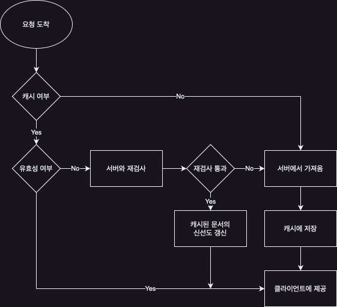

# 캐시(Cache)

> 웹 서버에서 클라이언트로 전송된 리소스를 임시로 저장하는 장소

- 불필요한 데이터 전송을 줄여 네트워크 트래픽을 줄이고, 서버의 부하를 줄일 수 있다.
- 네트워크 병목을 줄여 응답 속도를 높일 수 있다.
- 원 서버에 부하를 줄일 수 있다.
- 먼 거리에 있는 서버의 데이터를 빠르게 가져올 수 있다.

## 적중 / 비적중

캐시에 요청이 도착했을 때, 캐시에 해당 요청에 대한 데이터가 존재하면 캐시가 응답을 보내고, 캐시에 해당 요청에 대한 데이터가 존재하지 않으면 원 서버에 요청을 보낸다.  
이와 같이 캐시에 해당 요청에 대한 데이터가 존재하면 적중(cache hit), 존재하지 않으면 비적중(cache miss)이라고 한다.

### 재검사(Revalidation)

원 서버의 콘텐츠가 변경될 수 있기 때문에, 캐시는 반드시 원 서버에 콘텐츠가 변경되었는지 확인해야 한다.  
리소스 전체에 대해 검사를 하게 되면 네트워크 트래픽이 많아지기 때문에, 캐시는 콘텐츠의 일부분만 검사하게 된다.

- 재검사 적중: 캐시가 원 서버에 재검사를 요청하고, 원 서버가 콘텐츠가 변경되지 않았을 경우, 서버는 클라이언트에게 304 Not Modified 응답을 보낸다.
- 재검사 부적중: 캐시가 원 서버에 재검사를 요청하고, 원 서버가 콘텐츠가 변경되었을 경우, 서버는 콘텐츠 전체와 함께 클라이언트에게 200 OK 응답을 보낸다.
- 객체 삭제: 캐시가 원 서버에 재검사를 요청하고, 원 서버가 콘텐츠가 삭제되었을 경우, 서버는 클라이언트에게 404 Not Found 응답을 보낸다.

### 적중률

적중률은 적중 횟수를 전체 요청 횟수로 나눈 값으로, 0 ~ 1 사이의 값이다.  
당연히 적중률이 높을수록 캐시의 효율이 좋은 것으로, 현대 웹에서는 40% 정도면 괜찮은 수준이다.  
바이트 적중률이라는 횟수가 아닌 바이트 단위로 적중률을 계산하는 방법도 있다.

## 캐시 토폴로지

캐시는 한 명의 사용자에게만 적용될 수도 있고(public cache), 여러 명의 사용자에게 적용될 수도 있다(private cache).

- 개인 전용 캐시(Private Cache)
    - 한 명의 사용자에게만 적용되는 캐시
    - 웹브라우저에 개인 전용 캐시를 내장하고 있다.
- 공용 캐시(Public Cache)
    - 여러 명의 사용자에게 적용되는 캐시
    - 웹 서버에 공용 캐시를 내장하고 있다.

## 캐시 처리 단계

1. 요청 받기: 네트워크로부터 도착한 요청 메시지를 읽음
2. 파싱: 메시지를 파싱하여 URL과 헤더들을 추출
3. 검색: 로컬 복사본이 있는지 검사한 뒤, 사본이 없다면 사본을 받아와 로컬에 저장
4. 신선도 검사: 캐시된 사본이 유효한지 확인한 후, 유효하지 않다면 원 서버에 재검사를 요청
5. 응답 생성: 새로운 헤더와 캐시된 본문으로 응답 메시지를 생성
6. 발송: 네트워크를 통해 응답을 클라이언트에 보냄
7. 로깅: 선택 사항으로, 트랜잭션에 대한 로그를 남김

### 플로우 차트

## 캐시 신선도 유지

리소스는 변경될 수 있기 때문에 캐시된 사본은 항상 원 서버의 데이터와 일치하지 않을 수 있다.

### 문서 만료

HTTP의 Cache-Control / Expires 헤더를 사용하여 캐시된 사본의 유효기간을 설정할 수 있다.

|               헤더                |           설명           |
|:-------------------------------:|:----------------------:|
| Cache-Control: max-age=<second> | 캐시된 사본의 유효기간을 초 단위로 설정 |
|         Expires: <date>         |  캐시된 사본의 유효기간을 날짜로 설정  |

위의 시간이 지나면 캐시된 사본은 만료되고, 만료된 사본은 재검사를 통해 유효한지 확인해야 한다.  
여기서 해당 사본이 원 서버와 일치하지 않다는 것을 의미하는 것은 아니고 만료된 사본이라는 것만 의미하여 재검사를 통해 유효한지 확인할 필요가 있음을 의미한다.

### 조건부 메서드와의 재검사

HTTP의 조건부 메서드를 통해 재검사를 더 효율적으로 할 수 있다.  
서버가 갖고 있는 캐시가 유효한지 확인하기 위해 클라이언트가 서버에게 요청을 보낼 때, 특정 헤더를 함께 보내서 서버가 캐시를 재검사할 수 있도록 할 수 있다.

|            헤더             |                설명                |
|:-------------------------:|:--------------------------------:|
| If-Modified-Since: <date> |  주어진 날짜 이후로 수정됐을 경우, 요청 메서드를 수행  |
|   If-None-Match: <ETag>   | 주어진 ETag와 일치하지 않을 경우, 요청 메서드를 수행 |

## 캐시 제어

캐시는 캐시된 사본을 어떻게 관리할지에 대한 정책을 가지고 있다.

- HTTP 헤더 Cache-Control 캐시 지시어
    - `max-age` : 캐시 유효 시간을 초 단위로 지정
    - `no-cache` : 데이터는 캐시해도 되지만, 캐시된 데이터를 사용하기 전에 항상 원 서버에 검증을 요청
    - `no-store` : 데이터에 민감한 정보가 포함되어 있으므로 캐시에 저장하지 않음
    - `must-revalidate`: 캐시 만료 후 최조 조회 시 원 서버에 검증 필요
    - `expires` : 캐시 유효 시간을 날짜와 시간으로 지정, `max-age`가 지정되어 있으면 무시되며 `max-age` 사용을 권장`
    - `public` : 응답 데이터를 public 캐시(프록시 캐시 서버)에 저장할 수 있음
    - `private` : 응답 데이터를 private 캐시에 저장할 수 있음(해당 사용자만 캐시를 사용할 수 있음, 기본값)
    - `s-maxage` : `max-age`와 동일하지만, 프록시 캐시에만 적용됨

###### 참고자료

- [HTTP 완벽 가이드](https://www.nl.go.kr/seoji/contents/S80100000000.do?schM=intgr_detail_view_isbn&page=1&pageUnit=10&schType=simple&schStr=HTTP+완벽+가이드&isbn=9788966261208&cipId=200309770%2C4096969)
- [(그림으로 배우는) http & network basic](https://www.nl.go.kr/seoji/contents/S80100000000.do?schM=intgr_detail_view_isbn&page=1&pageUnit=10&schType=simple&schStr=9788931447897&isbn=9788931447897&cipId=200443691%2C)