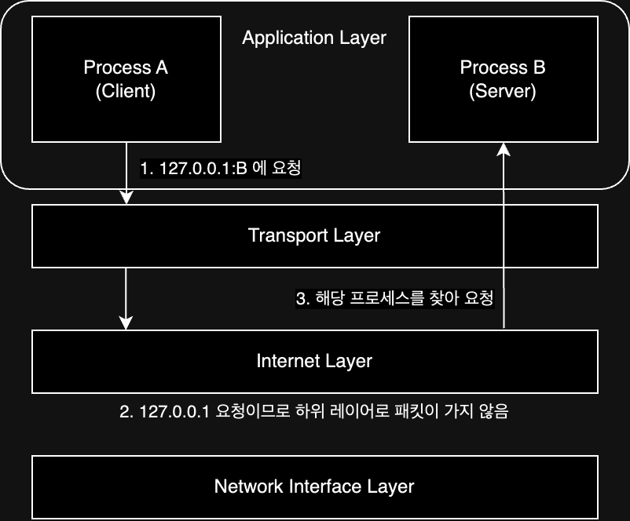

# Network Layer(네트워크 계층) - TCP/IP Layer 2

> 물리 계층과 데이터 계층에 해당하는 Network Access Layer는 LAN에 국한된 통신을 담당하는 계층이다.  
> 네트워크 계층은 LAN을 넘어서기 위한 계층으로, 라우팅을 하여 네트워크 간 통신이 가능하도록 한다.

현재 사용되는 대표적인 프로토콜로 IP(Internet Protocol)가 있다.

## MAC 주소가 있지만 IP 주소도 필요한 이유

모든 네트워크 장비는 MAC 주소를 가지고 있기 때문에 임의의 네트워크에 속한 MAC 주소를 파악하여 통신하는 것은 불가능에 가깝다.  
때문에 IP 주소를 통해 네트워크를 식별하고, 식별한 네트워크에 속한 장비들의 MAC 주소를 파악하여 통신을 한다.

|         MAC 주소          |           IP 주소            |
|:-----------------------:|:--------------------------:|
| 네트워크 장비에 할당된 고유한 물리적 주소 | 네트워크에 연결된 컴퓨터를 식별하는 논리적 주소 |
| 네트워크 장비가 제조사에 의해 직접 할당  |        네트워크 관리자가 할당        |
|      일반적으로 변경 불가능       |           변경 가능            |
|      48비트(6바이트) 길이      |    일반적으로 32비트(4바이트) 길이     |

## IP의 주요 기능

### IP 주소 지정

IP 주소는 직접 지정할 수도 있지만, DHCP(Dynamic Host Configuration Protocol)를 통해 자동으로 할당받을 수도 있다.

### 단편화(Fragmentation)

패킷의 크기를 MTU(Maximum Transmission Unit)라고 하며, 일반적으로 1500byte(=약 1.4kb)이다.  
더 큰 데이터를 전송하기 위해서는 L3 패킷을 분할하여 전송하는 단편화(Fragmentation)를 수행하고, 목적지에서 다시 재조립하여 사용한다.

## IP 주소 종류

IPv4와 IPv6가 존재하며, IPv4는 32비트로 구성되어 있고, IPv6는 128비트로 구성되어 있다.  
현재는 둘 다 사용하지만 아직까지 IPv4가 주로 사용되고 있으며, IPv6는 IPv4의 주소 고갈 문제를 방지하기 위해 등장하였다.(실제론 다른 기술로 IPv4 주소 고갈 문제를 해결하고 있다.)

|       IPv4        |                  IPv6                   |
|:-----------------:|:---------------------------------------:|
|    4바이트(32비트)     |              16바이트(128비트)               |
| 0 ~ 255까지의 숫자로 표현 |                16진수로 표현                 |
| 8비트씩 4개의 옥텟으로 구성  |            16비트씩 8개의 옥텟으로 구성            |
|    192.168.1.1    | 2001:0db8:85a3:0000:0000:8a2e:0370:7334 |

### IPv4의 헤더

- 단편화에 사용되는 헤더 정보
    - 식별자: 단편화된 패킷을 재조립할 때 사용하는 식별값
    - 플래그: 단편화에 대한 정보를 담고 있는 비트열
    - 단편화 오프셋: 단편화되기 전 원본 데이터에서 해당 패킷이 위치한 오프셋
- 그 외
    - TTL(Time To Live): 패킷이 네트워크 장치(라우터)를 통과할 때마다 1씩 감소하는 카운터로, 0이 되면 해당 패킷은 폐기, 폐기 시 장치에서 ICMP 메시지 전송
    - 프로토콜: 상위 계층 프로토콜을 명시하는 필드(TCP: 6, UDP: 17... etc)
    - 헤더 체크섬
- 주소 정보
    - 송신지 IP 주소
    - 목적지 IP 주소

### IPv6의 헤더

- 페이로드 길이
- 다음 헤더(=확장 헤더): 고정되지 않은 헤더로, 필요한 경우 추가되는 헤더(ex. 단편화, 인증, 암호화 등)
- 홉 제한: TTL과 비슷한 역할
- 주소 정보
    - 송신지 IP 주소
    - 목적지 IP 주소

## ARP(Address Resolution Protocol)

> IP 주소를 MAC 주소로 변환하는 프로토콜

IP 프로토콜로 통신을 하기 위해서는 MAC 주소가 필요하지만 실제로는 IP 주소를 알지만 MAC 주소를 모르는 경우가 많다.  
이 때 ARP를 통해 IP 주소를 MAC 주소로 변환하여 통신을 한다.  
ARP는 `동일 네트워크 내`의 호스트의 MAC 주소를 알아내기 위한 프로토콜이며, IP 주소를 통해 MAC 주소를 알아내는 과정은 아래와 같다.

1. ARP 요청(브로드 캐스트 메시지)
    - ARP 요청 메시지를 브로드 캐스트하여 해당 IP 주소를 가진 호스트가 있는지 확인
2. ARP 응답
    - 해당 IP 주소를 가진 호스트가 있다면, 해당 호스트가 자신의 MAC 주소를 담은 ARP 응답 메시지를 전송
3. ARP 캐시 테이블 갱신
    - MAC 주소와 IP 주소가 매핑된 형태의 ARP 캐시 테이블을 갱신
    - ARP에 저장된 주소에 대해서는 다시 ARP 요청을 보내지 않고, ARP 캐시 테이블을 통해 바로 통신
    - ARP 캐시 테이블은 일정 시간이 지나면 삭제되며, 삭제된 경우 ARP 요청을 통해 다시 매핑

하지만 ARP는 `동일 네트워크 내`의 호스트의 MAC 주소를 알아내기 위한 프로토콜이기 때문에, 다른 네트워크에 있는 호스트의 MAC 주소를 알아내기 위해서는 다른 프로토콜도 사용하여 통신하게 된다.

## ICMP(Internet Control Message Protocol)

IP 프로토콜에는 비신뢰성, 비연결형 전달을 한다는 점에서 한계가 있다.

- 비신뢰성: 패킷이 목적지까지 제대로 전송하지 않을 수 있음
- 비연결형: 호스트 간 연결을 설정하지 않고 통신을 하기 때문에, 패킷을 보내는 호스트가 패킷을 보내는 동안 목적지 호스트가 살아있는지 확인하지 않음

TCP/IP 3계층의 TCP를 이용하여 위 두 가지 한계를 해결할 수 있지만, 네트워크 계층 내의 ICMP 프로토콜을 이용하여 위 두 가지 한계를 보완할 수 있다.(완전한 해결은 아님)

ICMP는 IP 프로토콜의 비신뢰성과 비연결형의 한계를 보완하기 위한 네트워크 계층 프로토콜로, IP 패킷의 전송 과정에 대한 정보를 제공한다.  
네트워크 연결을 확인하는 `ping` 명령어가 내부적으로 ICMP를 사용하여 동작한다.

## IP 주소의 구성

```
192.168.12.45
- 192.168: 네트워크 주소, 네트워크를 식별하는 고유 번호
- 12.45: 호스트 주소, 해당 네트워크에 연결된 호스트를 식별하는 고유 번호

네트워크 주소를 통해 해당 네트워크에 진입한 뒤, 호스트 주소를 통해 해당 호스트에 접근하게 된다.
주소의 구성은 가변적으로 변경 될 수 있어서 네트워크 주소와 호스트 주소의 길이가 유동적이다.
```

### 클래스풀 주소 체계

이전에 사용되던 IP 주소 체계로, 네트워크 주소와 호스트 주소의 길이가 고정되어 있었다.

| 클래스 |  네트워크 주소   |   호스트 주소   |
|:---:|:----------:|:----------:|
|  A  | 1바이트(8비트)  | 3바이트(24비트) |
|  B  | 2바이트(16비트) | 2바이트(16비트) |
|  C  | 3바이트(24비트) | 1바이트(8비트)  |

192.168을 네트워크 주소로 가지는 클래스 B를 기준으로 192.168.0.0 ~ 192.168.255.255 범위만큼 2^16개의 호스트를 가질 수 있지만,
실제로 사용할 수 있는 주소는 2^16 - 2개로, 아래 두 가지의 예약된 주소를 제외한 주소만 사용할 수 있다.

- 192.168.0.0: 네트워크 주소
- 192.168.255.255: 브로드캐스트 주소

하지만 네트워크 주소의 길이가 고정되어 있어서, 낭비되는 주소가 많아지는 문제가 발생하였다.

### 클래스리스 주소 체계 - 서브넷 마스크(Subnet Mask)

오늘날 주로 사용하는 방식으로, 네트워크와 호스트를 구분하기 위해 서브넷 마스크를 사용한다.  
서브넷 마스크는 IP 주소와 같은 길이의 비트열로, 네트워크 주소와 호스트 주소를 구분하는 역할을 한다.

```
11000000.10101000.00001100.00101101 - IP 주소
11111111.11111111.11111111.00000000 - 서브넷 마스크
-----------------------------------
11000000.10101000.00001100.00000000 - 네트워크 주소
00000000.00000000.00000000.00101101 - 호스트 주소
```

결과적으로 서브넷 마스크가 1인 부분은 네트워크 주소를 나타내고, 0인 부분은 호스트 주소를 나타낸다.  
서브넷 마스크를 표기하기 위해 1의 개수를 IP 주소 뒤에 표기하여 `192.168.100.103/30` 형태로 표기할 수 있다.(CIDR 표기법)

## IP 주소의 분류

IP 주소는 공인 IP 주소와 사설 IP 주소로 나뉜다.

- 공인 IP 주소: 인터넷에서 사용하는 고유한 주소
    - 모든 IP를 사용할 수 있는 것이 아니라 예약된 몇 몇 IP 주소가 존재한다.
- 사설 IP 주소: 사설 네트워크에서 사용하는 고유하지 않은 주소
    - 사설 IP 주소 대역으로 `10.0.0.0/8`, `172.16.0.0/12`, `192.168.0.0/16`이 존재한다.

### NAT(Network Address Translation)

> 사설 IP 주소를 공인 IP 주소로 변환하는 프로토콜

사설 IP 주소는 인터넷에서 사용할 수 없기 때문에, 공인 IP 주소로 변환하여 사용하게 된다.  
사설 IP 주소를 공인 IP 주소로 변환하는 과정에서, 하나의 공인 IP 주소가 여러 개의 사설 IP 주소에 의해 공유되어 사용되는데, 공유됐을 경우에 포트 번호를 활용하여 각각의 통신을 구분할 수 있다.  
IP를 공유하여 IP 주소 부족 문제를 해결할 수 있고, 이 역할은 주로 라우터가 수행하게 된다.(일상에서는 공유기가 이 역할을 대부분 수행)

|     사설 IP 주소      | 변환된 공인 IP 주소 |
|:-----------------:|:------------:|
| 192.168.0.5:1000  | 1.2.3.4:6200 |
| 192.168.0.10:1000 | 1.2.3.4:6201 |
|        ...        |     ...      |

---

또는 정적 IP 주소와 동적 IP 주소로도 나눌 수 있다.

- 정적 IP 주소: 수동으로 IP 주소를 할당하는 방식(고정)
- 동적 IP 주소: DHCP(Dynamic Host Configuration Protocol)를 통해 자동으로 IP 주소를 할당하는 방식(가변)

### DHCP(Dynamic Host Configuration Protocol)

> 동적 IP 주소를 할당하기 위한 프로토콜

호스트가 네트워크에 접속할 때, DHCP 서버에게 IP 주소를 요청하고, DHCP 서버는 IP 주소를 할당한다.  
이 때, DHCP 서버는 IP 주소를 임대해주는 것이기 때문에, 임대 기간이 만료되면 IP 주소를 회수하게 되며, 임대 절차는 아래와 같다.

1. DHCP Discover: 호스트가 네트워크에 접속하면 DHCP 서버를 찾기 위해 브로드캐스트 메시지를 전송
2. DHCP Offer: DHCP 서버는 DHCP Discover 메시지를 받으면, 사용할 수 있는 IP 주소를 응답
3. DHCP Request: 호스트는 DHCP Offer 메시지를 받으면, 해당 IP 주소를 사용하겠다는 응답을 전송
4. DHCP Ack: DHCP 서버는 DHCP Request 메시지를 받으면, 해당 IP 주소를 임대하고, 호스트에게 응답

이 역할 또한 보통 라우터가 수행하며, 일상 생활에서는 공유기에 해당한다.

## 라우팅(Routing)

네트워크 계층의 핵심 기능으로, 패킷이 이동할 최적 경로 설정과 해당 경로로 패킷을 전송하는 역할을 수행한다.  
라우팅 프로토콜로 라우팅이 어떻게 수행하게 될지 결정하게 된다.  
보통 라우터와 라우터 간의 패킷 이동 과정이 많은데 이를 홉(Hop)이라고 한다.

### 라우팅 테이블(Routing Table)

특정 목적지까지 도달하기 위한 경로 정보를 담고 있는 테이블로, 수동으로 생성할 수도 있지만(정적 라우팅), 라우팅 프로토콜을 통해 자동으로 생성할 수도 있다.(동적 라우팅)

|   목적지 주소    |    서브넷 마스크    |  게이트웨이 주소   | 인터페이스 | 메트릭 |
|:-----------:|:-------------:|:-----------:|:-----:|:---:|
|     ...     |      ...      |     ...     |  ...  | ... |
| 192.168.2.0 | 255.255.255.0 | 192.168.2.1 | eth0  | 30  |
|     ...     |      ...      |     ...     |  ...  | ... |

- 목적지 주소: 목적지 IP 주소
- 서브넷 마스크: 목적지 IP 주소의 서브넷 마스크
- 게이트웨이 주소: 목적지 IP 주소로 가기 위한 다음 라우터의 IP 주소(호스트의 첫 번째 라우터는 디폴트 게이트웨이라고 한다.)
- 인터페이스: 목적지 IP 주소로 가기 위한 다음 라우터의 인터페이스
- 메트릭: 목적지 IP 주소로 가기 위한 다음 라우터의 비용

## 127.0.0.1(Localhost)와 루프백

로컬호스트 IP로 루프백(Loopback) 네트워크 인터페이스로 사용하기 위해 예약해 놓은 IP로, 자신의 컴퓨터를 의미한다.  
해당 IP에 요청하기 되면 외부 네트워크로부터 격리되며 물리적인 네트워크 인터페이스를 통하지 않고, 컴퓨터 내부에서만 통신이 이루어진다.



###### 참고자료

- [외워서 끝내는 네트워크 핵심이론 - 기초](https://www.inflearn.com/course/네트워크-핵심이론-기초)
- [현실 세상의 컴퓨터 공학 지식 - 네트워크](https://fastcampus.co.kr/dev_online_newcomputer)
