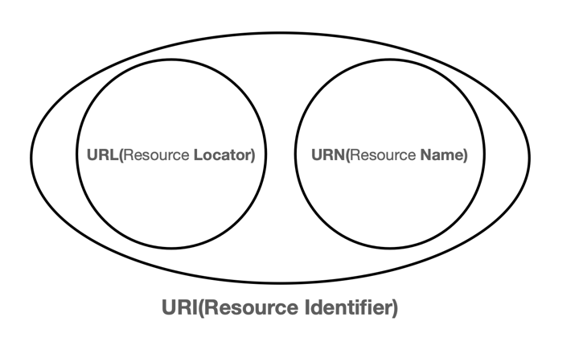

# IP - Internet Protocol

네트워크 상에서 컴퓨터들이 서로 통신하기 위해 사용하는 프로토콜이다. IP는 네트워크 상에서 컴퓨터들을 식별하기 위한 주소를 부여하고, 패킷을 전송하는 역할을 한다.  
(IP 패킷: 전송데이터를 포함한, 출발지 IP/목적지 IP 외 기타 정보가 들어있는 정보)

### IP 프로토콜의 한계

- 비연결성 : 패킷을 받을 대상이 없거나 서비스 불능 상태여도 그대로 패킷 전송
- 비신뢰성 : 중간에 패킷이 사라지거나 패킷이 순서대로 안 오는 경우
- 프로그램 구분 : 같은 Ip를 사용하는 서버에서 통신하는 애플리케이션이 둘 이상일 경우 구분이 불가능

### 인터넷 프로토콜 스택의 4계층

|        프로토콜 계층        |        예시        |
|:---------------------:|:----------------:|
| 애플리케이션 계층 - HTTP, FTP | 웹 브라우저, 채팅 프로그램  |
|   전송 계층 - TCP, UDP    |   OS(TCP/UDP)    |
|      인터넷 계층 - IP      |      OS(IP)      |
|     네트워크 인터페이스 계층     | LAN 드라이버, LAN 장비 |

### 채팅 프로그램의 메시지 전송 예시

1. 애플리케이션 계층의 `Socket Library`를 통해 OS에 메시지 전달
2. OS의 TCP 계층에서 메시지(데이터)에 TCP 정보 생성
3. OS의 IP 계층에서 TCP 정보에 IP 정보 생성
4. 네트워크 인터페이스 LAN 카드를 통해 나갈 때 `Ethernet Frame`을 통해 전송

### 전송된 데이터 형태

```
- IP 패킷: 출발지 IP, 목적지 IP, 기타
    - TCP 세그먼트: 출발지 포트, 목적지 포트, 전송 제어, 순서, 검증 정보, 기타
        - 데이터: 전송 데이터
```

## TCP - 전송 제어 프로토콜(Transmission Control Protocol)

TCP는 IP와 함께 사용되는 프로토콜이다. TCP는 IP의 한계를 보완하기 위해 만들어졌다. TCP는 연결지향, 데이터 전달 보증, 순서 보장, 신뢰성 있는 전송을 제공한다.

### 연결 지향 - TCP 3 way handshake(가상 연결)

메시지 전송 전 연결 확인으로 물리적 연결이 아닌 논리상의 연결(이 정도로만 이해하자)

1. `Client`가 `SYN` 서버로 메세지 전송
2. `Server`가 `SYN/ACK` 클라이언트로 메세지 전송
3. `Client`가 `ACK` 서버로 메세지 전송
4. 데이터 전송(3번과 동시에 가능)

### 데이터 전달 보증

데이터 전달 유무 확인, 데이터가 전달되지 않으면 재전송을 해준다.

1. 클라이언트에서 데이터 전송
2. 서버에서 클라이언트에 데이터 수신 확인 메시지 전송

### 순서 보장

데이터가 순서대로 전달되지 않으면 재정렬을 해준다.

1. 클라이언트에서 패킷1, 패킷2, 패킷3 전송
2. 서버에서 패킷1, `패킷3`, 패킷2 순서로 도착(순서 오류) <- TCP의 순서 정보로 가능해짐
3. 서버에서 클라이언트에 패킷2 재전송 요청

## UDP- 사용자 데이터그램 프로토콜(User Datagram Protocol)

- 기능이 거의 없음
- 연결지향/데이터 전달 보증/순서 보장이 없음
- 단순하지만 빠른 속도
- IP와 거의 같으나 PORT, 체크섬 정도의 기능만 지님
- 기능이 필요할 경우 UDP 위에 기능을 추가하여 사용
    - TCP를 주로 사용했지만 최근에는 UDP에 기능을 추가 및 최적화하여 사용

# PORT

한 번에 둘 이상 연결하기 위한 기능으로, 같은 IP 내에서 프로세스 구분

- 0 ~ 65535 할당 가능
- 0 ~ 1023 : Well-known port
    - FTP(21), Telnet(23), HTTP(80), HTTPS(443), SMTP(25), POP3(110), IMAP(143)

# URI(Uniform Resource Identifier)

URI는 로케이터(locator), 이름(name) 또는 둘 다 추가로 분류될 수 있다.



```
　　　　　　　　　　　　　　　　　　　　ｈｉｅｒａｒｃｈｉｃａｌ　ｐａｒｔ
　　　　　　　　┌───────────────────┴────────────────────┐
　　　　　　　　　　　　　　　　　　　　ａｕｔｈｏｒｉｔｙ　　　　　　　　　　ｐａｔｈ
　　　　　　　　┌───────────────┴──────────────┐┌───┴────┐
　　ａｂｃ：／／ｕｓｅｒｎａｍｅ：ｐａｓｓｗｏｒｄ＠ｅｘａｍｐｌｅ．ｃｏｍ：１２３／ｐａｔｈ／ｄａｔａ？ｋｅｙ＝ｖａｌｕｅ＃ｆｒａｇｉｄ１
　　└┬┘　　　└───────┬───────┘└────┬─────┘└─┬┘　　　　　　　　└───┬────┘└───┬──┘
ｓｃｈｅｍｅ　　ｕｓｅｒ　ｉｎｆｏｒｍａｔｉｏｎ　　　　ｈｏｓｔ　　　  ｐｏｒｔ　　　　　　　　  ｑｕｅｒｙ　　　ｆｒａｇｍｅｎｔ

　　ｕｒｎ：ｅｘａｍｐｌｅ：ｍａｍｍａｌ：ｍｏｎｏｔｒｅｍｅ：ｅｃｈｉｄｎａ
　　└┬┘　└──────────────┬───────────────┘
ｓｃｈｅｍｅ　　　　　　　　　　　　　　ｐａｔｈ
```

## URI/URL/URN 단어 뜻

- Uniform: 리소스 식별하는 통일된 방식
- Resource: 자원, URI로 식별할 수 있는 모든 것(제한 없음)
- Identifier: 다른 항목과 구분하는데 필요한 정보
- Locator: 리소스가 있는 위치를 지정
- Name: 리소스에 이름을 부여

## URL 전체 문법

- scheme://[userinfo@]host[:port][/path][?query][#fragment]
- https://www.google.com:443/search?q=hello&hl=ko

|    문법    |             내용              |                       설명                       |
|:--------:|:---------------------------:|:----------------------------------------------:|
|  scheme  | http, https, ftp, file, ... |               리소스에 접근하기 위한 프로토콜                |
| userinfo |        user:password        |          서버에 접근할 때 사용자 정보(거의 사용하지 않음)          |
|   host   |       www.google.com        |                  호스트명 또는 IP주소                  |
|   port   |        80, 443, 8080        |              접근 포트(일부 port 생략 가능)              |
|   path   |           /search           |                 리소스 경로, 계층적 구조                 |
|  query   |       ?q=hello&hl=ko        | key=value 형태, `?`로 시작 `&`로 구분, query parameter |
| fragment |          #bookmark          |          html 내부 북마크, id(서버에 전송하지 않음)          |

# 웹 브라우저 요청 흐름

1. DNS 조회
2. HTTP 요청 메시지 생성

```http request
GET /search?q=hello&hl=ko HTTP/1.1
Host: www.google.com
```

3. SOCKET 라이브러리를 통해 TCP/IP 연결
4. TCP/IP 패킷 생성

```http request
출발지 IP, PORT + 목적지 IP, PORT
GET /search?q=hello&hl=ko HTTP/1.1
Host: www.google.com
```

5. 서버에 요청 패킷 전송
6. 서버에서 요청 패킷을 받아 HTTP 요청 메시지 파싱
7. 서버에서 HTTP 응답 메시지 생성

```http request
HTTP/1.1 200 OK
Content-Type: text/html;charset=UTF-8
...

<!doctype html>
<html itemscope="" itemtype="http://schema.org/SearchResultsPage" lang="ko">
<head>
<meta charset="UTF-8">
<title>hello - Google 검색</title>
```

8. 응답 패킷 전송
9. 응답 패킷 도착
10. 웹 브라우저 HTML 렌더링

###### 출처

- https://www.inflearn.com/course/http-웹-네트워크