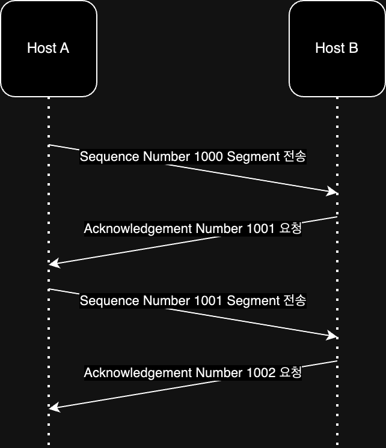
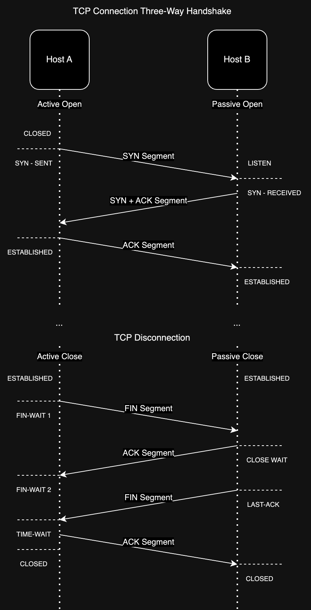

# 전송 계층 (Transport Layer) - TCP/IP Layer 3

전송 계층은 응용 계층(TCP/IP L4)의 애플리케이션 프로세스 식별과, 네트워크 계층(TCP/IP L2)의 신뢰성/연결성 확립(네트워크 계층의 한계 극복)을 담당한다.

- 애플리케이션 프로세스 식별 -> 포트 번호
- 신뢰성/연결성 확립 -> TCP 프로토콜

## PORT

네트워크 내의 단일 장치에서 실행되는 프로세스를 식별하는 논리적인 단위이다.  
포트 번호는 16비트의 숫자로, 0 ~ 65535까지 사용할 수 있으며, 범위에 따라 아래와 같이 분류된다.

|            포트 종류             |      범위       |                     설명                      |
|:----------------------------:|:-------------:|:-------------------------------------------:|
| Well-known port(System Port) |   0 ~ 1023    |     잘 알려진 포트로, 특정 프로토콜에 할당된 포트(특정 프로토콜)     |
|       Registered port        | 1024 ~ 49151  | 위의 포트보다는 덜 범용적이지만 흔히 사용되는 포트(특정 기업의 애플리케이션) |
|         Dynamic port         | 49152 ~ 65535 |       사용자가 자유롭게 할당 가능한 포트(크롬 같은 브라우저)       |

IANA(Internet Assigned Numbers Authority)에서 관리하고 아래 링크에서 확인할 수 있다.  
[IANA](https://www.iana.org/assignments/service-names-port-numbers/service-names-port-numbers.xhtml)

## TCP(Transmission Control Protocol)

TCP는 전송 계층의 대표적인 프로토콜로, 신뢰성 있는 데이터 전송을 보장한다.  
TCP의 데이터 단위는 세그먼트(Segment)이며, 세그먼트는 TCP 헤더와 Payload(애플리케이션 계층에서 전달받은 데이터)로 구성된다.  
컴퓨터는 항상 여러 개의 TCP 커넥션을 유지하고 있는데, 송신지 Port / 수신지 Port / 송신지 IP 주소 / 수신지 IP 주소로 구분하고 유지한다.

### TCP 소켓 프로그래밍

운영체제는 TCP 커넥션 생성과 관련된 여러 기능을 제공하고 있다.

- 연결 되지 않은 익명의 소켓 생성
- 소켓에 로컬 포트 번호와 인터페이스 할당
- 로컬의 소켓과 원격의 호스트 및 포트 사이에 TCP 커넥션 생성
- 커넥션을 받아들이기 위해 로컬 소켓에 허용함을 표시
- ...
- TCP 커넥션을 완전히 끊음
- TCP 커넥션의 입출력만 닫음
- ...

위 기능을 사용할 수 있는 소켓 API의 다양한 구현체들이 존재하여 현재 대부분 운영체제나 프로그래밍 언어에서 사용할 수 있다.

### TCP Segment 헤더 구조

- Source Port: 송신지 포트 번호
- Destination Port: 수신지 포트 번호
- Sequence Number: 송수신되는 세그먼트 데이터 첫 바이트에 부여되는 순서 번호
- Acknowledgement Number: 순서 번호에 대한 응답(다음으로 수신받길 기대하는 바이트 번호)
- Control Bits: TCP 연결 설정/해제, 데이터 전송 등을 제어하는 비트
    - ACK: 세그먼트 승인을 나타내는 비트
    - SYN: 연결 수립을 위한 비트
    - FIN: 연결을 끝내기 위한 비트
    - 그 외: URG / PSH / RST ...
- Window Size: 수신지 윈도우 크기(한 번에 수신 받고자 하는 크기)

세그먼트는 최대 크기가 MSS(Maximum Segment Size)로 제한되는데, 더 큰 데이터를 전송하고자 할 경우 여러 개의 세그먼트로 나누어 전송하게 된다.  
나뉘어진 세그먼트의 순서를 보장하기 위해 Sequence Number를 통해 순서를 붙이고, Acknowledgement Number를 통해 수신지에서 다음 세그먼트를 수신받길 기대하는 바이트 번호를 전송한다.

### UDP(User Datagram Protocol)

UDP는 TCP와 비교했을 때 기능이 없는 프로토콜로, 단지 IP 패킷을 캡슐화하는 역할만 수행한다.  
때문에 포트 정보와 길이, 체크섬(신뢰성과 관련 없는 필드) 정도의 정보만 가지고 있으며, 기능이 필요할 경우 UDP 위에 기능을 추가하여 사용한다.

|            TCP             |          UDP           |
|:--------------------------:|:----------------------:|
| 연결 지향(Connection Oriented) | 비연결 지향(Connectionless) |
|           신뢰성 보장           |        신뢰성 보장 X        |
|           순서 보장            |        순서 보장 X         |
|           흐름 제어            |        흐름 제어 X         |
|           혼잡 제어            |        혼잡 제어 X         |
|           느린 성능            |         빠른 성능          |

### TCP Connection Flow

TCP는 연결을 수립하고, 연결을 끊는 과정을 거치는 연결 지향형 프로토콜로, 신뢰성을 보장하기 위해 아래와 같은 과정을 거친다.

1. 연결 수립
2. 데이터 송수신
3. 연결 해제

전체적으로 위의 과정을 통해 TCP는 신뢰성을 보장하는데, 연결 수립과 해제 과정은 아래와 같다.

- 연결 수립 - Three-way Handshake

1. 호스트 A가 호스트 B에게 SYN 비트가 1로 초기화된 TCP 세그먼트를 전송
2. 호스트 B가 호스트 A에게 SYN 비트와 ACK 비트가 1로 초기화된 TCP 세그먼트를 전송
3. 호스트 A가 호스트 B에게 ACK 비트가 1로 초기화된 TCP 세그먼트를 전송

- 연결 해제 - Four-way Handshake

1. 호스트 A가 호스트 B에게 FIN 비트가 1로 초기화된 TCP 세그먼트를 전송
2. 호스트 B가 호스트 A에게 ACK 비트가 1로 초기화된 TCP 세그먼트를 전송
3. 호스트 B가 호스트 A에게 FIN 비트가 1로 초기화된 TCP 세그먼트를 전송
4. 호스트 A가 호스트 B에게 ACK 비트가 1로 초기화된 TCP 세그먼트를 전송
    - 호스트 B는 ACK를 받은 뒤에 바로 연결 해제
    - 호스트 A는 ACK를 보낸 뒤 일정 시간을 기다린 뒤 연결 해제

연결 수립과 데이터 송수신, 연결 해제 과정에 따라 TCP는 다양한 상태를 가지게 된다.(Stateful)  
이러한 상태를 표현하기 위해 TCP는 상태(state)를 가지고 있다.

- TCP 상태

|      상태      |                          설명                          |
|:------------:|:----------------------------------------------------:|
|    CLOSED    |                    아무런 연결이 없는 상태                     |
|    LISTEN    |      SYN 세그먼트를 기다리는 상태, 보통 서버 호스트가 요청을 기다리는 상태       |
|   SYN-SENT   |         SYN 세그먼트를 보낸 뒤 SYN-ACK 세그먼트를 기다리는 상태         |
| SYN-RECEIVED |         SYN-ACK 세그먼트를 보낸 뒤 ACK 세그먼트를 기다리는 상태         |
| ESTABLISHED  | 연결이 수립된 상태로, Three-way Handshake가 완료되어 데이터를 송수신하는 상태 |

그 외에 FIN-WAIT-1 / FIN-WAIT-2 / CLOSE-WAIT / LAST-ACK / TIME-WAIT 는 연결 해제 과정에서 사용되는 상태이며, 연결이 종료되면 CLOSED 상태가 된다.  
연결 수립 및 해제 과정과 상태 변경에 대한 흐름은 아래 그림과 같다.

### TCP가 신뢰성을 보장하는 방법

신뢰성 있는 데이터 전송을 보장하기 위해 재전송 기반의 오류 제어, 흐름 제어 / 혼잡 제어를 사용한다.  
자세한 내용은 아래와 같다.

#### 1. 재전송 기반의 오류 제어 - ARQ(Automatic Repeat Request)

TCP는 중복된 ACK 세그먼트를 수신했을 때나 타임아웃이 발생했을 때 잘못 전송되었음을 감지하고, 재전송을 하게 된다.  
이러한 재전송 기반의 오류 제어는 아래와 같은 방식으로 동작한다.

- Stop-and-Wait ARQ
    - 송신자가 데이터를 전송하고, 수신자가 ACK를 전송할 때까지 기다리는 방식
    - 제대로 보냈음을 확인하면 다음 데이터를 전송
    - 전송 -> ACK -> 전송 -> ACK -> 전송 -> ACK -> ...
    - 네트워크 효율이 낮아져 사용하지 않음
- Go-Back-N ARQ
    - 파이프라이닝 방식으로 여러 개의 세그먼트를 전송하고, 수신자가 올바른 세그먼트에 대해서 ACK를 전송하는 방식
    - 올바르지 않은 세그먼트가 수신되면 그 이후의 세그먼트를 폐기하고, 올바르지 않았던 세그먼트 이후의 모든 세그먼트를 재전송(N번째에서 오류 시 N번째 이후에 대해 폐기 및 재전송)
- Selective Repeat ARQ
    - 파이프라이닝 방식으로 여러 개의 세그먼트를 전송하고, 수신자가 올바른 세그먼트에 대해서 ACK를 전송하는 방식
    - 올바르지 않은 세그먼트가 수신되면 그 세그먼트만 재전송
    - Go-Back-N ARQ에 비해 복잡하지만, 네트워크 효율이 높아 사용

#### 2. 흐름 제어 / 혼잡 제어

송신자와 수신자는 한정된 버퍼를 가지고 있기 때문에, 송신자가 너무 빠르게 데이터를 전송하면 수신자는 버퍼가 가득 차서 데이터를 처리하지 못하게 된다.(데이터 손실)  
이러한 문제를 해결하기 위해 TCP는 흐름 제어와 혼잡 제어를 사용한다.

- 흐름 제어: 수신 호스트의 처리 속도를 고려하여 송수신 속도를 균일하게 조절
    - 수신 호스트는 TCP Segment Header의 Window Size를 통해 자신의 버퍼 크기를 전송하여 송신자에게 알려준다.
    - Window Size는 확인 응답 받지 않고 전송할 수 있는 한 번에 전송할 수 있는 데이터의 크기가 된다.
    - 슬라이딩 윈도우(Sliding Window)를 통해 흐름 제어를 수행하게 된다.
- 혼잡 제어: 많은 트래픽으로 인해 패킷 처리 속도가 느려지거나 유실될 수 있는 것을 방지
    - 혼잡 제어가 이루어지지 않으면 계속 유실되어 재전송을 하게 되면서 네트워크 혼잡이 더욱 심해지게 된다.
    - 송신 호스트에서 혼잡 없이 전송할 수 있을 양을 계산하게 되는데, 이를 Congestion Window Size라고 한다.
    - Congestion Window Size는 계속해서 증가하고 감소하는 가변적인 크기이다.(RTT, 패킷 유실 등을 고려)
    - Congestion Window Size와 TCP Segment Header의 Window Size 중 작은 값이 전송할 수 있는 데이터의 크기가 된다.
    - 느린 시작(Slow Start) / 혼잡 회피(Congestion Avoidance) / 빠른 회복(Fast Recovery) 알고리즘을 통해 혼잡 제어를 수행하게 된다.

### TCP와 HTTP

HTTP는 TCP 바로 위에 있는 계층이기 떄문에 HTTP 트랜잭션의 성능은 그 아래 계층인 TCP 성능에 영향을 받게 된다.  
대부분 HTTP 지연의 대부분은 TCP의 아래와 같은 특징 때문에 발생하게 된다.

- TCP 커넥션의 핸드셰이크 설정
- TCP 재전송 기반의 오류 제어
- 인터넷 혼잡을 제어하기 위한 TCP의 혼잡 제어
- 네트워크 효율을 위해 TCP 세그먼트보다 작은 여러 개의 데이터를 하나의 TCP 세그먼트로 전송하기 위한 Nagle 알고리즘
- TIME_WAIT 지연과 포트 고갈

결국 대부분이 신뢰성과 연결성을 보장하는 기능이지만, HTTP에서는 성능 저하를 일으키게 된다.

###### 참고자료

- [현실 세상의 컴퓨터 공학 지식 - 네트워크](https://fastcampus.co.kr/dev_online_newcomputer)
- [HTTP 완벽 가이드](https://www.nl.go.kr/seoji/contents/S80100000000.do?schM=intgr_detail_view_isbn&page=1&pageUnit=10&schType=simple&schStr=HTTP+완벽+가이드&isbn=9788966261208&cipId=200309770%2C4096969)