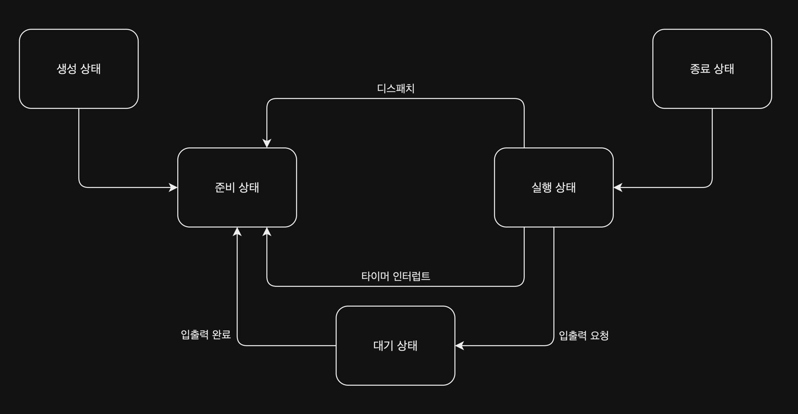

# Process(프로세스)

> 메모리에 적재하고 실행 된 프로그램

프로그램은 실행되기 전까지는 보조기억장치에 있는 데이터에 불과하지만, 프로그램을 메모리에 적재하고 실행하는 순간 프로세스가 된다.(= 프로세스 생성)

## 운영체제 내 실행 중인 프로세스 확인

윈도우에서는 작업 관리자의 프로세스 탭에서 확인할 수 있고, 리눅스에서는 `ps` 명령어로 확인할 수 있다.

```shell
$ ps -ef
  501 99763     1   0  2:45PM ??         0:00.08 /.../MacOS/com.apple.WebKit.Networking
    0  6764  6763   0  3:34PM ttys000    0:00.01 /.../MacOS/ShellLauncher --launch_shell
  501  6765  6764   0  3:34PM ttys000    0:00.25 -zsh
  501  6780     1   0  3:34PM ttys000    0:00.00 -zsh
  501  6813     1   0  3:34PM ttys000    0:00.00 -zsh
  501  6814     1   0  3:34PM ttys000    0:00.00 -zsh
  501  6816  6780   0  3:34PM ttys000    0:00.00 /Users/hyoguoo/.cache/gitstatus/gitstatusd-darwin-arm64 -G v1.5.4 -s -1 -u -1 -d -1 -c -1 -m -1 -v FATAL -t 20
    0  6892  6765   0  3:34PM ttys000    0:00.00 ps -ef
```

명령어를 실행하여 확인해보면 직접 실행한 프로세스 외에도 여러 프로세스를 확인할 수 있다.

## 프로세스 제어 블록(Process Control Block, PCB)

모든 프로세스는 실행을 위해 CPU를 필요하지만, 한정된 CPU 자원으로 인해 프로세스들은 차례대로 돌아가며 사용하게 된다.  
프로세스마다 정해진 시간만큼 CPU를 사용하고, 사용을 완료했음을 알리는 인터럽트(= 타이머 인터럽트)가 발생하면 다음 차례의 프로세스가 CPU를 사용하게 된다.

위 작업을 수행하기 위해 운영체제는 프로세스에 CPU를 포함한 자원을 할당하는데, 이를 위해 운영체제는 PCB를 사용한다.

|  정보   |                                  설명                                  |
|:-----:|:--------------------------------------------------------------------:|
| 생성 위치 |                                커널 영역                                 |
|  목적   |                         프로세스를 식별하기 위한 정보 저장                          |
|  정보   | 프로세스 식별자, 레지스타 값, 프로세스 상태, CPU 스케줄링 정보, 메모리 관리 정보, 사용한 파일 및 입출력장치 목록 |
| 생성 시점 |                              프로세스 생성 시점                              |

## 문맥교환(Context Switch)

> 문맥(context): 프로세스의 상태(프로그램 카운터, 레지스터 값 등) 정보, 즉 프로세스 제어 블록(PCB)에 저장되는 정보라고 봐도 무방

프로세스들은 타이머 인터럽트나 입출력 인터럽트 등의 인터럽트가 발생하면 CPU를 반환하고, 운영체제는 CPU를 반환한 프로세스의 문맥을 PCB에 저장한다.  
이 과정에서 기존 프로세스의 문맥을 PCB에 백업하고, 위해 문맥을 복구하여 새로운 프로세스를 실행하는 것을 문맥 교환(context switch)이라고 한다.

|     단계      |       프로세스 A       |       프로세스 B       |
|:-----------:|:------------------:|:------------------:|
|  프로세스 A 실행  |         실행         |         대기         |
|  문맥 교환 발생   |    PCB A에 문맥 저장    |                    |
|             |                    | PCB B에 저장된 문맥 불러오기 |
|  프로세스 B 실행  |         대기         |         실행         |
| 다시 문맥 교환 발생 |                    |    PCB B에 문맥 저장    |
|             | PCB A에 저장된 문맥 불러오기 |                    |
|  프로세스 A 실행  |         실행         |         대기         |

위 과정을 통해 프로세스들은 아주 빠르게 번갈아가며 CPU를 사용하게 되는데, 이 때문에 프로세스들은 동시에 실행되는 것처럼 보이게 된다.

## 프로세스의 메모리 영역

프로세스가 생성되면 커널 영역에 PCB가 저장되고, 사용자 영역에는 크게 코드, 데이터, 스택 영역으로 나뉘어 저장된다.

|          영역          |                                                 설명                                                  |
|:--------------------:|:---------------------------------------------------------------------------------------------------:|
| 코드 영역(code segment)  | 텍스트 영역이라고도 불리며, 실행할 수 있는 코드인 기계어로 이루어진 명령어가 저장<br/>데이터가 아닌 CPU가 실행할 명령어가 담겨 있기 때문에 쓰기가 금지된 읽기 전용 공간 |
| 데이터 영역(data segment) |        잠깐 썼다가 없앨 데이터가 아닌 프로그램이 실행되는 동안 유지할 데이터가 저장되는 공간<br/>크기가 고정된 영역이기 때문에 정적 할당 영역이라고도 함         |
|  힙 영역(heap segment)  |              프로그래머가 직접 할당할 수 있는 저장 공간<br/>할당을 하면 반환을 해야하는 공간(올바르게 반환하지 않으면 메모리 누수 발생)               |
| 스택 영역(stack segment) |                       데이터를 일시적으로 저장하는 공간<br/>데이터 영역과는 반대로 잠깐 쓰이다 사라지는 데이터가 저장                       |

## 프로세스 상태

운영체제에서는 여러 프로세스들이 빠르게 번갈아 가면서 실행되는데, 이 때 프로세스들은 상태를 가지고 있고, 가지고 있을 수 있는 대표적인 상태는 아래와 같다.

- 생성(new) 상태: 프로세스를 생성 중인 상태, 막 메모리에 적재되어 PCB를 할당 받은 상태로 프로세스 실행 전 준비 상태가 된다.
- 준비(ready) 상태: CPU를 할당받아 실행할 수 있지만 대기중인 상태로, 차례가 되면 실행 상태로 바뀐다.
- 실행(running) 상태: CPU를 할당받아 실행 중인 상태로, 할당된 일정 시간 동안만 실행된다.
    - 할당된 시간을 모두 사용 시(=타임 인터럽트 발생): 다시 준비 상태로 변경
    - 실행 도중 입출력장치를 사용 시: 입출력 장치의 작업이 끝날 때까지 기다려야 하는 경우 대기 상태로 변경
- 대기(blocked) 상태: 프로세스는 실행 도중 입출력장치를 사용하는 경우가 있는데, 입출력 작업이 끝날 때까지 기다리는 상태로, 입출력 작업이 끝나면 준비 상태로 변경된다.
- 종료(terminated) 상태: 프로세스가 종료된 상태로, 이 상태로 진입하면 운영체제는 PCB와 프로세스가 사용한 메모리를 정리한다.



## 프로세스 계층 구조

프로세스는 실행 도중 시스템 호출을 통해 다른 프로세스를 생성할 수 있는데, 이 경우 프로세스 계층 구조를 형성하게 된다.

- 부모 프로세스(parent process): 새 프로세스를 생성한 프로세스
- 자식 프로세스(child process): 부모 프로세스에 의해 생성된 프로세스(자식 프로세스도 또 다른 자식 프로세스를 생성할 수 있다.)

위 두 프로세스는 엄연히 다른 프로세스이기 때문에 각기 다른 PID를 가지게 되며, 자식 프로세스의 PCB에 부모 프로세스의 PID인 PPID(Parent PID)를 저장한다.

프로세스는 부모 - 자식 관계를 이루면서 계속해서 생성되기 때문에, 프로세스 계층 구조는 트리 형태로 표현할 수 있다.(= 프로세스 계층 구조)  
여기서 최초의 프로세스가 존재하게 되는데, 이 프로세스를 init 프로세스라고 하며, 모든 프로세스는 init 프로세스의 자식 프로세스이다.(항상 PID 1을 가진다.)

## 프로세스 생성

프로세스는 부모 프로세스에 의해 생성되는데, 이 때 부모 프로세스와 자식 프로세스는 다음과 같은 시스템 호출을 하게 된다.

- 부모 프로세스: `fork()` 시스템 호출하여 자신의 복사본을 자식 프로세스로 생성
    - 부모 프로세스의 복사본이기 때문에 부모 프로세스의 자원(메모리/열린 파일 목록 등)이 자식 프로세스에 그대로 상속
    - PID나 저장된 메모리 위치는 다름
- 자식 프로세스: `exec()` 시스템 호출하여 자신의 메모리 공간을 다른 프로그램으로 교체
    - 부모 프로세스의 복사본이 아닌 자신의 메모리 공간을 사용
    - `exec`를 호출하지 않고 그대로 수행하는 경우도 존재(= 부모 프로세스와 같은 코드를 병행하여 실행)

부모가 자식 프로세스를 실행하며 프로세스 계층 구조를 이루는 과정은 `fork`와 `exec`가 반복되는 과정이라고 볼 수 있다.

###### 참고자료

- [혼자 공부하는 컴퓨터 구조 + 운영체제 - 1:1 과외하듯 배우는 컴퓨터 공학 전공 지식 자습서](https://www.nl.go.kr/seoji/contents/S80100000000.do?schM=intgr_detail_view_isbn&page=1&pageUnit=10&schType=simple&schStr=혼자+컴퓨터+구조&isbn=9791162243091&cipId=228751835%2C)
