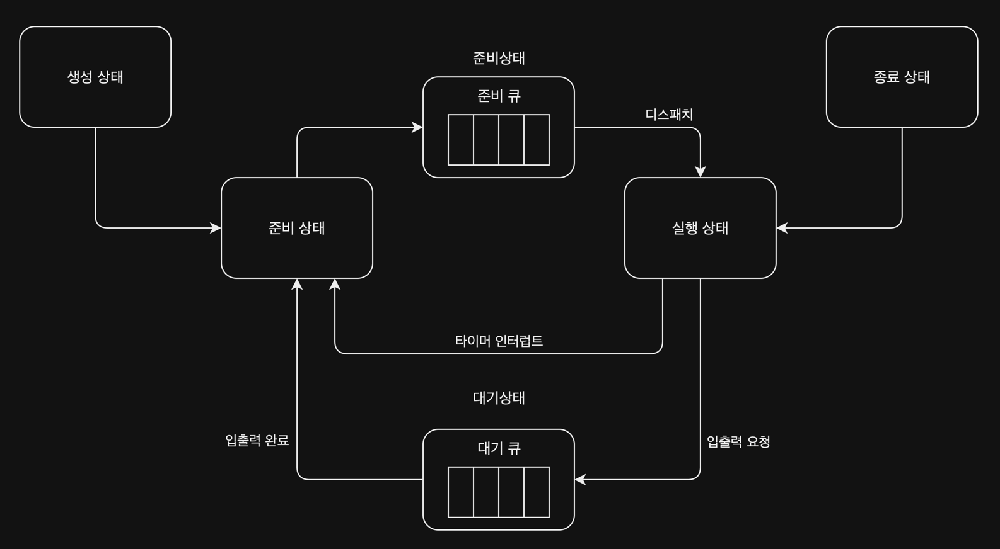

# CPU 스케줄링(CPU scheduling)

모든 프로세스는 CPU를 필요로 하기 때문에, 운영체제는 공정하고 합리적으로 CPU를 할당하기 위해 CPU 스케줄링(CPU scheduling)을 수행한다.

## 프로세스 우선순위

프로세스들을 차례로 돌아가며 CPU를 할당하는 것보다는, 프로세스들의 우선순위에 따라 CPU를 할당하는 것이 더 합리적이다.  
대표적으로 우선순위가 높은 프로세스는 입출력 작업이 많은 프로세스(= 입출력 집중 프로세스)이며, 그 이유는 아래와 같다.  
(반대로 CPU 작업이 많은 프로세스는 CPU 집중 프로세스라고 한다.)

입출력 작업을 할 때는 CPU 사용과 입출력장치 사용이 계속해서 반복되는데, 입출력장치 사용하는 동안 CPU는 대기 상태가 된다.  
떄문에 입출력 작업을 많이 하는 프로세스는 CPU를 많이 사용하지 않기 때문에 먼저 처리하고, 그 사이에 CPU 작업을 많이 하는 프로세스를 처리하는 것이 더 효율적으로 작업을 처리할 수 있다.

## 스케줄링 큐(scheduling queue)

우선순위는 PCB에 저장되어 있지만, CPU에서 다음 할당 프로세스를 찾기 위해 PCB를 하나씩 찾아보는 것은 비효율적이기 떄문에 운영체제는 프로세스들을 우선순위에 따라 스케줄링 큐로 구현하여 관리한다.  
여기서 큐는 FIFO 원칙을 따르는 자료구조가 아닌, 우선순위에 따라 정렬된 자료구조이며, 다양한 종류의 스케줄링 큐로 관리된다.  
대표적으로 아래 두 개의 큐가 있으며, 전체적인 프로세스는 아래와 같이 진행된다.

- 대기 큐(waiting queue): 입출력장치를 이용하기 위해 대기 상태에 있는 프로세스들이 저장되는 큐, 각 입출력 장치마다 각각 대기 큐가 존재(프린터 대기 큐, 하드 디스크 대기 큐 등)
    1. 입출력 장치를 사용하기 위해 대기 상태에 있는 프로세스들이 대기 큐에 마지막에 삽입
    2. 입출력장치 사용을 위해 차례 대기
    3. 입출력이 완료되면 대기 큐에서 삭제 후 준비 큐에 삽입
- 준비 큐(ready queue): CPU를 할당받기 위해 대기하는 프로세스들이 저장되는 큐
    1. 준비 상태에 있는 프로세스들이 준비 큐에 마지막에 삽입
    2. CPU 사용을 위해 차례 대기
    3. 운영체제에서 큐에 삽입된 순서대로 프로세스를 하나씩 실행(여기서 우선순위가 높은 경우 해당 프로세스가 먼저 실행)

기존의 프로레스 상태 다이어그램에서 준비 / 대기 큐에 대해 추가된 부분을 그림으로 표현하면 아래와 같다.

## 선점형 / 비선점형 스케줄링

스케줄링 큐를 관리할 때 실행 중인 프로세스를 강제로 중단하여 다른 프로세스를 실행시키는 방법에 따라 선점형 / 비선점형 스케줄링으로 나뉜다.

- 선점형 스케줄링(preemptive scheduling): 프로세스 실행 중 다른 프로세스가 도착하면 실행 중인 프로세스를 중단하고, 우선순위가 높은 프로세스를 실행하는 스케줄링
    - 한 프로세스의 자원 독점을 막고 프로세스들에 골고루 자원 배분이 되는 장점 존재
    - 문맥 교환 과정에서 오버헤드 발생 가능성 존재
- 비선점형 스케줄링(non-preemptive scheduling): 프로세스 실행 중 다른 프로세스가 도착하더라도 실행 중인 프로세스를 중단하지 않고, 우선순위가 높은 프로세스가 실행될 때까지 기다리는 스케줄링
    - 문맥 교환 횟수가 줄어들어 오버헤드가 선점형 스케줄링보다 적게 발생
    - 프로세스의 자원 독점이 발생할 수 있음

## 스케줄링 알고리즘

운영체제는 저마다 다른 스케줄링 알고리즘을 사용하며, 아래 다섯 가지 스케줄링 알고리즘 이외에도 다양한 스케줄링 알고리즘이 존재한다.

- 선입 선처리 스케줄링: 준비 큐에 삽입된 프로세스 순서대로 CPU 할당
- 최단 작업 우선 스케줄링: 준비 큐에 삽입된 프로세스 중 CPU 사용 시간이 가장 짧은 프로세스에게 CPU 할당
- 라운드 로빈 스케줄링: 정해진 시간만큼만 CPU를 할당하고, 할당된 시간이 지나면 다음 프로세스에게 CPU 할당
- 우선순위 스케줄링: 가장 높은 우선순위를 가진 프로세스에게 CPU 할당
- 다단계 피드백 큐 스케줄링: 프로세스들이 큐 사이를 이동하며 CPU를 할당받는 스케줄링

###### 참고자료

- [혼자 공부하는 컴퓨터 구조 + 운영체제 - 1:1 과외하듯 배우는 컴퓨터 공학 전공 지식 자습서](https://www.nl.go.kr/seoji/contents/S80100000000.do?schM=intgr_detail_view_isbn&page=1&pageUnit=10&schType=simple&schStr=혼자+컴퓨터+구조&isbn=9791162243091&cipId=228751835%2C)