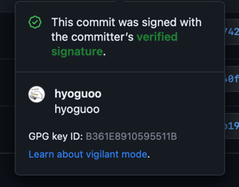

# Github Verified Commit



로컬 커밋에서 GPG를 사용해 Verified Commit을 하기 위한 설정 방법

## 설치

```shell
brew install gnupg pinentry-mac
```

## 키 생성

```shell
gpg --full-generate-key
```

위 명령어 실행 후 아래 옵션으로 생성

```
(1) RSA and RSA
keysize: 4096
0 = key does not expire
Real name: hyoguoo
Email address: hyoguoo@gmail.com
Comment:
```

옵션 설정을 마치면 암호를 입력하라는 메시지가 나오는데, 이 암호는 나중 단계에서 최초 커밋할 때 사용된다.

## 생성 된 키 확인

```shell
gpg --list-secret-keys --keyid-format=long
```

```
gpg: checking the trustdb
gpg: marginals needed: 3  completes needed: 1  trust model: pgp
gpg: depth: 0  valid:   1  signed:   0  trust: 0-, 0q, 0n, 0m, 0f, 1u
/Users/hyogu/.gnupg/pubring.kbx
-------------------------------
sec   rsa4096/A*************** 2023-04-25 [SC]
      B***************************************
uid                 [ultimate] hyoguoo <hyoguoo@gmail.com>
ssb   rsa4096/C*************** 2023-04-25 [E]
```

위에 값 중 A로 시작하는 키가 있는 곳이 GPG Key ID

## git config 설정

`.gitconfig` 파일에 아래의 내용 추가

```
[user]
	name = hyoguoo
	email = hyoguoo@gmail.com
	signingkey = A***************
[commit]
	gpgsign = true
[gpg]
	program = gpg
```

## GPG Agent 설정

- `pinentry` 설치 위치 확인

```shell
which pinentry-mac
```

- 확인되는 설치 경로 `/opt/homebrew/bin/pinentry-mac` 기준 아래의 명령어 실행

```shell
echo "pinentry-program /opt/homebrew/bin/pinentry-mac" >> ~/.gnupg/gpg-agent.conf
```

- GPG Agent 재실행

```shell
killall gpg-agent
```

## GiHub 키 등록

```shell
gpg --armor --export A***************
```

```
-----BEGIN PGP PUBLIC KEY BLOCK-----

...
...
...
-----END PGP PUBLIC KEY BLOCK-----
```
위의 명령어를 실행해 GPG Key 확인하면 출력되는 내용(BEGIN ~ END까지)을 복사 후  
`GitHub - Settings - SSH and GPG keys - New GPG key` 에서 복사한 내용을 붙여넣기 후 등록

## 커밋

최초 커밋 시 위에서 설정한 비밀번호 입력하면 `Verified Commit`이 된다.
