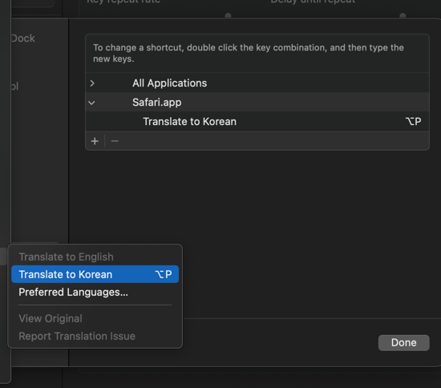

# Mac

## 메뉴 단축키 지정

- System Settings > Keyboard > Keyboard Shortcuts > App Shortcuts -> + -> `Application` - `Menu Title`
- 메뉴에 명시된 글씨와 동일하게 입력



## `Karabiner-Elements` 활용한 키 할당 변경

### 한글 자판 시 원화 `₩` 출력 방지

`DefaultkeyBinding.dict` 파일을 통한 \`키 변경을 하게 되면 IntelliJ 내부에서는 한글 자판에선 그대로 `₩`가 출력되는데,  
해당 파일을 사용하지 않고 `Karabiner-Elements`를 통해 아래 파일을 생성하여 적용하면 IntelliJ 내부에서 ` 키를 사용할 수 있다.  
(시스템 전역으로 적용하게 되면 애플리케이션 내 창 전환이 안되는 문제가 있어서 IntelliJ에서만 적용되도록 설정)

- path: /.config/karabiner/assets/complex_modifications

```json
{
  "title": "Change Won (₩) to grave accent (`)",
  "rules": [
    {
      "description": "Change Won (₩) to grave accent (`) in Korean layout.",
      "manipulators": [
        {
          "conditions": [
            {
              "type": "input_source_if",
              "input_sources": [
                {
                  "language": "ko"
                }
              ]
            }
          ],
          "type": "basic",
          "from": {
            "key_code": "grave_accent_and_tilde",
            "modifiers": {
              "optional": [
                "any"
              ]
            }
          },
          "to": [
            {
              "key_code": "grave_accent_and_tilde",
              "modifiers": [
                "option"
              ]
            }
          ],
          "conditions": [
            {
              "type": "frontmost_application_if",
              "bundle_identifiers": [
                "^com\\.jetbrains\\.intellij$"
              ]
            }
          ]
        }
      ]
    }
  ]
}
```


