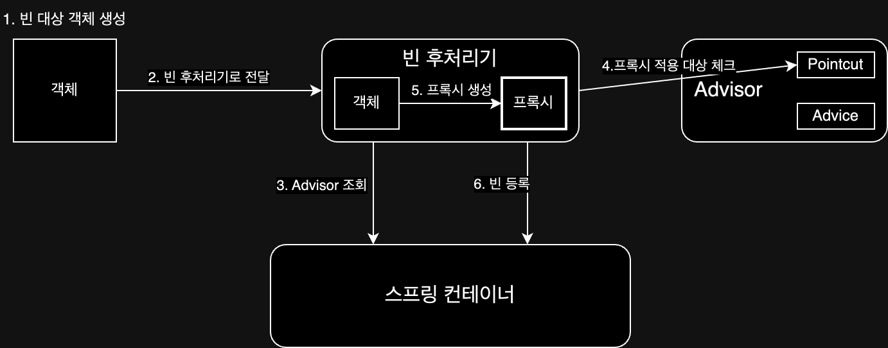

# AOP(Aspect-Oriented Programming)

> 관점 지향 프로그래밍

애플리케이션 로직은 크게 핵심 기능과 부가 기능으로 나눌 수 있다.  
보통 부가 기능은 여러 클래스에 걸쳐 사용되는 경우가 많아 중복 코드가 발생하여 유지보수가 어려워지며, 핵심 기능의 코드를 흐리게 만든다.  
때문에 이를 분리하려는 시도를 하기 시작했고, 부가적인 기능을 분리하여 설계하여 개발 하는 방법을 관점 지향 프로그래밍(AOP)이라고 한다.

## 적용 방식

AOP를 사용할 때 부가 기능 조작을 추가하는 방법(시점)은 크게 세가지가 있다.

- 컴파일 시점
    - 컴파일러에서 `.class`를 만드는 시점에서 부가 기능 로직을 추가하는 방법으로 위빙(weaving)이라고 한다.
    - 특별한 컴파일러도 필요하고 복잡하기 때문에 잘 사용하지 않는다.
- 클래스 로딩 시점
    - `.class` 파일을 JVM 내부의 클래스 로더에 보관하는 시점에 부가 기능 로직을 추가하는 방법으로 로드 타임 위빙(Load Time Weaving)이라고 한다.
    - 모니터링 툴들이 이 방식을 사용한다.
    - 클래스 로더 조작기를 지정하여 사용하는데, 운영하기 어려워 잘 사용하지 않는다.
- 런타임 시점
    - 자바의 메인 메서드가 실행된 다음에 부가 기능 로직을 추가하는 방법으로 프록시 객체를 통해 구현할 수 있다.
    - 프록시를 사용하기 때문에 메서드 실행 지점에만 AOP를 적용할 수 있다.(제한된 기능)
    - 하지만 스프링이나 AspectJ 같은 프레임워크를 사용하면 복잡한 과정을 거치지 않고도 AOP를 적용할 수 있다.

이중 가장 많이 사용하는 방법은 스프링 AOP나 AspectJ 같은 프레임워크를 사용하여 런타임 시점에 프록시 객체를 통해 구현하는 방법이다.  
이 방법은 메서드 실행 지점에만 AOP를 적용할 수 있지만, 충분히 대부분의 문제를 해결할 수 있기 때문에 대부분 스프링 AOP를 사용하고 있다.

## 용어 정리

- 어드바이스(Advice)
    - 제공할 부가 기능
- 조인 포인트(Join point)
    - 어드바이스가 적용될 수 있는 지점
        - 메소드 실행, 생성자 호출, 필드 값 접근, static 메서드 접근 등 특정 지점 모두 가능(= AOP를 적용할 수 있는 지점)
- 포인트컷(Pointcut)
    - 조인 포인트 중에서 어드바이스가 적용될 위치를 선별하는 기능
    - 주로 AspectJ 표현식을 사용해서 지정
- 타겟(Target)
    - 어드바이스가 적용되는 대상 객체
- 애스펙트(Aspect)
    - 어드바이스 + 포인트컷을 모듈화 한 것
    - 스프링에서는 보통 `@Aspect` 애노테이션을 통해 적용
- 어드바이저(Advisor)
    - 하나의 어드바이스와 하나의 포인트 컷으로 결합된 것
    - 스프링 AOP에서만 사용되는 특별한 용어
- 위빙(Weaving)
    - 포인트컷으로 결정한 타켓의 조인 포인트에 어드바이스를 적용하는 과정
- AOP 프록시(AOP Proxy)
    - AOP 기능을 구현하기 위해 만든 프록시 객체

## 스프링에서의 AOP

스프링에서는 AOP를 구현하기 위해 여러 가지 기술들을 제공하고 있으며, 최근엔 `@Aspect` 애노테이션을 사용하는 것을 가장 많이 사용하고 있다.  
또한 하나의 부가 기능만 제공할 수 있는 것이 아니라 체인 형태로 구성하여 여러 개의 부가 기능을 제공할 수 있다.

## JDK 동적 프록시 / CGLIB

스프링에서 프록시 패턴을 구현하는 가장 기본적인 방법은 JDK 동적 프록시와 CGLIB가 있다.  
두 방법은 사용하기 불편하고 복잡하기 때문에 직접적으로 사용하는 경우는 없지만, 스프링 프레임워크에서는 이를 핵심 기술로 활용하여 편리하게 사용할 수 있도록 추상화된 기능을 제공하고 있다.

### JDK 동적 프록시

- 자바 언어에서 기본으로 제공하는 표준 라이브러리 동적 프록시 기술로 인터페이스 기반 프록시 생성하는 방법
- 인터페이스가 없으면 프록시 생성 불가능한 한계 존재
- `InvocationHandler` 인터페이스를 구현하여 프록시 객체 생성 및 동작 정의

```java
class TestInvocationHandler implements InvocationHandler {

    private TargetInterface target; // Target, 적용이 될 실제 객체

    public TestInvocationHandler(TargetInterface target) {
        this.target = target;
    }

    @Override
    public Object invoke(Object proxy, Method method, Object[] args) throws Throwable {
        log.info("log start");
        Object result = method.invoke(target, args);  // 실제 객체의 메서드 호출
        log.info("log end");

        return result;
    }
}
```

### CGLIB

- 바이트 코드를 조작하여 프록시 역할을 하는 클래스를 만들어주는 라이브러리를 사용하여 프록시 패턴을 구현하는 방법
- 클래스 상속 방식으로 구현하기 때문에 인터페이스가 없어도 프록시 패턴 구현 가능
- 클래스나 메서드에 `final` 키워드가 있으면 상속이 불가능하거나 오버라이딩이 불가능하기 때문에 `final` 키워드가 없는 클래스나 메서드만 적용 가능
- `MethodInterceptor` 인터페이스를 구현하여 동작을 정의

```java
class TestMethodInterceptor implements MethodInterceptor {

    private TargetImpl target; // Target, 적용이 될 실제 객체

    public TestMethodInterceptor(TargetImpl target) {
        this.target = target;
    }

    @Override
    public Object intercept(Object obj, Method method, Object[] args, MethodProxy proxy) throws Throwable {
        log.info("log start");
        Object result = proxy.invoke(target, args); // 실제 객체의 메서드 호출
        log.info("log end");

        return result;
    }
}
```

예시 코드에서 볼 수 있듯이 프록시 패턴을 구현해야하는 인터페이스가 다르기 때문에 구현하는데 복잡성을 가진다.  
스프링에서는 이를 추상화시켜 프록시를 생성하는 방법을 통일하여 사용할 수 있도록 Proxy Factory를 제공한다.

## Proxy Factory

Proxy Factory는 스프링에서 프록시 객체를 생성하고 요청을 처리하는 방법을 통일하여 사용할 수 있도록 추상화한 것이다.  
인터페이스 유무 혹은 옵션에 따라 JDK 동적 프록시와 CGLIB를 사용하여 프록시 패턴을 구현해주는 기능을 제공한다.


프록시 생성(Proxy Factory)과 생성된 프록시에 요청(Advice Call)을 하게 되면 위와 같은 흐름으로 동작하게 된다.

- Proxy Factory를 이용한 예시 코드

```java
// 부가 기능을 제공할 Advice
class LogTraceAdvice implements MethodInterceptor {

    @Override
    public Object invoke(MethodInvocation invocation) throws Throwable {
        log.info("log start");
        Object result = invocation.proceed(); // 실제 객체의 메서드 호출
        log.info("log end");

        return result;
    }
}

class ExampleProxyFactory {

    public Object getProxy(Object target) {
        // Pointcut
        NameMatchMethodPointcut pointcut = new NameMatchMethodPointcut();
        pointcut.setMappedNames("request*", "order*", "save*");

        // Advice
        LogTraceAdvice advice = new LogTraceAdvice();

        // Advisor
        Advisor advisor = new DefaultPointcutAdvisor(pointcut, advice);

        return new ProxyFactory()
                .setTarget(target)
                .addAdvisor(advisor)
                .getProxy();
    }
}

class Main {

    public static void main(String[] args) {
        Example example = new Example();
        ExampleProxyFactory proxyFactory = new ExampleProxyFactory();
        Example proxy = (Example) proxyFactory.getProxy(example);
        proxy.execute();
    }
}
```

이 방법으로 생성 방법은 통일되었지만, 적용할 메서드를 하나하나 수동으로 등록해주어야 하기 때문에 설정 코드 자체도 길어지며, 컴포넌트 스캔을 하는 경우 프록시 객체 생성이 불가능하다는 한계가 존재한다.  
때문에 컴포넌트 스캔을 포함한 등록되는 빈들에 대해 프록시 객체를 적용하는 빈 후처리기 방법이 등장하게 되었다.

## 빈 후처리기

빈 후처리기를 이용하면 컴포넌트 스캔을 포함한 등록되는 빈들에 대해 프록시 객체를 적용하여 등록할 수 있다.  
또한 적용 될 빈을 필터링할 수 있기 때문에 특정 빈에만 프록시를 적용할 수 있게 된다.

```java
// Processor.java
class PackageLogTracePostProcessor implements BeanPostProcessor {

    private final String basePackage; // 프록시 적용 패키지
    private final Advisor advisor; // Advice + Pointcut

    public PackageLogTracePostProcessor(String basePackage, Advisor advisor) {
        this.basePackage = basePackage;
        this.advisor = advisor;
    }

    @Override
    public Object postProcessAfterInitialization(Object bean, String beanName) throws BeansException {
        String packageName = bean.getClass().getPackageName();

        // 프록시 적용 대상 여부 체크
        if (!packageName.startsWith(basePackage)) {
            return bean; // 프록시 적용 대상이 아니면 원본을 반환
        }

        // 프록시 대싱이면 프록시를 만들어서 반환
        return new ProxyFactory()
                .setTarget(bean)
                .addAdvisor(advisor)
                .getProxy();
    }
}

// Config.java
@Configuration
@Import({AppV1Config.class, AppV2Config.class})
class BeanPostProcessorConfig {

    @Bean
    public PackageLogTracePostProcessor logTracePostProcessor() {
        return new PackageLogTracePostProcessor("hello.proxy.app", getAdvisor());
    }

    @Bean
    public DefaultPointcutAdvisor advisor() {
        return new DefaultPointcutAdvisor(Pointcut.TRUE, new MyAdvice());
    }
}
```

하지만 이 방법을 사용하더라도 포인트 컷(=빈 후처리기)과 어드바이스(=Proxy Factory)를 별도로 정의해야 하기 때문에 여전히 복잡하고 관리하기 어렵다는 단점이 존재한다.

## @Aspect

프록시를 직접 생성하여 구현하는 방법이 아닌 CGLib를 사용하여 바이트 코드를 조작하여 기능을 제공하는 방법으로, 가장 간단하게 AOP를 구현할 수 있는 방법이다.  
포인트컷(Pointcut)과 어드바이스(Advice)로 구성된 어드바이저(Advisor)의 생성을 편리하게 해주는 기능을 가진 어노테이션을 통해 훨씬 간단하게 부가 기능을 제공할 수 있다.

```java
// Aspect.java
@Aspect
class ExampleAspect {

    @Around(value = "execution(* hello.proxy.app..*(..))") // Pointcut
    public Object execute(ProceedingJoinPoint joinPoint) throws Throwable {
        // Advice 로직
        // ...

        Object result = joinPoint.proceed(); // 실제 객체의 메서드 호출

        // ...
        // Advice 로직
        return result;
    }
}

// Config.java
@Configuration
class AopConfig {

    @Bean
    public LogTraceAspect logTraceAspect(LogTrace logTrace) {
        return new LogTraceAspect(logTrace);
    }
}
```

### @Aspect의 동작 방식

@Aspect를 사용하여 프록시 객체를 적용할 때, 어드바이저 생성과 프록시 객체 적용은 다음과 같은 흐름으로 동작하게 된다.

- 어드바이저 생성

1. 스프링 실행 후 `@Aspect` 애노테이션이 붙은 빈 조회
2. `@Aspect` 애노테이션 정보를 기반으로 어드바이저 생성
3. 어드바이저 등록

- 프록시 객체 적용



1. 스프링 빈 대상이 되는 객체 생성
2. 생성된 객체들을 스프링 빈 컨테이너 등록하기 전 빈 후처리기에 전달
3. 스프링 빈 컨테이너에서 어드바이저 조회
4. 어드바이저에 등록된 포인트컷을 통해 프록시 적용 대상인지 확인(클래스 내에 하나 이상의 메서드가 존재하면 프록시 적용 대상)
5. 프록시 팩토리를 통해 프록시 객체 생성
6. 프록시 객체를 스프링 빈 컨테이너에 등록

## 프록시 내부 호출(Self Invocation)

프록시를 적용하였더라도, 대상 객체의 내부에서 메서드 호출을 하게 되면 프록시를 거치지 않고 대상 객체를 직접 호출하게 되어 프록시 기능이 적용되지 않는 문제가 발생한다.

```java
class Example {

    public void external() {
        // do something
        internal(); // 프록시를 거치지 않고 대상 객체 내부에서 메서드 호출하기 프록시 기능이 적용되지 않음
    }

    public void internal() {
        // do something
    }
}
```

이러한 문제를 해결하기 위해서 프록시를 사용하는 것이 아닌 실제 코드에 AOP를 직접 적용하는 방법도 있으나, 복잡하기 때문에 그대로 프록시를 쓰면서 문제를 회피하는 방법을 사용한다.

- 자기 자신 주입
- 지연 조회
- 구조 변경(스프링에서 권장하는 방법)

## 스프링과 CGLIB

최신 버전의 스프링 부트에서는 프록시 객체를 생성할 때 기본적으로 CGLIB를 사용하는데, 이를 통해 아래와 같은 장점을 가지게 된다.

- 인터페이스가 없는 클래스도 프록시로 만들 수 있음
- 의존관계 주입 시 문제가 발생하지 않음(JDK 동적 프록시는 발생)

하지만 CGLIB는 클래스를 상속받아 생성하는 방식이기 때문에 다음과 같은 제약사항이 존재했지만 3번을 제외하고는 이미 해결되었다.(`objenesis`라는 라이브러리를 사용하여 해결)

1. 대상 클래스에 기본 생성자가 반드시 존재해야 함
2. 생성자 호출이 두 번 발생(실제 객체를 생성할 때 + 프록시 객체를 생성할 때)
3. final 클래스, final 메서드가 있는 경우 프록시를 생성할 수 없음

3번 문제는 아직 해결하지 못했으나 대부분의 경우 final 키워드를 잘 사용하지 않기 때문에 큰 문제가 되지 않는다.

## ETC

- 프록시 객체는 스프링 컨테이너가 관리하고 자바 힙 메모리에도 올라가지만, 실제 객체는 자바 힙 메모리에는 올라가지만 스프링 컨테이너가 관리하지는 않는다.

###### 참고자료

- [스프링 핵심 원리 - 고급편](https://www.inflearn.com/course/스프링-핵심-원리-고급편)