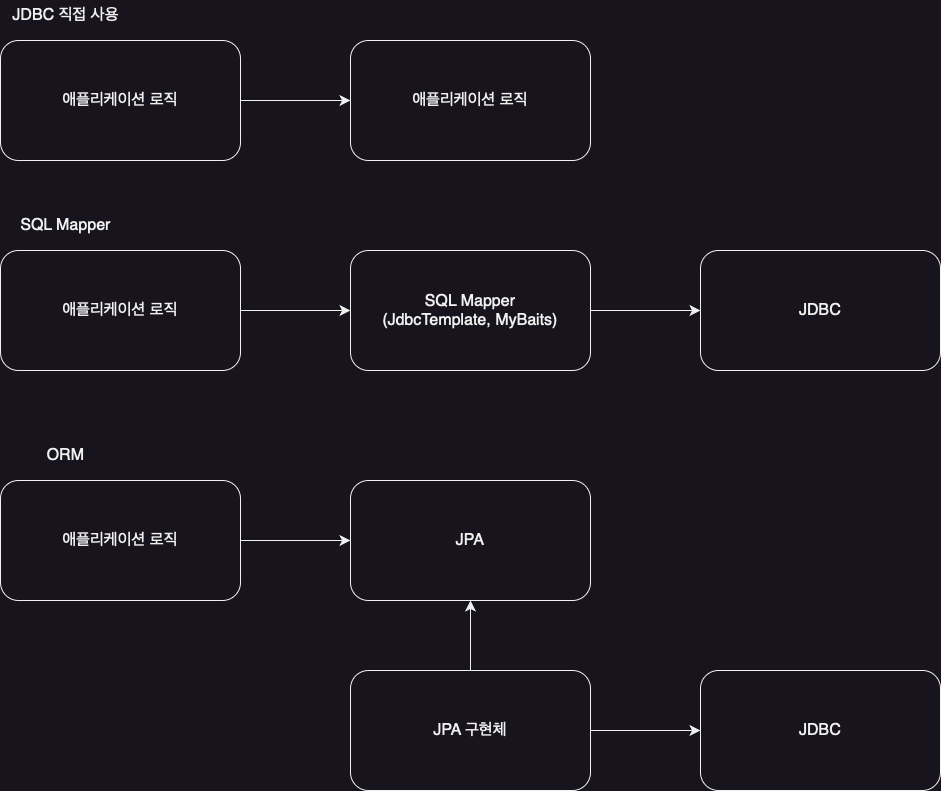

# JDBC(Java Database Connectivity)

자바에서 데이터베이스에 접속할 수 있도록 하는 자바 API로, Java로 데이터베이스에 연결 및 쿼리를 실행하기 위한 인터페이스를 제공한다.

- `java.sql.Connection`: 연결
- `java.sql.Statement`: SQL을 담은 내용
- `java.sql.ResultSet`: SQL 요청 응답
- JDBC 드라이버: DB 벤더에서 제공하는 라이브러리

위의 세 개의 인터페이스와 JDBC 드라이버를 사용하여 DB에 접근할 수 있다.

## JDBC의 사용

JDBC는 여러 문제를 해결해주었지만 오래된 기술이고 사용하는 방법이 복잡하기 때문에, 최근에는 직접 사용하는 것보다는 `SQL Mapper`나 `ORM`을 결합하여 사용하고 있다.

- SQL Mapper
    - 장점
        - SQL 응답 결과를 객체로 편리하게 변환
        - JDBC의 반복 코드를 제거
    - 단점
        - 개발자가 SQL을 직접 작성
    - 대표 기술: 스프링 JdbcTemplate, MyBatis

- ORM
    - 장점
        - 객체와 RDB의 패러다임 불일치 해결
        - 생산성
        - 유지보수
    - 단점
        - 학습비용
        - 잘못 사용하면 성능 이슈
    - JPA는 자바 진영의 ORM 표준 인터페이스
    - 대표 기술: JPA, 하이버네이트, 이클립스링크

###### 참고자료

- [스프링 DB 1편 - 데이터 접근 핵심 원리](https://www.inflearn.com/course/스프링-db-1)