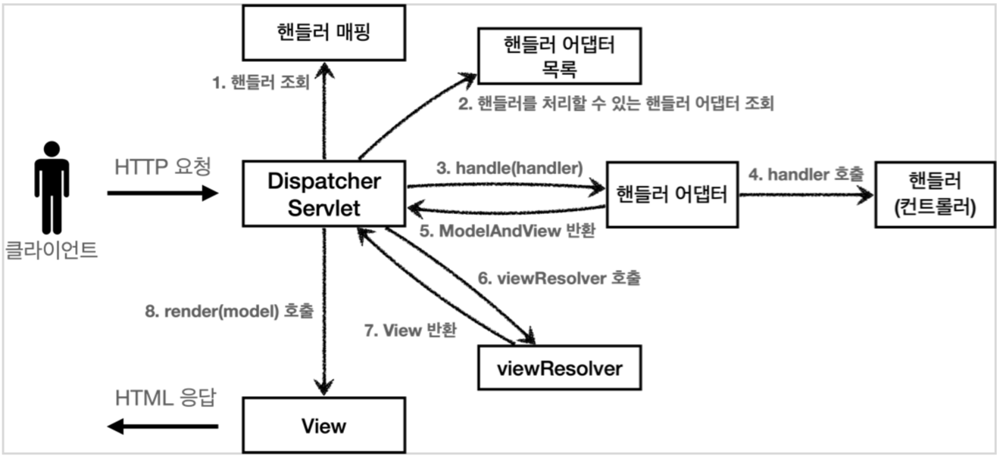

# DispatcherServlet(디스패처 서블릿)

`org.springframework.web.servlet.DispatcherServlet`

스프링 MVC의 핵심으로, 프론트 컨트롤러 역할을 한다.

- 부모 클래스에서 `HttpServlet`을 상속 받아 사용하고, 서블릿으로 동작
- 스프링 부트는 `DispatcherServlet`을 자동으로 등록하면서 모든 경로에 (`urlPatterns = "/"`) 매핑

## 요청 흐름

1. 서블릿이 호출되면 `HttpServlet`의 `service()` 메서드가 호출
2. 스프링 MVC의 `DispatcherServlet`은 `FrameworkServlet`의 `service()` 메서드를 오버라이딩이 되어있음
3. `FrameworkServlet`의 `service()` 메서드는 여러 메서드를 호출하는데, 그 중 `doDispatch()` 메서드가 가장 중요한 역할을 함

### `doDispatch()` 코드 분석 및 요청 흐름



내부 코드를 살펴보면 앞 문서에서 확인했던 Spring MVC Flow의 동작을 모두 확인할 수 있다.

```java
public class DispatcherServlet extends FrameworkServlet { // FrameworkServlet -> HttpServletBean -> HttpServlet
    // ...
    protected void doDispatch(HttpServletRequest request, HttpServletResponse response) throws Exception {
        HttpServletRequest processedRequest = request;
        HandlerExecutionChain mappedHandler = null;

        // ...

        try {
            ModelAndView mv = null;
            try {
                // 1. 핸들러 조회
                mappedHandler = getHandler(processedRequest);
                if (mappedHandler == null) {
                    noHandlerFound(processedRequest, response);
                    return;
                }
                // 2.핸들러 어댑터 조회 - 핸들러를 처리할 수 있는 어댑터
                HandlerAdapter ha = getHandlerAdapter(mappedHandler.getHandler());
            } catch (Exception ex) {
                // ...
            } catch (Throwable err) {
                // ...
            }
            /**
             * 3. 핸들러 어댑터 실행
             * 4. 핸들러 어댑터를 통해 핸들러 실행
             * 5. ModelAndView 반환 mv = ha.handle(processedRequest, response, mappedHandler.getHandler());
             */
            processDispatchResult(processedRequest, response, mappedHandler, mv, dispatchException);
        } catch (Exception ex) {
            // ...
        } catch (Throwable err) {
            // ...
        } finally {
            // ...
        }
    }

    private void processDispatchResult(HttpServletRequest request, HttpServletResponse response,
                                       @Nullable HandlerExecutionChain mappedHandler, @Nullable ModelAndView mv,
                                       @Nullable Exception exception) throws Exception {
        // ...
        render(mv, request, response); // 뷰 렌더링 호출
        // ...
    }

    protected void render(ModelAndView mv, HttpServletRequest request, HttpServletResponse response) throws Exception {
        // ...
        View view;
        String viewName = mv.getViewName(); //6. 뷰 리졸버를 통해서 뷰 찾기, 7.View 반환
        // ...
        view = resolveViewName(viewName, mv.getModelInternal(), locale, request);
        // ...
        // 8. 뷰 렌더링
        view.render(mv.getModelInternal(), request, response);
        // ...
    }
}
```

| 순서 |         내용         |                              설명                              |
|:--:|:------------------:|:------------------------------------------------------------:|
| 1  |       핸들러 조회       |                핸들러 매핑을 통해 요청 URL에 매핑된 핸들러 조회                 |
| 2  |     핸들러 어댑터 조회     |                   핸들러를 처리할 수 있는 핸들러 어댑터 조회                   |
| 3  |     핸들러 어댑터 실행     |                          핸들러 어댑터 실행                          |
| 4  | 핸들러 어댑터를 통해 핸들러 실행 |                      핸들러 어댑터를 통해 핸들러 실행                      |
| 5  |  ModelAndView 반환   |          핸들러 어댑터는 핸들러의 반환 정보를 ModelAndView로 변환해서 반환          |
| 6  |  뷰 리졸버를 통해서 뷰 찾기   |                       뷰 리졸버를 통해서 뷰를 찾음                       |
| 7  |      View 반환       | 뷰 리졸버는 논리 뷰 이름을 물리 뷰 이름으로 변환해서 반환 후 렌더링 역할을 담항하는 View 객체를 반환 |
| 8  |       뷰 렌더링        |             View 객체의 `render()` 메서드를 호출해서 뷰 렌더링              |

위의 역할 외에도 디스패처 서블릿은 스프링에서 모든 요청을 먼저 받는 곳이 디스패처 서블릿이기 때문에, 발생한 에러가 처리되는 시작되는 곳이기도 하다.

###### 참고자료

- [스프링 MVC 1편 - 백엔드 웹 개발 핵심 기술](https://www.inflearn.com/course/스프링-mvc-1)
