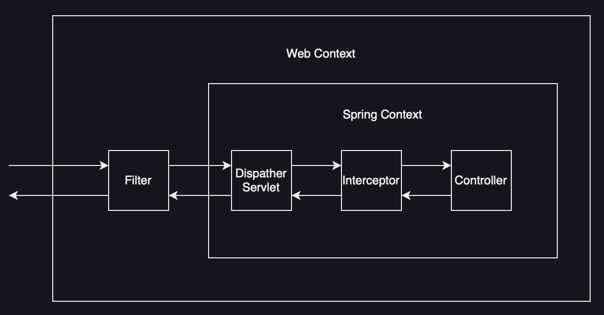

# 예외 처리(Exception Handling)

## 스프링의 기본적인 예외 처리 방법

스프링에서 컨트롤러에서 예외가 발생하게 되면, 아래의 사진에서처럼 역순으로 전파되어 WAS(톰캣)까지 전달된다.



WAS에서는 등록한 에러에 맞게 요청을 전달하게 되는데, 에러 컨트롤러(`BasicErrorController`)를 한 번 더 호출하여 에러를 처리하게 된다.  
여기서 요청할 때 인터셉터나 필터가 작동하지 않기 위해 dispatcherType을 `ERROR`로 하여 요청을 보낸다.(일반적인 요청은 `REQUEST`)  
이 방법은 WAS에서 두 번의 요청이 발생하기 때문에 비효율적이며, 예외 처리를 세밀하게 제어하기 어렵다는 단점이 있다.    
떄문에 스프링에서는 `HandlerExceptionResolver`라는 인터페이스를 제공하여 예외 처리를 세밀하게 제어하게 제공해주며, 우선 순위는 종류는 아래와 같다.

1. `ExceptionHandlerExceptionResolver`: 에러 응답을 위한 Controller나 ControllerAdvice에 있는 ExceptionHandler 처리
2. `ResponseStatusExceptionResolver`: 상태 코드를 지정하는 @ResponseStatus / ReponseStatusException 처리
3. `DefaultHandlerExceptionResolver`: 스프링 내부 기본적인 예외 처리

## ResponseStatusExceptionResolver

`@ResponseStatus` 혹은 `ResponseStatusException`을 통해 예외 처리 하는 방법으로 아래와 같이 사용할 수 있다.

- `@ResponseStatus`: 컨트롤러에서 발생하는 예외에 대해 상태 코드와 메시지를 지정

```java

@ResponseStatus(code = HttpStatus.BAD_REQUEST, reason = "잘못된 요청 오류")
public class BadRequestException extends RuntimeException {
}
```

BadRequestException을 발생시키면, `ResponseStatusExceptionResolver`가 위에 설정된 애노테이션을 확인해 상태 코드와 메시지를 담아 응답을 보낸다.  
같은 예외는 같은 상태와 에러 메시지를 반환하게 되어 에러 응답 커스터마이징을 하기 어려운 단점이 있다.

- `ResponseStatusException`: 예외를 발생시키면서 상태 코드와 메시지를 지정

```java
public class Example {
    @GetMapping("/api/response-status-ex2")
    public String responseStatusEx2() {
        throw new ResponseStatusException(HttpStatus.NOT_FOUND, "error.bad", new IllegalArgumentException());
    }
}
```

불필요하게 많은 예외 클래스를 만들지 않고도 예외를 발생시키면서 상태 코드와 메시지를 지정할 수 있다.  
직접 예외 처리를 하게 되어 일관된 예외 처리가 어렵고 중복 코드가 발생할 수 있다는 단점이 있다.

위의 두 방법은 결국 WAS에서 다시 오류 페이지를 내부 요청하는 과정을 거치게 된다.

## ExceptionHandlerExceptionResolver

`@ExceptionHandler`를 통해 예외를 처리하는 방법으로 위의 방식보다 유연하게 에러를 처리할 수 있게 해준다.  
컨트롤러의 메서드에 `@ExceptionHandler`를 적용하면 해당 컨트롤러에서 발생하는 예외를 처리할 수 있다.

```java

@RestController
public class ExampleController {

    @ResponseStatus(HttpStatus.BAD_REQUEST)
    @ExceptionHandler(IllegalArgumentException.class)
    // 해당 컨트롤러 안에서 발생하는 IllegalArgumentException 을 잡아서 처리, JSON 응답으로 반환
    public ErrorResult illegalExHandler(IllegalArgumentException e) {
        log.error("[exceptionHandler] ex", e);
        return new ErrorResult("BAD", e.getMessage());
    }

    @GetMapping("/members/{id}")
    public MemberDto getMember(@PathVariable("id") String id) {

        if (id.equals("bad")) {
            throw new IllegalArgumentException("잘못된 입력 값");
        }

        return new ApiExceptionController.MemberDto(id, "hello" + id);
    }
}

```

여기서 선언된 ExceptionHandler는 해당 컨트롤러에서만 작동하기 때문에 다른 컨트롤러에서 발생하는 예외는 처리하지 못하여 중복 코드를 발생시킨다.

### @ControllerAdvice(@RestControllerAdvice)

위의 한계를 극복하기 위해 전역적으로 @ExceptionHandler를 적용할 수 있는 @ControllerAdvice를 제공한다.  
(@RestControllerAdvice는 @ResponseBody가 추가된 @ControllerAdvice)

```java

@RestControllerAdvice
public class ControllerAdvice {

    @ResponseStatus(HttpStatus.BAD_REQUEST)
    @ExceptionHandler(IllegalArgumentException.class)
    // 해당 컨트롤러 안에서 발생하는 IllegalArgumentException 을 잡아서 처리, JSON 응답으로 반환
    public ErrorResult illegalExHandler(IllegalArgumentException e) {
        log.error("[exceptionHandler] ex", e);
        return new ErrorResult("BAD", e.getMessage());
    }
}
```

위와 같이 별도의 클래스를 만들어 @ControllerAdvice를 적용하면 전역적으로 ExceptionHandler를 적용해줄 수 있으며, 특정 컨트롤러에만 적용하고 싶다면 아래와 같이 사용할 수 있다.

```java
// @RestController 애노테이션이 적용된 컨트롤러에만 적용
@ControllerAdvice(annotations = RestController.class)
public class ExampleAdvice1 {
}

// 특정 패키지와 하위에 있는 컨트롤러에만 적용
@ControllerAdvice("org.example.controllers")
public class ExampleAdvice2 {
}

// 특정 클래스에만 적용
@ControllerAdvice(assignableTypes = {ControllerInterface.class, AbstractController.class})
public class ExampleAdvice3 {
}
```

때문에 현재 Spring에서는 ControllerAdvice를 사용하여 예외 처리를 하는 것을 주로 사용한다.

## 전체 흐름

1. ExceptionHandlerExceptionResolver
    - 예외가 발생한 컨트롤러 안에 @ExceptionHanlder 애노테이션이 있는지 확인
    - 있으면 해당 메서드를 실행, 없는 경우 ControllerAdvice에서 적용되는 @ExceptionHandler 애노테이션이 있는지 확인
2. ResponseStatusExceptionResolver
    - @ResponseStatus 애노테이션이나 ResponseStatusException 예외가 있는지 확인
    - 있는 경우 실행하여 ServletResponse의 sendError()로 예외를 서블릿에 전달 후, BasicErrorController로 요청 전달
3. DefaultHandlerExceptionResolver
    - 스프링 내부에서 발생한 예외인지 검사 후 예외 처리
4. 위의 과정에서 에러가 처리되지 않은 경우 SpringBoot의 설정에 맞게 BasicErrorController로 요청을 다시 전달

###### 참고자료

- [스프링 MVC 2편 - 백엔드 웹 개발 활용 기술](https://www.inflearn.com/course/스프링-mvc-2)
- [망나니개발자 티스토리](https://mangkyu.tistory.com/204)
