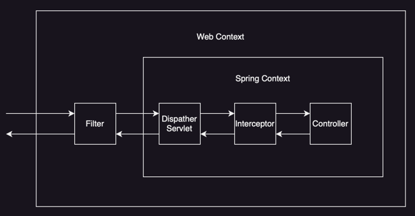

# Filter & Interceptor(필터 & 인터셉터)



## 필터(Filter)

자바에서 제공하는 스펙으로, 디스패처 서블릿(DispatcherServlet)에 요청이 전달되기 전과 후에 작업을 필터링(Filter) 처리 할 수 있는 기능을 제공한다.

- 스프링 영역에 있지 않아, 스프링에 구현 된 예외 처리기를 적용 받지 않아 예외 처리 별도로 해야 함
- 필터는 체인하여 여러 개를 사용할 수 있으며, 체인된 순서대로 필터 실행

필터는 `javax.servlet.Filter` 인터페이스를 구현하여 사용한다.

```java
public interface Filter {

    default void init(FilterConfig filterConfig) throws ServletException {
    }

    void doFilter(ServletRequest request, ServletResponse response, FilterChain chain)
            throws IOException, ServletException;

    default void destroy() {
    }
}
```

- `init()`: 필터 초기화 메서드, 서블릿 컨테이너가 생성될 때 호출
- `doFilter()`: 고객의 요청이 올 때 마다 해당 메서드가 호출되는 곳으로, 필터의 로직 구현 부분
- `destroy()`: 필터 종료 메서드, 서블릿 컨테이너가 종료될 때 호출

doFilter 구현부에서 `chain.doFilter(request, response)`를 호출하지 않으면 다음 필터가 실행되지 않는다.

```java
public class MyFilter implements Filter {

    @Override
    public void doFilter(ServletRequest request, ServletResponse response, FilterChain chain)
            throws IOException, ServletException {
        // 다음 필터로 넘기기 전의 로직
        chain.doFilter(new MockHttpServletRequest(), new MockHttpServletResponse());
        // 다음 필터가 실행된 후의 로직
    }
}
```

파라미터로 넘기는 request / response 는 다음 필터에 전달되는데, 아예 다른 객체를 넘길 수 있다.

### 용도

필터는 스프링과 무관하게 전역적으로 처리해야 하는 작업들을 처리하는데 사용한다.

- 인코딩 변환
- 모든 요청에 대한 로깅
- 공통된 인증/인가 작업(Spring Security)

## 인터셉터(Interceptor)

Spring에서 제공하는 기술로, 디스패처 서블릿이 컨트롤러를 호출하기 전과 후에 요청과 응답을 가로채(intercept) 처리하는 기능을 제공한다.

- 필터와 달리 스프링 영역에 있어, 스프링에 구현 된 예외 처리기를 적용 받아 예외 처리 가능
- 디스패처 서블릿에서 핸들러 매핑을 통해 컨트롤러를 찾아 요청하면 실행 체인을 얻음
- 얻은 실행 체인에 인터셉터가 등록되어 있다면 컨트롤러를 호출하기 전과 후에 인터셉터가 실행

인터셉터는 `org.springframework.web.servlet.HandlerInterceptor` 인터페이스를 구현하여 사용한다.

```java
public interface HandlerInterceptor {

    default boolean preHandle(
            HttpServletRequest request,
            HttpServletResponse response,
            Object handler
    ) throws Exception {
        return true;
    }

    default void postHandle(
            HttpServletRequest request,
            HttpServletResponse response,
            Object handler,
            @Nullable ModelAndView modelAndView
    ) throws Exception {
    }

    default void afterCompletion(
            HttpServletRequest request,
            HttpServletResponse response,
            Object handler,
            @Nullable Exception ex
    ) throws Exception {
    }
}
```

- `preHandle()`: 컨트롤러 호출 전에 실행, boolean 값에 따라 다음 단계 진행 여부를 결정
- `postHandle()`: 컨트롤러 호출 후에 실행, 컨트롤러에서 예외가 발생하면 실행되지 않음
- `afterCompletion()`: 컨트롤러 호출 후에 실행, 컨트롤러에서 예외가 발생해도 실행

구현된 인터셉터는 아래와 같이 등록할 수 있다.

```java
@Configuration
public class WebConfig implements WebMvcConfigurer {

    @Autowired
    private LoggingInterceptor loggingInterceptor;

    @Override
    public void addInterceptors(InterceptorRegistry registry) {
        // 모든 요청에 대해 인터셉터 적용
        registry.addInterceptor(loggingInterceptor).addPathPatterns("/**");
    }
}
```

### 용도

클라이언트의 요청과 관련되어 전역적으로 처리해야 하는 작업들을 처리하는데 사용한다.

- 로그인 사용자의 권한 체크
- Controller에 넘겨주기 전 `HttpServletRequest` / `HttpServletResponse` 내부 데이터 가공

###### 참고자료

- [스프링 MVC 2편 - 백엔드 웹 개발 활용 기술](https://www.inflearn.com/course/스프링-mvc-2)
- [망나니개발자 티스토리](https://mangkyu.tistory.com/173)
