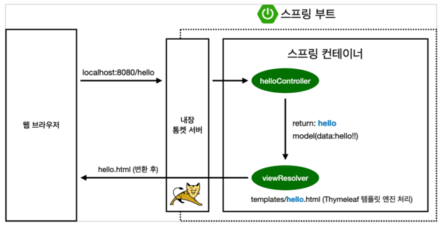
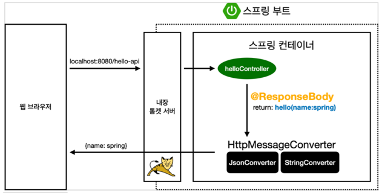

# Introduce

스프링이라는 단어는 문맥에 따라 다르게 사용되어 다음의 목록들을 지칭하게 된다.

- 스프링 DI 컨테이너 기술
- 스프링 프레임워크
- 스프링 부트, 스프링 프레임워크 등을 모두 포함한 스프링 생태계

## 스프링 기술 종류

현대 웹 개발에선 스프링 프레임워크와 스프링 부트는 거의 필수로 사용되고 있으며 그 외에 여러 기술들이 존재한다.

- 스프링 프레임워크: 핵심이 되는 프레임워크
- 스프링 부트: 여러 기술을 편리하게 사용하도록 서포트하는 역할
- 그 외
    - 스프링 데이터
    - 스프링 세션
    - 스프링 시큐리티
    - 스프링 Rest Docs
    - 스프링 배치
    - 스프링 클라우드

### 스프링 프레임워크

스프링의 핵심 기술로서 스프링 프레임워크를 사용하면 다음과 같은 기술들을 사용할 수 있다.

- 핵심 기술: 스프링 DI 컨테이너, AOP, 이벤트, 기타
- 웹 기술: 스프링 MVC, 스프링 WebFlux
- 데이터 접근 기술: 트랜잭션, JDBC, ORM 지원, XML 지원
- 기술 통합: 캐시, 이메일, 원격접근, 스케줄링
- 테스트: 스프링 기반 테스트 지원
- 언어: 코틀린, 그루비

최근에는 스프링 부트를 통해서 스프링 프레임워크의 기술들을 편리하게 사용할 수 있게 되었다.

### 스프링 부트

스프링 부트는 스프링 프레임워크를 쉽게 사용할 수 있게 도와주는 도구일 뿐이며, 결국 핵심 기능은 스프링 프레임워크에 있다.

- 스프링을 편리하게 사용할 수 있도록 지원, 최근에는 기본으로 사용
- 단독으로 실행할 수 있는 스프링 애플리케이션을 쉽게 생성 Tomcat 같은 웹 서버를 내장해서 별도의 웹 서버를 설치하지 않아도 됨
- 손쉬운 빌드 구성을 위한 starter 종속성 제공
- 스프링과 3rd party(외부) 라이브러리 자동 구성
- 메트릭, 상태 확인, 외부 구성 같은 프로덕션 준비 기능 제공 관례에 의한 간결한 설정
- 관례에 의한 간결한 설정

## 스프링 핵심 개념

- 자바 언어 기반의 프레임워크
- 자바 언어의 가장 큰 특징인 객체지향을 살려내는 프레임워크
- 동시에 좋은 객체 지향 애플리케이션을 개발할 수 있도록 도와주는 프레임워크

스프링에서 응답 데이터를 만들어 내는 방법은 크게 아래 3가지가 있다.

### 1. 정적 컨텐츠

### 2. MVC & 템플릿 엔진

### 3. API

- http body에 문자 내용 반환
- `HttpMessageConverter` 동작
    - 문자: `StringHttpMessageConverter`
    - 객체: `MappingJackson2HttpMessageConverter`
    - 그 외에도 여러 converter 존재

## 스프링에서 사용되는 용어와 핵심

- [DI(Dependency Injection)](dependency-injection): 객체 간 의존성을 자신이 아닌 외부에서 두 객체 간의 관계를 설정하는 것
- IoC(Inversion of Control): 제어의 역전, 프로그램의 제어 흐름을 개발자가 아닌 프레임워크가 담당하는 것
- [AOP(Aspect Oriented Programming)](aop.md): 공통의 관심 사항을 추출하여 원하는 곳에 적용하는 기술

## 스프링이 주는 이점

|          이점          |                          설명                           |
|:--------------------:|:-----------------------------------------------------:|
| 일관된 객체지향 개발 (DI/IoC) |            의존성 역전으로 모듈 간 결합도 감소, 테스트·교체 용이            |
|        관심사 분리        |    공통 기능을 AOP/Filter/Interceptor로 분리하여 도메인 로직에 집중     |
|     표준화된 인프라 추상화     | 트랜잭션, 데이터 접근 예외 변환, 메시지 컨버터, 캐시 등 공통 인프라를 라이브러리별로 추상화 |
|       테스트 용이성        |      프로파일/테스트 슬라이스, MockMvc, TestEntityManager 등      |
|        운영/관찰         |        Actuator, Micrometer, 헬스체크/메트릭/트레이싱 연동         |
|         생산성          |    Spring Boot의 자동 구성, Starter, 외부 설정으로 초기 설정 최소화     |
|         확장성          |      조건부 빈 등록, BeanPostProcessor, 이벤트로 유연한 확장 가능      |
|      벤더 종속성 완화       |         JPA/Transaction 등 표준 인터페이스로 구현 교체 용이          |
|       거대한 생태계        |     Security, Data, Batch, Cloud 등 검증된 하위 프로젝트 활용     |

###### 참고자료

- [스프링 핵심 원리 - 기본편](https://www.inflearn.com/course/스프링-핵심-원리-기본편)
- [스프링 부트 - 핵심 원리와 활용](https://www.inflearn.com/course/스프링부트-핵심원리-활용)
