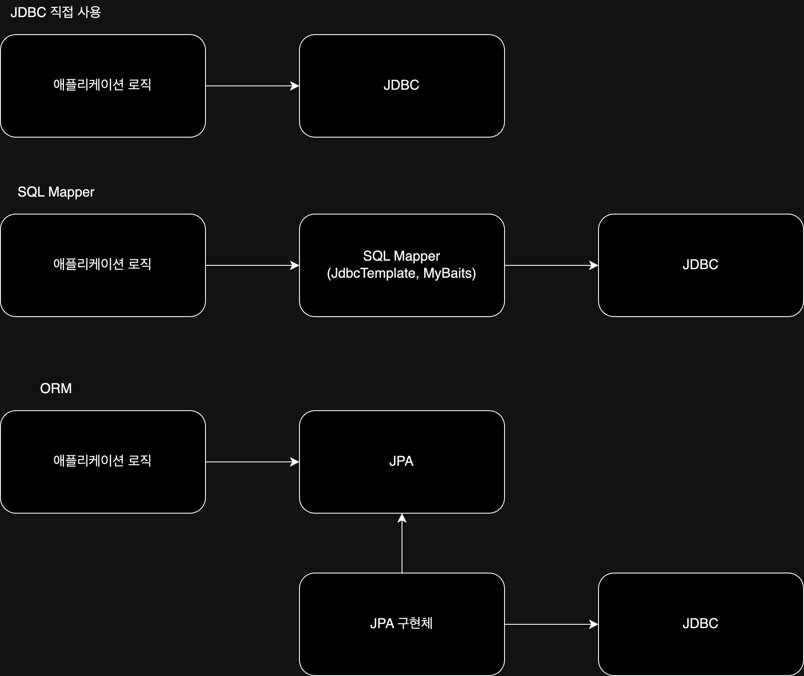

# JDBC(Java Database Connectivity)

자바에서 데이터베이스에 접속할 수 있도록 하는 자바 API로, Java로 데이터베이스에 연결 및 쿼리를 실행하기 위한 인터페이스를 제공한다.

| 인터페이스/개념              | 설명                                     | 사용되는 클래스/메서드                                                       |
|-----------------------|----------------------------------------|--------------------------------------------------------------------|
| `java.sql.Connection` | 데이터베이스와의 연결을 나타내는 인터페이스, 연결 정보 및 관리 담당 | `java.sql.DriverManager` (연결 얻기), `Connection` 인터페이스 메서드 (연결 관리)   |
| `java.sql.Statement`  | SQL 쿼리를 실행하고 결과를 받아오는 역할을 하는 인터페이스     | `Connection.createStatement()`, `Statement` 인터페이스 메서드 (쿼리 실행 및 설정) |
| `java.sql.ResultSet`  | SQL 쿼리의 실행 결과를 나타내는 인터페이스              | `Statement.executeQuery()`, `ResultSet` 인터페이스 메서드 (결과 처리)          |
| JDBC 드라이버             | 특정 데이터베이스 벤더에서 제공하는 JDBC 드라이버 라이브러리    | 벤더별 JDBC 드라이버 라이브러리 (예: Oracle JDBC 드라이버, MySQL JDBC 드라이버 등)       |

위의 세 개의 인터페이스와 JDBC 드라이버를 사용하여 DB에 접근할 수 있다.

## JDBC Flow

| 단계                     | 설명                                                                                                   | 사용 클래스/메서드                                                                                                                                   |
|------------------------|------------------------------------------------------------------------------------------------------|----------------------------------------------------------------------------------------------------------------------------------------------|
| 1. Get Connection      | 데이터베이스에 연결하기 위한 연결 정보를 사용하여 `DriverManager` 클래스를 통해 데이터베이스 연결                                        | `java.sql.Connection` 인터페이스를 반환하는 `DriverManager.getConnection()` 메서드를 사용하여 `Connection` 객체 생성                                               |
| 2. Create Statement    | `Connection` 객체로부터 SQL 쿼리를 실행하기 위한 `Statement` 객체를 생성                                                | `java.sql.Statement` 인터페이스를 반환하는 `Connection.createStatement()` 메서드를 사용하여 `Statement` 객체 생성                                                  |
| 3. Configure Statement | 생성된 `Statement` 객체에 실행하려는 SQL 쿼리를 설정 (보통 `PreparedStatement` 사용)                                     | `java.sql.PreparedStatement` 인터페이스를 사용하여 `PreparedStatement` 객체 생성 및 매개변수 설정                                                                 |
| 4. Execute Statement   | 구성된 SQL 쿼리를 실행                                                                                       | - `executeQuery()`: SELECT 문을 실행하고 결과를 `ResultSet` 객체로 반환  - `executeUpdate()`: INSERT, UPDATE, DELETE 등의 데이터 조작 쿼리를 실행하고 영향을 받은 행의 수를 반환 |
| 5. Handle Warning      | SQL 쿼리 실행 중에 발생한 경고나 예외 처리                                                                           | - `try-catch` 블록을 사용하여 예외 처리                                                                                                                 |
| 6. Return Result       | 쿼리를 실행한 결과 데이터 반환                                                                                    | - `ResultSet` 객체를 사용하여 결과를 검색 및 처리                                                                                                           |
| 7. Close Statement     | 작업이 완료되면 사용한 `Statement` 객체를 `Statement.close()` 메서드를 사용하여 명시적으로 닫아 자원 해제                            | `java.sql.Statement` 인터페이스의 `close()` 메서드                                                                                                    |
| 8. Close Connection    | 모든 데이터베이스 작업 완료 후 `Connection` 객체를 `Connection.close()` 메서드를 사용하여 명시적으로 닫아 데이터베이스 연결 자원을 해제 후 연결을 종료 | `java.sql.Connection` 인터페이스의 `close()` 메서드                                                                                                   |

굉장히 많은 과정을 필요로 하지만 `JdbcTemplate`를 사용하면 이러한 과정을 대신 처리해주어 편리하게 사용할 수 있다.

## JDBC의 사용

JDBC와 `JdbcTemplate`는 이미 여러 문제를 해결해주고 편리함을 제공해주었지만, 최근에는 직접 사용하는 것보다는 `SQL Mapper`나 `ORM`을 결합하여 사용하고 있다.

- SQL Mapper
    - 장점
        - SQL 응답 결과를 객체로 편리하게 변환
        - JDBC의 반복 코드를 제거
    - 단점
        - 개발자가 SQL을 직접 작성
    - 대표 기술: 스프링 JdbcTemplate, MyBatis

- ORM
    - 장점
        - 객체와 RDB의 패러다임 불일치 해결
        - 생산성
        - 유지보수
    - 단점
        - 학습비용
        - 잘못 사용하면 성능 이슈
    - JPA는 자바 진영의 ORM 표준 인터페이스
    - 대표 기술: JPA, 하이버네이트, 이클립스링크

###### 참고자료

- [스프링 DB 1편 - 데이터 접근 핵심 원리](https://www.inflearn.com/course/스프링-db-1)