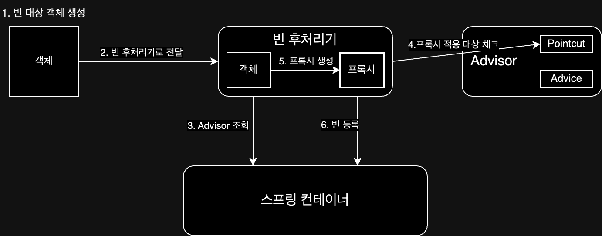

# Proxy(프록시)

> 실제 객체를 감싸고 호출된 메서드에 횡단 관심사를 적용하여 제어하는 중간 계층의 객체

일반적으로 클라이언트가 서버를 직접 호출하고, 처리 결과를 직접 받지만, 중간에 프록시(=대리자)를 두어 접근 제어나 부가 기능을 추가할 수 있다.  
프록시를 GOF 디자인 패턴 관점으로 봤을 때 프록시 패턴과 데코레이터 패턴이 있으며 그 역할은 다음과 같다.  
주의할 점은 본문에서 다루는 프록시와 GOF 디자인 패턴에서의 프록시라는 용어는 전혀 다른 개념이며 이름만 같을 뿐이니 주의하자.

- 접근 제어(=프록시 패턴)
    - 권한에 따른 접근 차단
    - 캐싱
    - 지연 로딩
- 부가 기능 추가(=데코레이터 패턴)
    - 원래의 서버가 제공하지 않는 기능 추가

여기서 하나의 프록시뿐만 아니라 여러 개의 프록시를 연결하여 체인 형태로 구성할 수 있다.

## JDK 동적 프록시 / CGLIB

스프링 표준 라이브러리로 제공하는 프록시 패턴을 구현하는 방법은 다음과 같다.
프록시 객체를 생성하는 방법에는 JDK 동적 프록시와 CGLIB가 있다.

- JDK 동적 프록시
    - 자바 언어에서 기본으로 제공하는 표준 라이브러리 동적 프록시 기술로 인터페이스 기반 프록시 생성
    - 인터페이스가 없으면 프록시 생성 불가
    - `InvocationHandler` 인터페이스를 구현하여 프록시 객체 생성 및 동작 정의

```java
class TestInvocationHandler implements InvocationHandler {

    private TargetInterface target; // Target, 적용이 될 실제 객체

    public TestInvocationHandler(TargetInterface target) {
        this.target = target;
    }

    @Override
    public Object invoke(Object proxy, Method method, Object[] args) throws Throwable {
        log.info("log start");
        Object result = method.invoke(target, args);  // 실제 객체의 메서드 호출
        log.info("log end");

        return result;
    }
}
```

- CGLIB
    - 바이트 코드를 조작하여 프록시 역할을 하는 클래스를 만들어주는 라이브러리
    - 클래스 상속 방식으로 프록시 패턴을 생성하기 때문에 인터페이스가 없어도 프록시 생성 가능
    - 클래스나 메서드에 `final` 키워드가 있으면 상속이 불가능하거나 오버라이딩이 불가능하기 때문에 해당 클래스나 메서드는 프록시 생성 불가
    - `MethodInterceptor` 인터페이스를 구현하여 동작을 정의

```java
class TestMethodInterceptor implements MethodInterceptor {

    private TargetImpl target; // Target, 적용이 될 실제 객체

    public TestMethodInterceptor(TargetImpl target) {
        this.target = target;
    }

    @Override
    public Object intercept(Object obj, Method method, Object[] args, MethodProxy proxy) throws Throwable {
        log.info("log start");
        Object result = proxy.invoke(target, args); // 실제 객체의 메서드 호출
        log.info("log end");

        return result;
    }
}
```

구현하려는 프록시의 원본 객체에 인터페이스 여부에 따라서 사용하는 구현해야하는 인터페이스가 다르기 때문에 프록시를 생성하는 방법도 다르다.  
때문에 스프링에서는 이를 추상화 시켜 프록시를 생성하는 방법을 통일하였다.

## Proxy Factory

Proxy Factory는 스프링에서 프록시 객체를 생성하고 요청을 처리하는 방법을 통일하여 사용할 수 있도록 추상화한 것이다.  
인터페이스 유무에 따라 JDK 동적 프록시와 CGLIB를 사용하여 프록시 객체를 생성하여 기능을 제공한다.


프록시 생성(Proxy Factory)과 생성된 프록시에 요청(Advice Call)을 하게 되면 위와 같은 흐름으로 동작한다.

```java
// 부가 기능을 제공할 Advice
class LogTraceAdvice implements MethodInterceptor {

    @Override
    public Object invoke(MethodInvocation invocation) throws Throwable {
        log.info("log start");
        Object result = invocation.proceed(); // 실제 객체의 메서드 호출
        log.info("log end");

        return result;
    }
}

class ExampleProxyFactory {

    public Object getProxy(Object target) {
        // Pointcut
        NameMatchMethodPointcut pointcut = new NameMatchMethodPointcut();
        pointcut.setMappedNames("request*", "order*", "save*");

        // Advice
        LogTraceAdvice advice = new LogTraceAdvice();

        // Advisor
        Advisor advisor = new DefaultPointcutAdvisor(pointcut, advice);

        return new ProxyFactory()
                .setTarget(target)
                .addAdvisor(advisor)
                .getProxy();
    }
}

class Main {

    public static void main(String[] args) {
        Example example = new Example();
        ExampleProxyFactory proxyFactory = new ExampleProxyFactory();
        Example proxy = (Example) proxyFactory.getProxy(example);
        proxy.execute();
    }
}
```

이 방법으로 생성 방법은 통일되었지만, 적용할 메서드를 하나하나 수동으로 등록해주어야 하기 때문에 설정 코드 자체도 길어지며, 컴포넌트 스캔을 하는 경우 프록시 객체 생성이 불가능하다.  
때문에 컴포넌트 스캔을 포함한 등록되는 빈들에 대해 프록시 객체를 적용하는 빈 후처리기 방법이 등장하게 되었다.

### 빈 후처리기

빈 후처리기를 이용하면 컴포넌트 스캔을 포함한 등록되는 빈들에 대해 프록시 객체를 적용하여 등록할 수 있다.  
또한 적용 될 빈을 필터링할 수 있기 때문에 특정 빈에만 프록시를 적용할 수도 있다.

```java
// Processor.java
class PackageLogTracePostProcessor implements BeanPostProcessor {

    private final String basePackage; // 프록시 적용 패키지
    private final Advisor advisor; // Advice + Pointcut

    public PackageLogTracePostProcessor(String basePackage, Advisor advisor) {
        this.basePackage = basePackage;
        this.advisor = advisor; // Advisor는 위와 동일하게 생성하여 전달 받음
    }

    @Override
    public Object postProcessAfterInitialization(Object bean, String beanName) throws BeansException {
        String packageName = bean.getClass().getPackageName();

        // 프록시 적용 대상 여부 체크
        if (!packageName.startsWith(basePackage)) {
            return bean; // 프록시 적용 대상이 아니면 원본을 반환
        }

        // 프록시 대싱이면 프록시를 만들어서 반환
        return new ProxyFactory()
                .setTarget(bean)
                .addAdvisor(advisor)
                .getProxy();
    }
}

// Config.java
@Configuration
@Import({AppV1Config.class, AppV2Config.class}) // V3는 component scan의 대상이기 때문에 import 할 필요가 없다.
class BeanPostProcessorConfig {

    @Bean
    public PackageLogTracePostProcessor logTracePostProcessor() {
        return new PackageLogTracePostProcessor("hello.proxy.app", getAdvisor());
    }

    @Bean
    public DefaultPointcutAdvisor advisor() {
        return new DefaultPointcutAdvisor(Pointcut.TRUE, new MyAdvice());
    }
}
```

## @Aspect

Proxy Factory와 빈 후처리기는 스프링이 제공하는 기능이지만, @Aspect는 스프링이 제공하는 기능은 아니다.  
프록시 패턴을 구현하는 방법이 아닌 CGLib를 사용하여 바이트 코드를 조작하여 기능을 제공하는 방법으로, 실무에서 많이 사용되는 방법이다.  
포인트컷(Pointcut)과 어드바이스(Advice)로 구성된 어드바이저(Advisor)의 생성을 편리하게 해주는 기능을 가진 어노테이션을 통해 훨씬 간단하게 프록시를 적용할 수 있다.

```java
// Aspect.java
@Aspect
class ExampleAspect {

    @Around(value = "execution(* hello.proxy.app..*(..))") // Pointcut
    public Object execute(ProceedingJoinPoint joinPoint) throws Throwable {
        // Advice 로직
        Object result = joinPoint.proceed(); // 실제 객체의 메서드 호출
        // Advice 로직
        return result;
    }
}

// Config.java
@Configuration
class AopConfig {

    @Bean
    public LogTraceAspect logTraceAspect(LogTrace logTrace) {
        return new LogTraceAspect(logTrace);
    }
}
```

### @Aspect의 동작 흐름

@Aspect를 사용하여 프록시 객체를 생성하는 경우 전체적인 흐름은 어드바이저 생성 부분과 조회 부분을 나누어서 생각할 수 있다.

- 어드바이저 생성

1. 스프링 실행 후 `@Aspect` 애노테이션이 붙은 빈 조회
2. `@Aspect` 애노테이션 정보를 기반으로 어드바이저 생성
3. 어드바이저 등록

- 조회

1. 스프링 빈 대상이 되는 객체 생성
2. 생성된 객체들을 스프링 빈 컨테이너 등록하기 전 빈 후처리기에 전달
3. 스프링 빈 컨테이너에서 어드바이저 조회
4. 어드바이저에 등록된 포인트컷을 통해 프록시 적용 대상인지 확인(클래스 내에 하나 이상의 메서드가 존재하면 프록시 적용 대상)
5. 프록시 팩토리를 통해 프록시 객체 생성
6. 프록시 객체를 스프링 빈 컨테이너에 등록



## 프록시 내부 호출(Self Invocation)

대상 객체의 내부에서 메서드 호출이 발생하면 프록시를 거치지 않고 대상 객체를 직접 호출하게 되어 프록시 기능이 적용되지 않는다.

```java
class Example {

    public void external() {
        // do something
        internal(); // 프록시를 거치지 않고 대상 객체 내부에서 메서드 호출하기 프록시 기능이 적용되지 않음
    }

    public void internal() {
        // do something
    }
}
```

위의 문제를 해결하기 위해서 프록시를 사용하는 것이 아닌 실제 코드에 AOP를 직접 적용하는 방법도 있으나, 복잡하기 때문에 그대로 프록시를 쓰면서 문제를 회피하는 방법을 사용한다.

- 자기 자신 주입
- 지연 조회
- 구조 변경(스프링에서 권장하는 방법)

## 스프링과 CGLIB

스프링에서는 프록시 객체를 생성할 때 기본적으로 CGLIB를 사용하는데, 이를 통해 얻을 수 있는 장점으로는 다음과 같다.

- 인터페이스가 없는 클래스도 프록시로 만들 수 있음
- 의존관계 주입 시 문제가 발생하지 않음(JDK 동적 프록시는 발생)

하지만 CGLIB는 클래스를 상속받아 프록시 객체를 생성하기 때문에 다음과 같은 제약사항이 존재했다.

1. 대상 클래스에 기본 생성자가 반드시 존재해야 함
2. 생성자 호출이 두 번 발생(실제 객체를 생성할 때 + 프록시 객체를 생성할 때)
3. final 클래스, final 메서드가 있는 경우 프록시를 생성할 수 없음

여기서 1번과 2번 문제는 `objenesis`라는 라이브러리를 사용하여 해결하였고, 3번 문제는 아직 해결하지 못했으나 final 키워드를 잘 사용하지 않기 때문에 큰 문제가 되지 않는다.

## ETC

- 프록시 객체는 스프링 컨테이너가 관리하고 자바 힙 메모리에도 올라간다. 반면에 실제 객체는 자바 힙 메모리에는 올라가지만 스프링 컨테이너가 관리하지는 않는다.

###### 참고자료

- [스프링 핵심 원리 - 고급편](https://www.inflearn.com/course/스프링-핵심-원리-고급편)