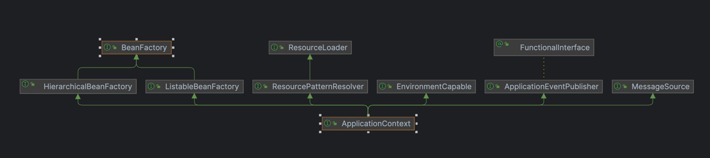

# Spring Container(컨테이너)

스프링 컨테이너는 스프링에서 애플리케이션을 구성하는 여러 빈(Bean)들을 관리하는 공간을 말한다.  
스프링 컨테이너를 언급할 때는 빈 팩토리(`Bean Factory`)와 애플리케이션 컨텍스트(`Application Context`) 크게 두 가지로 나눌 수 있다.

## BeanFactory vs. ApplicationContext

- BeanFactory
    - 스프링 컨테이너의 최상위 인터페이스
    - 스프링 빈(Bean)을 관리하고 조회하는 역할
    - `getBean()` 제공
- ApplicationContext
    - `BeanFactory` 기능을 모두 상속 받아 제공
    - 그 외에 아래를 포함한 많은 기능을 제공

|         interface         |         description          |
|:-------------------------:|:----------------------------:|
|       MessageSource       |            국제화 기능            |
|    EnvironmentCapable     |           환경변수 기능            |
| ApplicationEventPublisher |  이벤트를 발행하고 구독하는 모델을 편리하게 지원  |
|      ResourceLoader       | 파일/클래스패스/외부 등에서 리소스를 편리하게 조회 |

## 스프링 컨테이너 생성 과정

스프링 컨테이너는 애플리케이션 전반에 걸쳐 사용되는 객체들을 생성, 구성, 관리하는 핵심 기반이다.  
컨테이너는 설정 정보를 바탕으로 애플리케이션이 필요로 하는 객체들을 빈(Bean)으로 등록하고, 이들 사이의 의존관계를 관리한다.

1. 구성 정보 로딩
    - 자바 기반(`@Configuration`), XML 설정, 또는 컴포넌트 스캔을 통해 설정 정보를 읽음
    - 설정 정보를 통해 어떤 객체를 어떤 이름으로 생성하고, 어떤 방식으로 연결할지를 정의
2. 빈(Bean) 등록
    - 설정 정보를 바탕으로 객체를 생성하고, 이를 컨테이너 내부에 빈(Bean)으로 등록
    - 빈의 이름은 기본적으로 메서드명이나 클래스명 등을 따르며, 명시적으로 이름 지정 가능
3. 컨테이너 초기화 완료
    - 등록된 빈들을 애플리케이션 실행에 필요한 형태로 준비
    - 의존관계가 필요한 경우, 설정된 주입 방식에 따라 자동으로 연결

###### 참고자료

- [스프링 핵심 원리 - 기본편](https://www.inflearn.com/course/스프링-핵심-원리-기본편)
