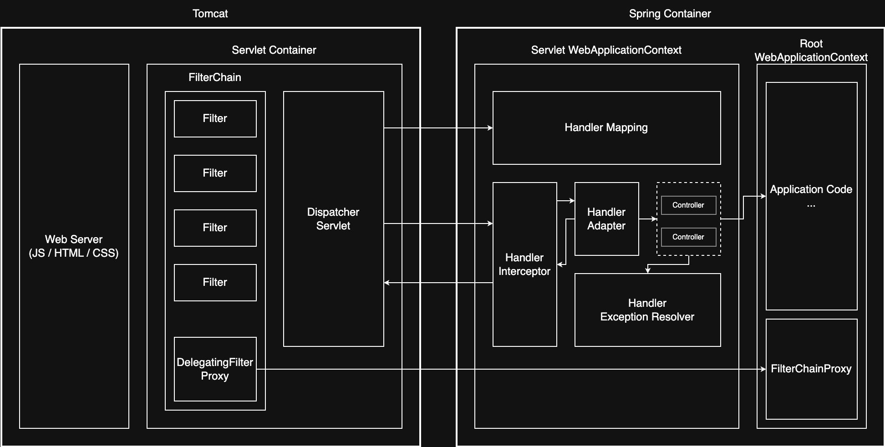

# Spring Web MVC

> Spring Web MVC는 Spring Framework에서 제공하는 웹 애플리케이션 프레임워크

## Spring Web MVC 아키텍처의 핵심 구성 요소



Spring Web MVC는 다양한 컴포넌트가 협력하여 HTTP 요청을 처리하고 응답을 생성하는 구조로 구성된다.

- Spring MVC는 보통 Tomcat 위에서 동작
- Tomcat은 웹 서버와 서블릿 컨테이너 역할을 함께 수행하며, 요청을 받아 서블릿에 위임하고, 스레드 풀을 통해 처리

Spring Web MVC는 크게 두 가지 구성으로 나뉜다.

- Servlet Container
    - Tomcat과 같은 WAS 내부에서 동작하며 Servlet의 생명주기를 관리하고 DispatcherServlet 실행 환경 제공
    - 요청/응답 처리 및 스레드 관리 수행
- Spring Container
    - IoC/DI 기반으로 관리되는 Spring 프레임워크의 핵심 컨테이너
    - 공통 Bean을 관리하는 Root Context와 Web 계층 Bean을 관리하는 Servlet Context로 구성

### 구성 요소 및 역할

|           구성 요소            |                        역할                         |
|:--------------------------:|:-------------------------------------------------:|
|        Filter Chain        | 인증 / 로깅 / CORS 등 공통 처리를 위한 Filter들이 체인 형태로 연결된 구조 |
|           Filter           |      FilterChain에 연결되어 서블릿 요청 전후에 공통 작업을 수행       |
|     DispatcherServlet      |    요청 수신 및 응답 반환 역할 수행하는 Spring MVC의 프론트 컨트롤러     |
|      Handler Mapping       |          요청 URI를 기준으로 Controller 탐색 및 결정          |
|    Handler Interceptor     |   Controller 전후로 실행되어 인증 / 로깅 / 전처리 / 후처리 등 수행    |
|      Handler Adapter       |               요청을 처리할 수 있는 핸들러를 실행                |
|         Controller         |            비즈니스 로직 수행 및 응답 데이터 혹은 뷰 반환            |
| Handler Exception Resolver |     Controller에서 발생한 예외를 View 혹은 Response로 변환     |
|      Application Code      |     사용자 정의 비즈니스 로직 코드(Service, Repository 등)      |
|   DelegatingFilterProxy    | Spring Bean으로 등록된 Filter를 서블릿 필터 체인에 연결하기 위한 프록시  |
|      FilterChainProxy      |       Spring Security가 내부적으로 사용하는 보안 필터 체인        |

## Spring MVC Code

```java

@Controller("/spring")
public class SpringExmapleController {

    @GetMapping("/example")
    public String process(Model model) {
        List<Member> members = new ArrayList<>();
        members.add(new Member("memberA", 10));
        members.add(new Member("memberB", 20));

        model.addAttribute("members", members);
        return "example";
    }
}
```

- `@Controller`
    - 스프링이 자동으로 스프링 빈으로 등록할 수 있도록 함
    - 내부에 `@Component` 애노테이션이 있어 컴포넌트 스캔의 대상
    - 스프링 MVC에서 애노테이션 기반 컨트롤러로 인식
    - [RequestMappingHandlerMapping](handler-mapping-adapter)이 스프링 빈 중에서 `@Controller`가 붙은 클래스를 찾아 매핑 정보를 생성
- `@RequestMapping`(=`@GetMapping`, `@PostMapping`, `@PutMapping`, `@DeleteMapping`)
    - 요청 정보를 매핑하여 해당 URL이 호출되면 애노테이션이 있는 메서드가 호출됨
    - 애노테이션 기반으로 동작하기 때문에 임의의 이름으로 지어도 상관 없음
- 반환 `String`
    - 뷰의 논리 이름
    - `ViewResolver`가 논리 이름을 실제 뷰 이름으로 변환하여 뷰를 찾음
- `Model`
    - 뷰에 전달할 데이터를 담는 객체
    - `Model`에 데이터를 담으면 `Model`은 `Map`으로 변환되어 뷰에 전달됨

###### 참고자료

- [스프링 MVC 1편 - 백엔드 웹 개발 핵심 기술](https://www.inflearn.com/course/스프링-mvc-1)
