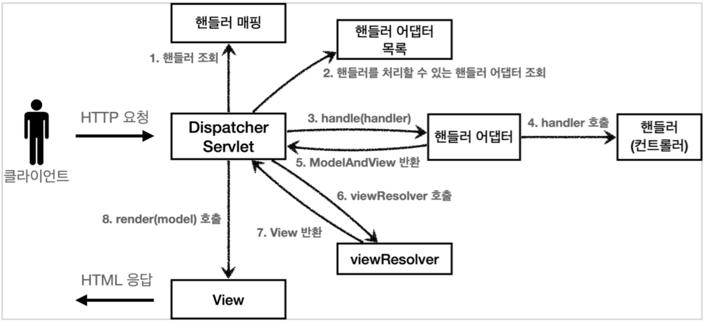

# Spring MVC(Model View Controller)

> Spring에서 제공하는 웹 모듈로, Model / View / Controller 세 가지 구성요소를 사용해 HTTP 요청을 처리를 지원해주는 프레임워크

## MVC 패턴 구조

- Model : 애플리케이션 데이터
- View : 모델을 사용자에게 표시
- Controller : 모델 데이터를 조작

## 구성 요소

|       구성 요소       |                                    설명                                    |
|:-----------------:|:------------------------------------------------------------------------:|
| DispatcherServlet | 클라이언트의 요청을 전달받아, Controller에게 클라이언트의 요청을 전달하고, 리턴한 결과를 View에 전달하여 응답을 생성 |
|  HandlerMapping   |              클라이언트의 요청 URL을 분석하여, 해당 요청을 처리할 Controller를 결정              |
|  HandlerAdapter   |                   Controller를 처리할 수 있는 Adapter를 찾아 반환                    |
|    Controller     |           클라이언트의 요청을 처리하고, 처리 결과를 DispatcherServlet에게 반환하는 객체            |
|   ViewResolver    |                           처리 결과를 보여줄 View를 결정                            |
|       View        |                                보여줄 응답을 생성                                |

이 중 `DispatcherServlet`이 가장 중요한 역할을 한다.

## Spring MVC Flow



| 순서  |         내용         |                              설명                              |
|:---:|:------------------:|:------------------------------------------------------------:|
|  1  |       핸들러 조회       |                핸들러 매핑을 통해 요청 URL에 매핑된 핸들러 조회                 |
|  2  |     핸들러 어댑터 조회     |                   핸들러를 처리할 수 있는 핸들러 어댑터 조회                   |
|  3  |     핸들러 어댑터 실행     |                          핸들러 어댑터 실행                          |
|  4  | 핸들러 어댑터를 통해 핸들러 실행 |                      핸들러 어댑터를 통해 핸들러 실행                      |
|  5  |  ModelAndView 반환   |          핸들러 어댑터는 핸들러의 반환 정보를 ModelAndView로 변환해서 반환          |
|  6  |  뷰 리졸버를 통해서 뷰 찾기   |                       뷰 리졸버를 통해서 뷰를 찾음                       |
|  7  |      View 반환       | 뷰 리졸버는 논리 뷰 이름을 물리 뷰 이름으로 변환해서 반환 후 렌더링 역할을 담항하는 View 객체를 반환 |
|  8  |       뷰 렌더링        |             View 객체의 `render()` 메서드를 호출해서 뷰 렌더링              |

## Spring MVC Code

```java

@Controller("/spring")
public class SpringExmapleController {

    @GetMapping("/example")
    public String process(Model model) {
        List<Member> members = new ArrayList<>();
        members.add(new Member("memberA", 10));
        members.add(new Member("memberB", 20));

        model.addAttribute("members", members);
        return "example";
    }
}
```

- `@Controller`
    - 스프링이 자동으로 스프링 빈으로 등록할 수 있도록 함
    - 내부에 `@Component` 애노테이션이 있어 컴포넌트 스캔의 대상
    - 스프링 MVC에서 애노테이션 기반 컨트롤러로 인식
    - [RequestMappingHandlerMapping](mvc/handler_mapping_adapter.md)이 스프링 빈 중에서 `@Controller`가 붙은 클래스를 찾아 매핑 정보를 생성
- `@RequestMapping`(=`@GetMapping`, `@PostMapping`, `@PutMapping`, `@DeleteMapping`)
    - 요청 정보를 매핑하여 해당 URL이 호출되면 애노테이션이 있는 메서드가 호출됨
    - 애노테이션 기반으로 동작하기 때문에 임의의 이름으로 지어도 상관 없음
- `String`
    - 뷰의 논리 이름
    - `ViewResolver`가 논리 이름을 실제 뷰 이름으로 변환하여 뷰를 찾음
- `Model`
    - 뷰에 전달할 데이터를 담는 객체
    - `Model`에 데이터를 담으면 `Model`은 `Map`으로 변환되어 뷰에 전달됨

###### 참고자료

- [스프링 MVC 1편 - 백엔드 웹 개발 핵심 기술](https://www.inflearn.com/course/스프링-mvc-1)