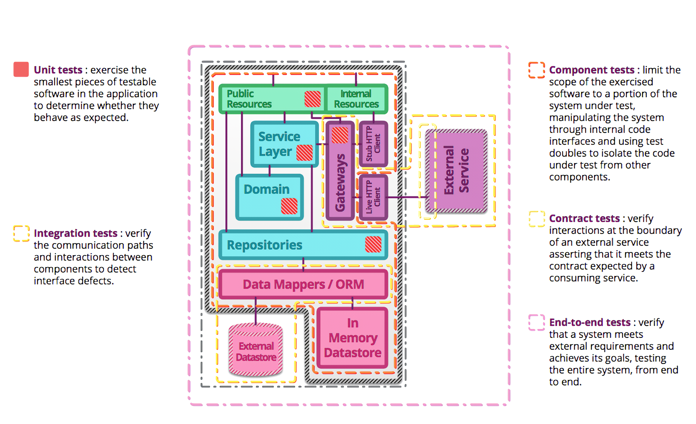

# Testing Basic(테스트 기초)

## 테스트 종류

### Unit Test(단위 테스트)

백엔드 애플리케이션에 있어 가장 많이 작성하고, 중요한 테스트이다.

- 애플리케이션에서 가장 작은 단위를 테스트
- 실행이 빠르고 특정 부분을 고립해서 테스트
- 협력 객체는 테스트 더블로 대체하여 테스트

### Integration Test(통합 테스트)

테스트하고자 하는 코드를 다른 의존관계와 연동이 잘 되는지 테스트한다.

- 내부 뿐만 아니라 외부와의 연동도 포함하여 테스트
- 테스트 더블을 사용하지 않고 실제 객체를 사용하여 객체 간의 상호작용을 테스트

### End-to-End Test(End-to-End 테스트)

사용자의 관점에서 애플리케이션의 기능을 테스트한다.

- 애플리케이션의 모든 레이어를 포함하여 테스트한다.
- 사용자가 실제로 사용하는 환경과 동일한 환경에서 테스트

## JUnit

- 매 단위 테스트시마다 테스트 클래스의 인스턴스가 생성되어 독립적인 테스트가 가능하다.
- 애노테이션을 제공해서 테스트 라이프 사이클을 관리하게 해주고 테스트 코드를 간결하게 작성하도록 도와준다.
- 테스트 러너를 제공해서 인텔리제이 / 이클립스 / 메이븐 등에서 테스트 실행이 가능하다.

JUnit에서는 모노리틱 아키텍처였으나, JUnit5부터는 3개의 모듈로 나누어져있다.

- JUnit Platform: JVM 상에 테스팅 프레임워크를 런칭하기 위한 모듈, 테스트를 발견하고 테스트 계획을 생성하는 `TestEngine` API를 제공한다.
- JUnit Jupiter: `TestEngine`의 실제 구현 별도 모듈로, `jupiter-api`를 사용해 `junit-jupiter-engine`이 테스트를 실행한다.
- JUnit Vintage: JUnit4와 3을 지원하기 위한 모듈
