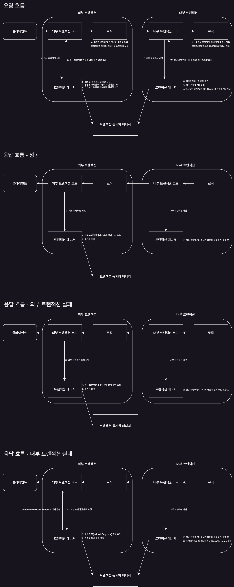

# Transactional

스프링은 `PlatformTransactionManager` 인터페이스를 통해 트랜잭션을 추상화하고 선언적 트랜잭션을 지원하여 트랜잭션을 편리하게 사용할 수 있도록 지원한다.  
`@Transactional`을 통한 선언적 트랜잭션 관리 방식을 사용하면 프록시 방식의 AOP가 적용되는데 그로 인해 아래와 같은 특징을 가지게 된다.

- `@Transactional` 애노테이션이 특정 클래스나 메서드에 하나라도 있으면 트랜잭션 AOP는 프록시를 만들어 스프링 컨테이너에 등록
- 실제 객체 대신에 프록시를 스프링 빈에 등록한 뒤 프록시는 실제 객체를 참조
- 만약 다른 곳에서 해당 객체를 의존관계 주입을 요청하게 되면 스프링 컨테이너에서 실제 객체 대신에 등록되어 있던 프록시 객체를 주입
- 최종적으로 `다른 객체` -> `실제 객체` -> `프록시 객체` 순으로 의존관계가 주입되게 됨

** 프록시는 기존 실제 객체를 상속해서 만들어지기 때문에 다형성을 지원하여 실제 객체에 프록시 객체가 주입 될 수 있다.

## 트랜잭션 동작 방식

1. 프록시 객체가 요청을 먼저 받음
2. 프록시 객체에서 트랜잭션 시작
3. 프록시 객체에서 실제 객체의 메서드 호출
4. 실제 객체 로직 수행
5. 프록시 객체에서 트랜잭션 커밋 또는 롤백

## 트랜잭션 우선 순위

`@Transactional` 애노테이션은 클래스, 인터페이스, 메서드에 적용할 수 있으며, 우선순위는 더 구체적이고 자세한 것이 높은 우선순위를 가지는 것을 원칙으로 한다.  
추가적으로 접근제어자가 public인 경우에만 트랜잭션이 적용된다.(과도하게 적용되는 것을 방지)

1. 클래스의 메서드
2. 클래스
3. 인터페이스의 메서드
4. 인터페이스

## 자기 호출(Self Invocation)

`@Transactional`이 적용 됐을 때 트랜잭션이 적용은 프록시 객체를 통해 수행되는데, 만약 프록시 객체를 거치지 않고 대상 객체를 직접 호출하게 되면 트랜잭션이 적용되지 않는다.  
보통의 경우는 프록시 객체를 거치기 때문에 문제가 되지 않지만, 대상 객체 내부에서 메서드 호출을 하게 되면 프록시를 거치지 않게 되어 위의 문제가 발생할 수 있다.

```java
class Example {

    public void external() {
        // do something
        internal(); // 프록시를 거치지 않고 대상 객체 내부에서 메서드 호출하기 때문에 트랜잭션이 적용되지 않는다.
    }

    @Transactional
    public void internal() {
        // do something
    }
}
```

클라이언트에서 external 메서드를 호출했을 때 다음과 같은 프로세스가 진행된다.

1. 클라이언트에서 프록시 호출
2. 프록시에서 external 메서드에 트랜잭션이 적용되어 있지 않기 때문에 트랜잭션 없이 메서드 호출
3. 실제 external 메서드 실행
4. external 메서드 내부에서 internal 메서드 호출
5. 실행 된 internal 메서드는 실제 객체에서 실행되기 때문에 트랜잭션이 적용되지 않는다.

이를 방지하기 위해 여러 해결방안들이 존재하지만 보통 실무에서는 별도 클래스로 분리하여 호출하는 것이 가장 적절한 방법이다.

## 초기화 시점

스프링 초기화 시점에는 트랜잭션 AOP가 적용되지 않을 수 있기 때문에 트랜잭션이 필요한 로직이 필요한 메서드 실행 시점을 스프링 컨테이너가 완전히 생성되고 난 뒤에 호출할 수 있도록 설정하는 것이 좋다.

```java
class Hello {

    @PostConstruct
    @Transactional
    public void init1() {
        boolean isActive = TransactionSynchronizationManager.isActualTransactionActive();
        log.info("tx active={} ", isActive); // false
    }

    @EventListener(ApplicationReadyEvent.class)
    @Transactional
    public void init2() {
        boolean isActive = TransactionSynchronizationManager.isActualTransactionActive();
        log.info("tx active={} ", isActive); // true
    }
}
```

## 트랜잭션 옵션

`@Transactional` 애노테이션을 통해 트랜잭션을 적용할 때 아래와 같이 옵션을 설정할 수 있으며, 지정하지 않은 경우엔 기본값이 적용된다.

```java

@Transactional(isolation = Isolation.DEFAULT, readOnly = false)
class Example {
}
```

애노테이션에 적용할 수 있는 옵션들은 아래와 같다.

### 1. rollbackFor / noRollbackFor

예외 발생시 스프랑 트랜잭션의 롤백 정책으로 기본 정책은 아래와 같다.

- 언체크 예외: 롤백
- 체크 예외: 롤백하지 않고 커밋

이 옵션에 추가로 롤백할 예외를 지정하게 되면, 해당 예외가 발생했을 때 롤백하게 된다.

```java

@Transactional(rollbackFor = Exception.class)
class Example {
}
```

반대로 `noRollbackFor` 옵션은 롤백하지 않을 예외를 지정할 수 있다.

### 2. isolation

트랜잭션 격리 수준 지정으로 보통 데이터베이스에서 설정한 트랜잭션 수준을 사용하는 `DEFAULT`를 사용한다.  
격리 수준에 대한 자세한 내용은 [격리 수준](../mysql/isolation-level.md) 참고

### 3. timeout

트랜잭션 타임아웃을 지정하는 옵션으로 기본값은 -1로 무제한이다.

### 4. readOnly

읽기 전용 트랜잭션으로 기본값은 false으로, 읽기 쓰기가 모두 가능한 트랜잭션이 적용된다.  
true 옵션을 사용하면 읽기 전용 트랜잭션이 적용되어 읽기 작업만 가능하다.(드라이버나 DB에 따라 읽기 전용 트랜잭션을 지원하지 않을 수 있다.)  
읽기 전용을 적용하게 되면 아래와 같은 차이점이 있다.

- 프레임워크: 읽기 전용이기 때문에 변경에 사용되는 플러시를 호출할 필요가 없으며, 변경 감지를 위한 스냅샷 객체를 생성하지 않아 다향한 성능상 이점을 가져올 수 있다.
- JDBC 드라이버: 변경 쿼리가 발생하면 예외를 발생시키기 때문에 변경 쿼리를 실행하지 않는다.
- 데이터베이스: 읽기 전용 트랜잭션은 읽기만 하면 되어 내부 성능 최적화가 발생한다.(미미한 차이)

### 5. propagation

트랜잭션 전파 옵션으로 기본값은 `REQUIRED`로, 대부분 이 옵션을 사용한다.

|      옵션       |        설명        |  기존 트랜잭션 X  |       기존 트랜잭션 O        |
|:-------------:|:----------------:|:-----------:|:----------------------:|
|   REQUIRED    |   하나의 트랜잭션 사용    | 새로운 트랜잭션 생성 |       기존 트랜잭션 사용       |
| REQUIRES_NEW  |  항상 새로운 트랜잭션 사용  | 새로운 트랜잭션 생성 |      새로운 트랜잭션 생성       |
|    SUPPORT    |     트랜잭션 지원      | 트랜잭션 없이 진행  |       기존 트랜잭션 사용       |
| NOT_SUPPORTED |     트랜잭션 미지원     | 트랜잭션 없이 진행  | 트랜잭션 없이 진행(기존 트랜잭션 보류) |
|   MANDATORY   | 트랜잭션이 반드시 존재해야 함 |    예외 발생    |       기존 트랜잭션 사용       |
|     NEVER     |  트랜잭션을 사용하지 않음   | 트랜잭션 없이 진행  |         예외 발생          |

isolation , timeout , readOnly 는 트랜잭션이 처음 시작될 때만 적용되며, 트랜잭션에 참여하는 경우에는 적용되지 않는다.

## 트랜잭션 전파 흐름 - REQUIRED 옵션

트랜잭션 전파 옵션이 `REQUIRED`인 경우 이미 트랜잭션이 존재하면 해당 트랜잭션을 사용하고 없으면 새로운 트랜잭션을 생성하게 된다.  
하나의 커밋이라도 발생하면 전체 트랜잭션이 커밋되고, 하나의 롤백이라도 발생하면 전체 트랜잭션이 롤백되며, 그 원리와 순서는 아래와 같다.



신규 트랜잭션이 아닌 경우에 커밋/롤백을 하게 되면 커넥션이 끝나버리기 때문에 실제로 커넥션을 가져온 매니저에서만 커밋/롤백을 수행하고,  
신규 트랜잭션이 아닌 경우에는 실제로 하는 것이 아닌 논리적으로만 커밋/롤백을 수행하여 전체 트랜잭션 결과에 영향을 줄 수 있게 한다.

- 내부 트랜잭션 롤백 시 로그

```shell
Participating transaction failed - marking existing transaction as rollback-only
Setting JDBC transaction [...] rollback-only
...
Global transaction is marked as rollback-only but transactional code requested commit
Initiating transaction rollback
Rolling back JDBC transaction on Connection [...]
```

###### 참고자료

- [스프링 DB 2편 - 데이터 접근 활용 기술](https://www.inflearn.com/course/스프링-db-2)
